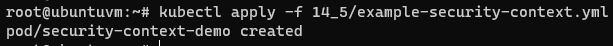

# Домашнее задание к занятию "3.2. Работа в терминале, лекция 2"

1. Какого типа команда `cd`? Попробуйте объяснить, почему она именно такого типа; опишите ход своих мыслей, если считаете что она могла бы быть другого типа.
   1. Это встроенная команда оболочки, а не отельная программа, т.е. она должна работать с текущим окружением.
2. Какая альтернатива без pipe команде `grep <some_string> <some_file> | wc -l`? `man grep` поможет в ответе на этот вопрос. Ознакомьтесь с [документом](http://www.smallo.ruhr.de/award.html) о других подобных некорректных вариантах использования pipe.
   1. `grep string2 test_file -c`
3. Какой процесс с PID `1` является родителем для всех процессов в вашей виртуальной машине Ubuntu 20.04?
   1. `systemd`
4. Как будет выглядеть команда, которая перенаправит вывод stderr `ls` на другую сессию терминала?
   1. ```bash
      who
      vagrant  pts/0        2021-11-13 17:59 (10.0.2.2)
      vagrant  pts/1        2021-11-13 18:41 (10.0.2.2)
      ```
      `pts/0`
      ```bash
      ls -l no_file 2>/dev/pts/1
      ```
      `pts/1`
      ```bash
      ls: cannot access 'no_file': No such file or directory
      ```
5. Получится ли одновременно передать команде файл на stdin и вывести ее stdout в другой файл? Приведите работающий пример.
   1. `cat test_file`
      ```
      string1
      string2
      string3
      ```
      `cat test_bash_out`
      ```bash
      cat: test_bash_out: No such file or directory
      ```
      `cat < test_file > test_bash_out`  
      `cat test_bash_out`
      ```
      string1
      string2
      string3
      ```
6. Получится ли вывести находясь в графическом режиме данные из PTY в какой-либо из эмуляторов TTY? Сможете ли вы наблюдать выводимые данные?
   1. ```bash
      sudo su
      echo Hello from pts0 to tty1 > /dev/tty1
      ```
      Наблюдать получилось в консоли virtualbox на tty1
      
7. Выполните команду `bash 5>&1`. К чему она приведет? Что будет, если вы выполните `echo netology > /proc/$$/fd/5`? Почему так происходит?
   1. `bash 5>&1` - создаст файловый дескриптор 5 и перенаправит его в stdout  
      `echo netology > /proc/$$/fd/5` - перенаправит stdout в дескриптор 5  
      Если `echo netology > /proc/$$/fd/5` выполнить в новой сессии то будет ошибка т.к. там не создан дескриптор 5
8. Получится ли в качестве входного потока для pipe использовать только stderr команды, не потеряв при этом отображение stdout на pty? Напоминаем: по умолчанию через pipe передается только stdout команды слева от `|` на stdin команды справа.
Это можно сделать, поменяв стандартные потоки местами через промежуточный новый дескриптор, который вы научились создавать в предыдущем вопросе.
   1. ```bash
      ls -l no_file 7>&2 2>&1 1>&7 | grep access -c 
      1
      ```
      `7>&2` - новый дескриптор перенаправили в stderr  
      `2>&1` - stderr перенаправили в stdout  
      `1>&7` - stdout перенаправили в новый дескриптор
9. Что выведет команда `cat /proc/$$/environ`? Как еще можно получить аналогичный по содержанию вывод?
   1. `cat /proc/$$/environ` - выведет переменные окружения. Аналогичный результат можно получить выполнив `env`
10. Используя `man`, опишите что доступно по адресам `/proc/<PID>/cmdline`, `/proc/<PID>/exe`.
    1. `man proc`  
    `/proc/<PID>/cmdline` - этот файл только для чтения содержит полную командную строку для процесса, если только процесс не является зомби, строка 226  
    `/proc/<PID>/exe` - В Linux 2.2 и более поздних версиях этот файл представляет собой символьную ссылку, содержащую фактический путь к выполняемой команде, строка 279
11. Узнайте, какую наиболее старшую версию набора инструкций SSE поддерживает ваш процессор с помощью `/proc/cpuinfo`.
    1. `sse4_2`  
       `grep sse /proc/cpuinfo`
12. При открытии нового окна терминала и `vagrant ssh` создается новая сессия и выделяется pty. Это можно подтвердить командой `tty`, которая упоминалась в лекции 3.2. Однако:

     ```bash
     vagrant@netology1:~$ ssh localhost 'tty'
     not a tty
     ```

     Почитайте, почему так происходит, и как изменить поведение.
    1. Если запрашивается интерактивный сеанс, ssh по умолчанию запрашивает псевдотерминал (pty) только для интерактивных сеансов, когда у клиента он есть. Флаги -T и -t можно использовать для переопределения этого поведения.
       ```bash
       vagrant@vagrant:~$ tty
       /dev/pts/2
       ```
       ```bash
       vagrant@vagrant:~$ ssh -t localhost 'tty'
       vagrant@localhost's password:
       /dev/pts/1
       Connection to localhost closed.
       ```
13. Бывает, что есть необходимость переместить запущенный процесс из одной сессии в другую. Попробуйте сделать это, воспользовавшись `reptyr`. Например, так можно перенести в `screen` процесс, который вы запустили по ошибке в обычной SSH-сессии.
    1. ```bash
       sudo su
       vi /etc/sysctl.d/10-ptrace.conf # kernel.yama.ptrace_scope = 0
       echo 0 > /proc/sys/kernel/yama/ptrace_scope
       ```
       ```bash
        screen
        reptyr 2951
       ```
14. `sudo echo string > /root/new_file` не даст выполнить перенаправление под обычным пользователем, так как перенаправлением занимается процесс shell'а, который запущен без `sudo` под вашим пользователем. Для решения данной проблемы можно использовать конструкцию `echo string | sudo tee /root/new_file`. Узнайте что делает команда `tee` и почему в отличие от `sudo echo` команда с `sudo tee` будет работать.
    1. `tee` делает одновременно вывод в файл, указанный в качестве параметра, и в `stdout`.
Команда получает вывод из `stdin`, перенаправленный через пайп от `stdout` команды `echo`,
и так как она запущена от sudo, получает права на запись в файл.