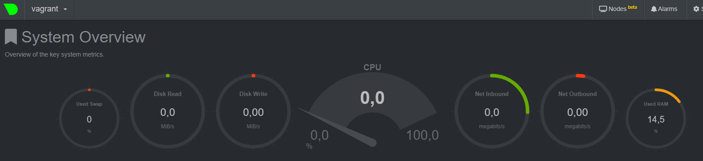
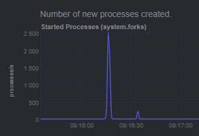
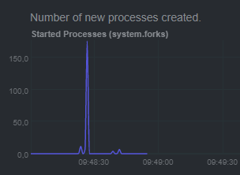

# Домашнее задание к занятию "3.4. Операционные системы, лекция 2"

1. На лекции мы познакомились с [node_exporter](https://github.com/prometheus/node_exporter/releases). В демонстрации его исполняемый файл запускался в background. Этого достаточно для демо, но не для настоящей production-системы, где процессы должны находиться под внешним управлением. Используя знания из лекции по systemd, создайте самостоятельно простой [unit-файл](https://www.freedesktop.org/software/systemd/man/systemd.service.html) для node_exporter:

    * поместите его в автозагрузку,
    * предусмотрите возможность добавления опций к запускаемому процессу через внешний файл (посмотрите, например, на `systemctl cat cron`),
    * удостоверьтесь, что с помощью systemctl процесс корректно стартует, завершается, а после перезагрузки автоматически поднимается.  

   1. 
   ```buildoutcfg
   vagrant@vagrant:~$ systemctl cat node_exporter
   [Unit]
   Description=Node Exporter
   
   [Service]
   ExecStart=/usr/bin/node_exporter-1.3.0.linux-amd64/node_exporter
   EnvironmentFile=-/etc/default/node_exporter
   
   [Install]
   WantedBy=multi-user.target
   ```
   `systemctl enable node_exporter`  
   `systemctl start node_exporter`  
   `systemctl status node_exporter`
   ```buildoutcfg
   ● node_exporter.service - Node Exporter
     Loaded: loaded (/etc/systemd/system/node_exporter.service; enabled; vendor preset: enabled)
     Active: active (running) since Mon 2021-11-22 20:59:44 UTC; 20s ago
   Main PID: 890 (node_exporter)
      Tasks: 3 (limit: 1071)
     Memory: 2.3M
     CGroup: /system.slice/node_exporter.service
             └─890 /usr/bin/node_exporter-1.3.0.linux-amd64/node_exporter
   ```
2. Ознакомьтесь с опциями node_exporter и выводом `/metrics` по-умолчанию. Приведите несколько опций, которые вы бы выбрали для базового мониторинга хоста по CPU, памяти, диску и сети.
   1. CPU
   ```buildoutcfg
   node_cpu_seconds_total{cpu="0",mode="idle"} 102.28
   node_cpu_seconds_total{cpu="0",mode="system"} 3.56
   node_cpu_seconds_total{cpu="0",mode="user"} 3.17
   ```
   2. RAM
   ```buildoutcfg
   node_memory_SwapTotal_bytes 1.027600384e+09
   node_memory_MemTotal_bytes 1.028923392e+09
   node_memory_MemAvailable_bytes 7.74057984e+08
   node_memory_MemFree_bytes 4.72346624e+08
   ```
   3. Disk
   ```buildoutcfg
   node_disk_io_now{device="sda"} 0
   node_disk_read_bytes_total{device="sda"} 4.29835264e+08
   node_disk_written_bytes_total{device="sda"} 2.8296192e+07
   node_disk_read_time_seconds_total{device="sda"} 6.698
   node_disk_write_time_seconds_total{device="sda"} 0.44
   ```
   4. Network
   ```buildoutcfg
   node_network_up{device="eth0"} 1
   node_network_speed_bytes{device="eth0"} 1.25e+08
   node_network_receive_bytes_total{device="eth0"} 84842
   node_network_receive_drop_total{device="eth0"} 0
   node_network_receive_errs_total{device="eth0"} 0
   node_network_transmit_bytes_total{device="eth0"} 93401
   node_network_transmit_drop_total{device="eth0"} 0
   node_network_transmit_errs_total{device="eth0"} 0   
   ```
3. Установите в свою виртуальную машину [Netdata](https://github.com/netdata/netdata). Воспользуйтесь [готовыми пакетами](https://packagecloud.io/netdata/netdata/install) для установки (`sudo apt install -y netdata`). После успешной установки:
    * в конфигурационном файле `/etc/netdata/netdata.conf` в секции [web] замените значение с localhost на `bind to = 0.0.0.0`,
    * добавьте в Vagrantfile проброс порта Netdata на свой локальный компьютер и сделайте `vagrant reload`:

    ```bash
    config.vm.network "forwarded_port", guest: 19999, host: 19999
    ```

    После успешной перезагрузки в браузере *на своем ПК* (не в виртуальной машине) вы должны суметь зайти на `localhost:19999`. Ознакомьтесь с метриками, которые по умолчанию собираются Netdata и с комментариями, которые даны к этим метрикам.
   1. 
4. Можно ли по выводу `dmesg` понять, осознает ли ОС, что загружена не на настоящем оборудовании, а на системе виртуализации?
   1. Можно
   ```bash
   vagrant@vagrant:~$ dmesg | grep virt
   [    0.001760] CPU MTRRs all blank - virtualized system.
   [    0.069737] Booting paravirtualized kernel on KVM
   [    0.200645] Performance Events: PMU not available due to virtualization, using software events only.
   [    2.132157] systemd[1]: Detected virtualization oracle.
   ```
5. Как настроен sysctl `fs.nr_open` на системе по-умолчанию? Узнайте, что означает этот параметр. Какой другой существующий лимит не позволит достичь такого числа (`ulimit --help`)?
   1. 
   ```bash
   vagrant@vagrant:~$ /sbin/sysctl fs.nr_open
   fs.nr_open = 1048576
   ```
   Накладывает ограничение на значение, до которого может быть увеличен лимит ресурсов RLIMIT_NOFILE. Другими словами означает максимальное количество дескрипторов файлов, которые может
выделить процесс.  
   `ulimit -n` - максимальное количество открытых файловых дескрипторов `1024` не позволит достичь `fs.nr_open`
6. Запустите любой долгоживущий процесс (не `ls`, который отработает мгновенно, а, например, `sleep 1h`) в отдельном неймспейсе процессов; покажите, что ваш процесс работает под PID 1 через `nsenter`. Для простоты работайте в данном задании под root (`sudo -i`). Под обычным пользователем требуются дополнительные опции (`--map-root-user`) и т.д.
   1. `unshare -f --pid --mount-proc sleep 1h`  
   `nsenter --target 2255 --pid --mount`
   ```bash
   root@vagrant:/# ps aux
   USER         PID %CPU %MEM    VSZ   RSS TTY      STAT START   TIME COMMAND
   root           1  0.0  0.0   8076   592 pts/2    S+   20:53   0:00 sleep 1h
   root           2  0.0  0.4   9836  4116 pts/1    S    20:55   0:00 -bash
   root          11  0.0  0.3  11492  3292 pts/1    R+   20:55   0:00 ps aux
   ```
7. Найдите информацию о том, что такое `:(){ :|:& };:`. Запустите эту команду в своей виртуальной машине Vagrant с Ubuntu 20.04 (**это важно, поведение в других ОС не проверялось**). Некоторое время все будет "плохо", после чего (минуты) – ОС должна стабилизироваться. Вызов `dmesg` расскажет, какой механизм помог автоматической стабилизации. Как настроен этот механизм по-умолчанию, и как изменить число процессов, которое можно создать в сессии?
   1. `:()` это функция с телом `{ :|:& }`, и после мы её запускаем `;:`.
   ```bash
   vagrant@vagrant:~$ declare -f
   : ()
   {
       : | : &
   }
   ```
   Функция запускает саму себя порождая фоновые процессы, это видно на графике мониторинга  
     
   За стабилицазицю отвечает:
   ```buildoutcfg
   [   81.420230] cgroup: fork rejected by pids controller in /user.slice/user-1000.slice/session-4.scope
   [ 2630.898046] cgroup: fork rejected by pids controller in /user.slice/user-1000.slice/session-6.scope
   ```
   Механизм настроен в соответствии с `ulimit -a` `max user processes`, значение по умолчанию `3572`, изменить можно указав новый лимит `ulimit -u 100`.
   Если выполнить функцию `:` ещё раз эффект заметен на графике.  
   