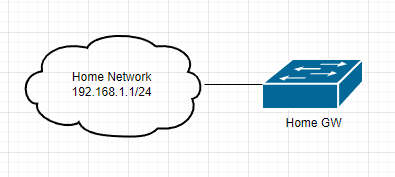

# Домашнее задание к занятию "3.8. Компьютерные сети, лекция 3"

1. Подключитесь к публичному маршрутизатору в интернет. Найдите маршрут к вашему публичному IP
```
telnet route-views.routeviews.org
Username: rviews
show ip route x.x.x.x/32
show bgp x.x.x.x/32
```

```bash
show bgp 188.35.131.240

BGP routing table entry for 188.35.0.0/16, version 1374178149
Paths: (24 available, best #23, table default)
Not advertised to any peer
...
  Refresh Epoch 1
  6939 34123
    64.71.137.241 from 64.71.137.241 (216.218.252.164)
    Origin IGP, localpref 100, valid, external, best
    path 7FE09B15C320 RPKI State not found
    rx pathid: 0, tx pathid: 0x0
```
2. Создайте dummy0 интерфейс в Ubuntu. Добавьте несколько статических маршрутов. Проверьте таблицу маршрутизации.  
   1. 
   ```bash
    root@vagrant:~# ip -br addr
    lo               UNKNOWN        127.0.0.1/8 ::1/128
    eth0             UP             10.0.2.15/24 fe80::a00:27ff:fe73:60cf/64
    dummy0           UNKNOWN        10.2.2.2/32 fe80::d4af:faff:fede:d009/64
   
    root@vagrant:~# ip route show
    default via 10.0.2.2 dev eth0 proto dhcp src 10.0.2.15 metric 100
    10.0.2.0/24 dev eth0 proto kernel scope link src 10.0.2.15
    10.0.2.2 dev eth0 proto dhcp scope link src 10.0.2.15 metric 100
    172.16.10.0/24 dev dummy0 scope link
    192.168.168.0/24 via 10.0.2.1 dev eth0
   ```
3. Проверьте открытые TCP порты в Ubuntu, какие протоколы и приложения используют эти порты? Приведите несколько примеров.  
   1. 
   ```bash
    root@vagrant:~# ss -tp
    State        Recv-Q        Send-Q               Local Address:Port               Peer Address:Port        Process
    ESTAB        0             0                        10.0.2.15:ssh                    10.0.2.2:58443        users:(("sshd",pid=1153,fd=4),("sshd",pid=1105,fd=4))
    ```
4. Проверьте используемые UDP сокеты в Ubuntu, какие протоколы и приложения используют эти порты?  
   1. 
   ```bash
    root@vagrant:~# ss -uap
    State  Recv-Q Send-Q  Local Address:Port    Peer Address:Port Process
    UNCONN 0      0       127.0.0.53%lo:domain       0.0.0.0:*     users:(("systemd-resolve",pid=562,fd=12))
    UNCONN 0      0      10.0.2.15%eth0:bootpc       0.0.0.0:*     users:(("systemd-network",pid=392,fd=19))
    UNCONN 0      0             0.0.0.0:sunrpc       0.0.0.0:*     users:(("rpcbind",pid=561,fd=5),("systemd",pid=1,fd=36))
    UNCONN 0      0                [::]:sunrpc          [::]:*     users:(("rpcbind",pid=561,fd=7),("systemd",pid=1,fd=38))
   ```

5. Используя diagrams.net, создайте L3 диаграмму вашей домашней сети или любой другой сети, с которой вы работали.  
   1. 
 ---
## Задание для самостоятельной отработки (необязательно к выполнению)

6*. Установите Nginx, настройте в режиме балансировщика TCP или UDP.

7*. Установите bird2, настройте динамический протокол маршрутизации RIP.

8*. Установите Netbox, создайте несколько IP префиксов, используя curl проверьте работу API.

 ---
