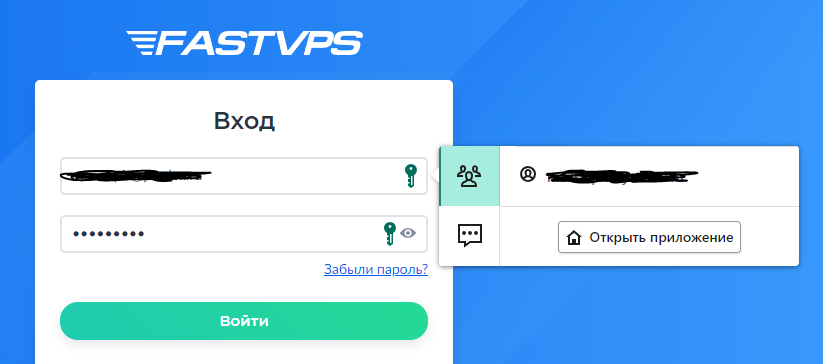
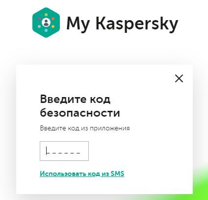
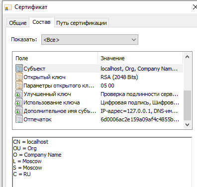
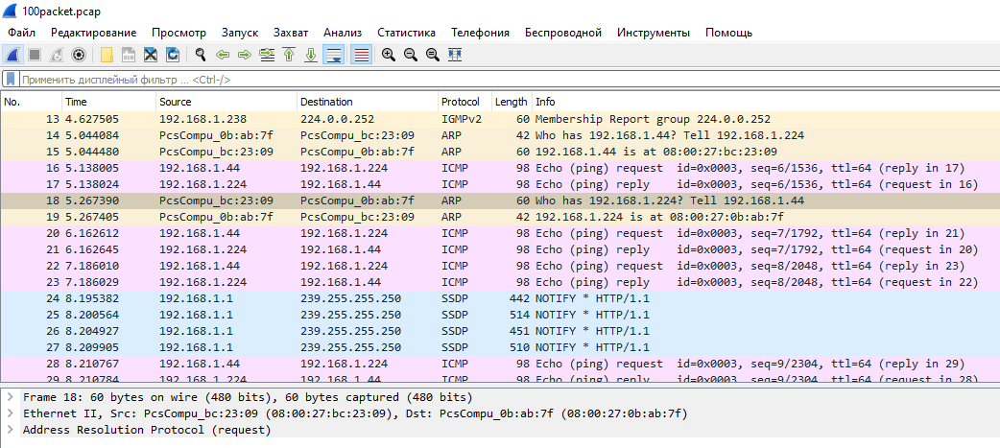

# Домашнее задание к занятию "3.9. Элементы безопасности информационных систем"

1. Установите Bitwarden плагин для браузера. Зарегестрируйтесь и сохраните несколько паролей.
   1. Использую Kaspersky Password Manager
   

2. Установите Google authenticator на мобильный телефон. Настройте вход в Bitwarden акаунт через Google authenticator OTP.
   1. Используется Microsoft Authenticator, настроил дополнительно для входа на портал MyKaspersky
   

3. Установите apache2, сгенерируйте самоподписанный сертификат, настройте тестовый сайт для работы по HTTPS.  
   1. ```bash
       root@vagrant:~# wget https://localhost/index.html --no-check-certificate
       --2021-12-07 20:05:31--  https://localhost/index.html
       Resolving localhost (localhost)... ::1, 127.0.0.1
       Connecting to localhost (localhost)|::1|:443... connected.
       WARNING: cannot verify localhost's certificate, issued by ‘CN=localhost,OU=Org,O=Company Name,L=Moscow,ST=Moscow,C=RU’:
         Self-signed certificate encountered.
       HTTP request sent, awaiting response... 200 OK
       Length: 20 [text/html]
       Saving to: ‘index.html’
   
       index.html                    100%[=================================================>]      20  --.-KB/s    in 0s
       
       2021-12-07 20:05:31 (2.04 MB/s) - ‘index.html’ saved [20/20]
      ```
      
      

4. Проверьте на TLS уязвимости произвольный сайт в интернете.  
   1. Отметил только найденные уязвимости
   ```bash
   root@vagrant:~/testssl.sh# ./testssl.sh -U --sneaky https://www.kaspersky.com/
   
   BREACH (CVE-2013-3587)                    potentially NOT ok, "gzip deflate" HTTP compression detected. - only supplied "/" tested
   LUCKY13 (CVE-2013-0169), experimental     potentially VULNERABLE, uses cipher block chaining (CBC) ciphers with TLS. Check patches 
   ```

5. Установите на Ubuntu ssh сервер, сгенерируйте новый приватный ключ. Скопируйте свой публичный ключ на другой сервер. Подключитесь к серверу по SSH-ключу.
   1. Имеем машины `vagrant-vm1 / 192.168.1.224` и `vagrant-vm2 / 192.168.1.44`
   2. Генерируем ключ на первой машине `ssh-keygen`
   3. Копируем ключ на вторую машину
   ```bash
   vagrant@vagrant-vm1:~$ ssh-copy-id vagrant@192.168.1.44
   /usr/bin/ssh-copy-id: INFO: Source of key(s) to be installed: "/home/vagrant/.ssh/id_rsa.pub"
   The authenticity of host '192.168.1.44 (192.168.1.44)' can't be established.
   ECDSA key fingerprint is SHA256:wSHl+h4vAtTT7mbkj2lbGyxWXWTUf6VUliwpncjwLPM.
   Are you sure you want to continue connecting (yes/no/[fingerprint])? yes
   /usr/bin/ssh-copy-id: INFO: attempting to log in with the new key(s), to filter out any that are already installed
   /usr/bin/ssh-copy-id: INFO: 1 key(s) remain to be installed -- if you are prompted now it is to install the new keys
   vagrant@192.168.1.44's password:
   
   Number of key(s) added: 1
   
   Now try logging into the machine, with:   "ssh 'vagrant@192.168.1.44'"
   and check to make sure that only the key(s) you wanted were added.
   ```
   3. Проверяем что ключ добавился на второй машине
   ```bash
   vagrant@vagrant-vm2:~$ cat .ssh/authorized_keys
   ssh-rsa AAAAB3N...ZTWlT vagrant
   ssh-rsa AAAAB3N...Gg0= vagrant@vagrant-vm1
   ```
   4. Подключаемся по ключу на вторую машину
   ```bash
   vagrant@vagrant-vm1:~$ ssh vagrant@192.168.1.44
   ...баннер...
   vagrant@vagrant-vm2:~$ hostname
   vagrant-vm2
   ```
 
6. Переименуйте файлы ключей из задания 5. Настройте файл конфигурации SSH клиента, так чтобы вход на удаленный сервер осуществлялся по имени сервера.
   1. Переименовал ключ
   ```bash
   vagrant@vagrant-vm1:~$ mv .ssh/id_rsa .ssh/some_server.key
   ```
   2. Настроил файл конфигурации
   ```bash
   vagrant@vagrant-vm1:~$ touch ~/.ssh/config && chmod 600 ~/.ssh/config
   
   vagrant@vagrant-vm1:~$ vi .ssh/config
   Host vagrant-vm2
   HostName 192.168.1.44
   IdentityFile ~/.ssh/some_server.key
   User vagrant
   
   vagrant@vagrant-vm1:~$ systemctl reload sshd.service
   ```
   3. Подключился на второй сервер по имени
   ```bash
   vagrant@vagrant-vm1:~$ ssh vagrant-vm2
   ...баннер...
   vagrant@vagrant-vm2:~$ hostname
   vagrant-vm2
   ```

7. Соберите дамп трафика утилитой tcpdump в формате pcap, 100 пакетов. Откройте файл pcap в Wireshark.
   1. Собрал 100 пакетов
   ```bash
   vagrant@vagrant-vm1:~$ sudo tcpdump -w /home/vagrant/100packet.pcap -i eth1 -c 100
   tcpdump: listening on eth1, link-type EN10MB (Ethernet), capture size 262144 bytes
   100 packets captured
   101 packets received by filter
   0 packets dropped by kernel
   ```
   2. Открыл в Wireshark
   
 ---
## Задание для самостоятельной отработки (необязательно к выполнению)

8*. Просканируйте хост scanme.nmap.org. Какие сервисы запущены?
   1. Хост scanme.nmap.org просканировать не вышло
   ```bash
   vagrant@vagrant-vm1:~$ sudo nmap -O scanme.nmap.org
   Starting Nmap 7.80 ( https://nmap.org ) at 2021-12-08 20:37 UTC
   Warning: 45.33.32.156 giving up on port because retransmission cap hit (10).
   ```
   2. Просканировал другие хосты, пример на kaspersky.com
   ```bash
   vagrant@vagrant-vm2:~$ sudo nmap -O kaspersky.com
   ...
   PORT    STATE SERVICE
   80/tcp  open  http
   443/tcp open  https
   ...
   ```
9*. Установите и настройте фаервол ufw на web-сервер из задания 3. Откройте доступ снаружи только к портам 22,80,443
   1. Включил fw, добавил правила
   ```bash
   root@vagrant-vm1:~# ufw enable
   
   root@vagrant-vm1:~# ufw allow in 22
   Rule added
   Rule added (v6)
   root@vagrant-vm1:~# ufw allow in 80
   Rule added
   Rule added (v6)
   root@vagrant-vm1:~# ufw allow in 443
   Rule added
   Rule added (v6)
   
   root@vagrant-vm1:~# ufw status verbose
   Status: active
   Logging: on (low)
   Default: deny (incoming), allow (outgoing), disabled (routed)
   New profiles: skip
   
   To                         Action      From
   --                         ------      ----
   22                         ALLOW IN    Anywhere
   80                         ALLOW IN    Anywhere
   443                        ALLOW IN    Anywhere
   22 (v6)                    ALLOW IN    Anywhere (v6)
   80 (v6)                    ALLOW IN    Anywhere (v6)
   443 (v6)                   ALLOW IN    Anywhere (v6)
   ```
 ---