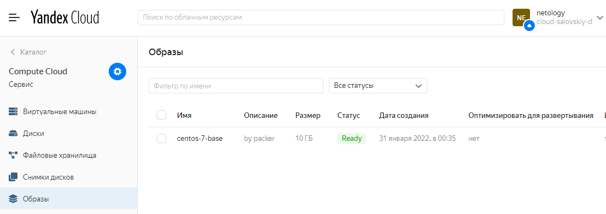
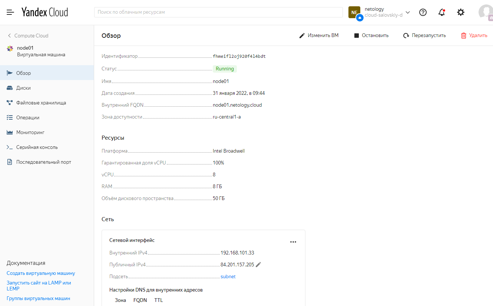
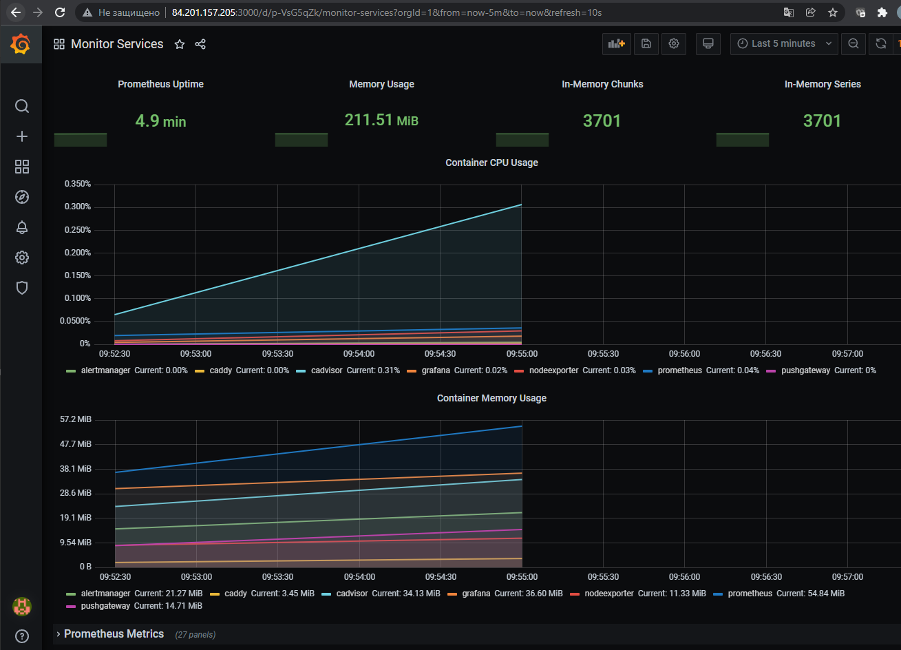
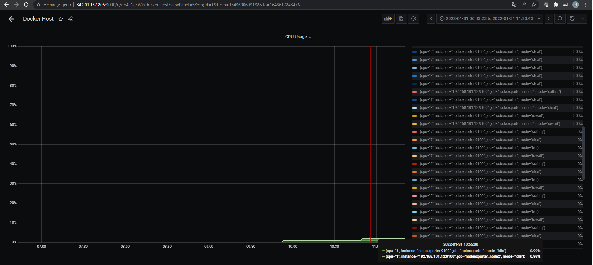

## Задача 1

Создать собственный образ операционной системы с помощью Packer.

Для получения зачета, вам необходимо предоставить:
- Скриншот страницы, как на слайде из презентации (слайд 37).

### Ответ

## Задача 2

Создать вашу первую виртуальную машину в Яндекс.Облаке.

Для получения зачета, вам необходимо предоставить:
- Скриншот страницы свойств созданной ВМ, как на примере ниже:

### Ответ

## Задача 3

Создать ваш первый готовый к боевой эксплуатации компонент мониторинга, состоящий из стека микросервисов.

Для получения зачета, вам необходимо предоставить:
- Скриншот работающего веб-интерфейса Grafana с текущими метриками, как на примере ниже

### Ответ

## Задача 4 (*)

Создать вторую ВМ и подключить её к мониторингу развёрнутому на первом сервере.

Для получения зачета, вам необходимо предоставить:
- Скриншот из Grafana, на котором будут отображаться метрики добавленного вами сервера.

### Ответ

- Создал 
  - отдельный файл [terraform](05-virt-04-docker_compose/src/terraform/node02.tf) для деплоя дополнительной ноды
  - отдельный [плейбук ansible](05-virt-04-docker_compose/src/ansible/add-nodes.yml) для подготовки дополнительной ноды и описал ноду в [инвентори](05-virt-04-docker_compose/src/ansible/inventory)
  - добавил экспортеры в [конфиг prometheus](05-virt-04-docker_compose/src/ansible/stack/prometheus/prometheus.yml)
  - дополнительные [docker-compose](05-virt-04-docker_compose/src/ansible/add_nodes/docker-compose.yaml) файлы для дополнительной ноды. Из особенностей добавил проброс портов, иначе экспортеры были недоступны по сети
  - Данные начали поступать в prometheus и grafana, долго дашборды не мучал, получил метрику в дашборде и выполнил terraform destroy

