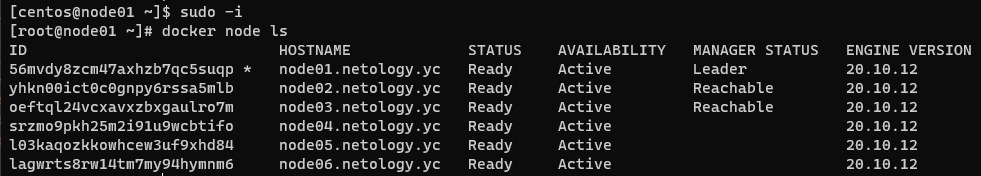
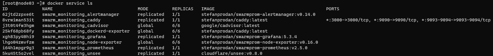
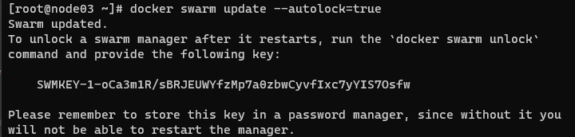
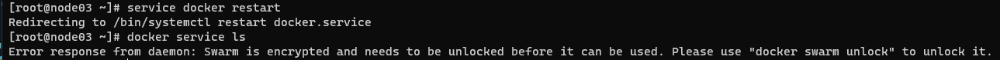
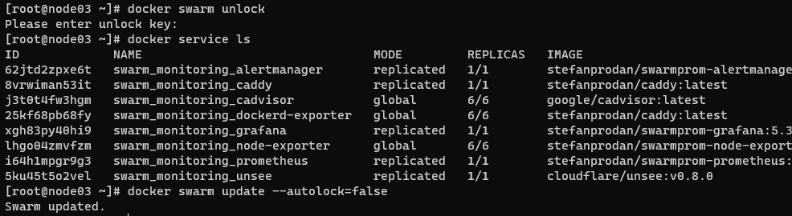

## Задача 1

Дайте письменные ответы на следующие вопросы:

- В чём отличие режимов работы сервисов в Docker Swarm кластере: replication и global?
- Какой алгоритм выбора лидера используется в Docker Swarm кластере?
- Что такое Overlay Network?

### Ответ

- Сервис в режиме `global` разворачивается с одной репликой на каждом узле кластера который удовлетворяет ограничениям размещения, в режиме `replication` сервисы обычно распределяются по нодам в запрошенном количестве, но также могут быть размещены на одной ноде.
- Используется так называемый алгоритм поддержания распределенного консенсуса — Raft
- Overlay Network создает подсеть, которую могут использовать контейнеры в разных хостах swarm-кластера. Overlay-сеть использует технологию vxlan, которая инкапсулирует layer 2 фреймы в layer 4 пакеты (UDP/IP). При помощи этого действия Docker создает виртуальные сети поверх существующих связей между хостами, которые могут оказаться внутри одной подсети.

## Задача 2

Создать ваш первый Docker Swarm кластер в Яндекс.Облаке

Для получения зачета, вам необходимо предоставить скриншот из терминала (консоли), с выводом команды:
```
docker node ls
```

### Ответ



## Задача 3

Создать ваш первый, готовый к боевой эксплуатации кластер мониторинга, состоящий из стека микросервисов.

Для получения зачета, вам необходимо предоставить скриншот из терминала (консоли), с выводом команды:
```
docker service ls
```

### Ответ



## Задача 4 (*)

Выполнить на лидере Docker Swarm кластера команду (указанную ниже) и дать письменное описание её функционала, что она делает и зачем она нужна:
```
# см.документацию: https://docs.docker.com/engine/swarm/swarm_manager_locking/
docker swarm update --autolock=true
```

### Ответ

- Команда `docker swarm update --autolock=true` создает новый ключ, используемый для шифрования открытых/закрытых ключей, используемых для шифрования/расшифровки журналов. Это нужно для того, что бы Docker смог защитить общий ключ шифрования TLS и ключ, используемый для шифрования и расшифровки журналов Raft, позволяя стать владельцем этих ключей и требовать ручной разблокировки управляющих нод.


  

  
