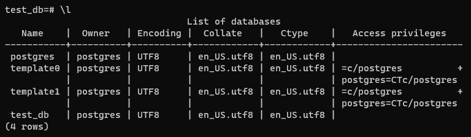
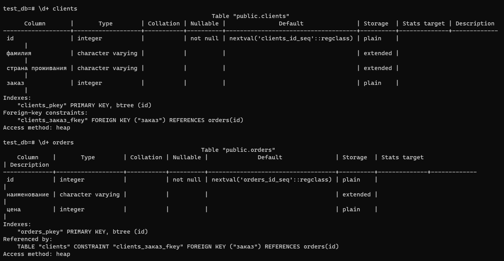
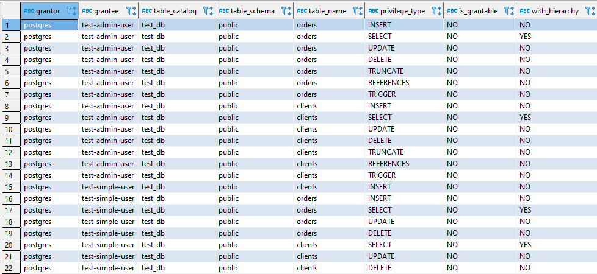

## Задача 1

Используя docker поднимите инстанс PostgreSQL (версию 12) c 2 volume, 
в который будут складываться данные БД и бэкапы.

Приведите получившуюся команду или docker-compose манифест.

### Ответ

- [docker-compose манифест](06-db-02-sql/docker-compose.yaml)
- `docker-compose -f docker-compose.yaml up -d`

## Задача 2

В БД из задачи 1: 
- создайте пользователя test-admin-user и БД test_db
- в БД test_db создайте таблицу orders и clients (спeцификация таблиц ниже)
- предоставьте привилегии на все операции пользователю test-admin-user на таблицы БД test_db
- создайте пользователя test-simple-user  
- предоставьте пользователю test-simple-user права на SELECT/INSERT/UPDATE/DELETE данных таблиц БД test_db

Таблица orders:
- id (serial primary key)
- наименование (string)
- цена (integer)

Таблица clients:
- id (serial primary key)
- фамилия (string)
- страна проживания (string, index)
- заказ (foreign key orders)

Приведите:
- итоговый список БД после выполнения пунктов выше,
- описание таблиц (describe)
- SQL-запрос для выдачи списка пользователей с правами над таблицами test_db
- список пользователей с правами над таблицами test_db

### Ответ

- Создал БД `test_db` и пользователя `test-admin-user`  
  ```sql
  CREATE DATABASE test_db;
  CREATE USER "test-admin-user" WITH PASSWORD '***';
  ```
- Создал таблицы `orders` и `clients`  
  ```sql
  CREATE TABLE orders (id SERIAL, наименование VARCHAR, цена INT, PRIMARY KEY(id));

  CREATE TABLE clients (id SERIAL, "фамилия" VARCHAR,
  "страна проживания" VARCHAR, "заказ" INT,
  PRIMARY KEY (id), FOREIGN KEY(заказ) REFERENCES orders(id));
  
  CREATE INDEX idx_country ON clients ("страна проживания");
  ```
- Выдал права на все таблицы для `test-admin-user`  
  ```sql
  GRANT ALL PRIVILEGES ON ALL TABLES IN SCHEMA public TO "test-admin-user";
  ```
- Создал пользователя `test-simple-user`  
  ```sql
  CREATE USER "test-simple-user" WITH PASSWORD '***';
  ```
- Выдал права на таблицы для `test-simple-user`  
  ```sql
  GRANT SELECT, INSERT, UPDATE, DELETE ON orders, clients TO "test-simple-user";
  ```
- итоговый список БД после выполнения пунктов выше

- описание таблиц (describe)

*На скрин не попал index для clients, т.к. сразу забыл его создать. Запись про него выглядит так: `"idx_country" btree ("страна проживания")`*
- SQL-запрос для выдачи списка пользователей с правами над таблицами test_db
  ```sql
  SELECT * from information_schema.table_privileges WHERE grantee in ('test-admin-user', 'test-simple-user') order by grantee asc;
  
  ещё запрос с более полным результатом
  SELECT * from information_schema.table_privileges WHERE table_catalog = 'test_db' order by grantee asc;
  ```
- список пользователей с правами над таблицами test_db


## Задача 3

Используя SQL синтаксис - наполните таблицы следующими тестовыми данными:

Таблица orders

|Наименование|цена|
|------------|----|
|Шоколад| 10 |
|Принтер| 3000 |
|Книга| 500 |
|Монитор| 7000|
|Гитара| 4000|

Таблица clients

|ФИО|Страна проживания|
|------------|----|
|Иванов Иван Иванович| USA |
|Петров Петр Петрович| Canada |
|Иоганн Себастьян Бах| Japan |
|Ронни Джеймс Дио| Russia|
|Ritchie Blackmore| Russia|

Используя SQL синтаксис:
- вычислите количество записей для каждой таблицы 
- приведите в ответе:
    - запросы 
    - результаты их выполнения.

### Ответ

- Заполнил таблицы `orders` и `clients`  
  ```sql
  INSERT INTO orders  (наименование, цена)
  VALUES
  ('Шоколад', 10),
  ('Принтер', 3000),
  ('Книга', 500),
  ('Монитор', 7000),
  ('Гитара', 4000)
  
  INSERT INTO clients (фамилия, "страна проживания")
  VALUES
  ('Иванов Иван Иванович', 'USA'),
  ('Петров Петр Петрович', 'Canada'),
  ('Иоганн Себастьян Бах', 'Japan'),
  ('Ронни Джеймс Дио', 'Russia'),
  ('Ritchie Blackmore', 'Russia')
  ```
- количество записей для каждой таблицы  
  ```sql
  SELECT count(*) from orders;
   count
  -------
       5
  (1 row)
  
  SELECT count(*) from clients;
   count
  -------
       5
  (1 row) 
  ```

## Задача 4

Часть пользователей из таблицы clients решили оформить заказы из таблицы orders.

Используя foreign keys свяжите записи из таблиц, согласно таблице:

|ФИО|Заказ|
|------------|----|
|Иванов Иван Иванович| Книга |
|Петров Петр Петрович| Монитор |
|Иоганн Себастьян Бах| Гитара |

Приведите SQL-запросы для выполнения данных операций.

Приведите SQL-запрос для выдачи всех пользователей, которые совершили заказ, а также вывод данного запроса.
 
Подсказк - используйте директиву `UPDATE`.

### Ответ

- Клиенты оформили заказы
  ```sql
  UPDATE clients  SET "заказ" = 3 WHERE id = 1;
  UPDATE clients  SET "заказ" = 4 WHERE id = 2;
  UPDATE clients  SET "заказ" = 5 WHERE id = 3; 
  ```
- Все клиенты, которые совершили заказ
```sql
SELECT * from clients where "заказ" is not null;

 id |       фамилия        | страна проживания | заказ
----+----------------------+-------------------+-------
  1 | Иванов Иван Иванович | USA               |     3
  2 | Петров Петр Петрович | Canada            |     4
  3 | Иоганн Себастьян Бах | Japan             |     5
(3 rows) 
```

## Задача 5

Получите полную информацию по выполнению запроса выдачи всех пользователей из задачи 4 
(используя директиву EXPLAIN).

Приведите получившийся результат и объясните что значат полученные значения.

### Ответ

  ```sql
  EXPLAIN SELECT * from clients where "заказ" is not null;
  
                         QUERY PLAN
  --------------------------------------------------------
   Seq Scan on clients  (cost=0.00..1.05 rows=5 width=72)
     Filter: ("заказ" IS NOT NULL)
  (2 rows)
  ```
- `Seq Scan` - используется последовательное чтение данных таблицы
- `cost` - затратность операции
  - `0.00` - затраты на получение первой строки
  - `1.05` - затраты на получение всех строк
- `rows` - приблизительное количество возвращаемых строк при выполнении операции `Seq Scan`
- `width` - средний размер одной строки в байтах

EXPLAIN показывает ожидания планировщика, для анализа на реальных данных можно использовать EXPLAIN (ANALYZE)

```sql
EXPLAIN (ANALYZE) SELECT * from clients where "заказ" is not null;

                                            QUERY PLAN
--------------------------------------------------------------------------------------------------
 Seq Scan on clients  (cost=0.00..1.05 rows=5 width=72) (actual time=0.009..0.010 rows=3 loops=1)
   Filter: ("заказ" IS NOT NULL)
   Rows Removed by Filter: 2
 Planning Time: 0.043 ms
 Execution Time: 0.020 ms
(5 rows)
```
- `actual time` - реальное время в миллисекундах, затраченное для получения первой строки и всех строк соответственно
- `rows` - реальное количество строк, полученных при `Seq Scan`
- `loops` - сколько раз пришлось выполнить операцию `Seq Scan`

## Задача 6

Создайте бэкап БД test_db и поместите его в volume, предназначенный для бэкапов (см. Задачу 1).

Остановите контейнер с PostgreSQL (но не удаляйте volumes).

Поднимите новый пустой контейнер с PostgreSQL.

Восстановите БД test_db в новом контейнере.

Приведите список операций, который вы применяли для бэкапа данных и восстановления. 

### Ответ

- Создал бекап БД `test_db`  
  ```bash
  root@154c607207e6:/# pg_dump -U postgres -Fc test_db > /var/lib/postgresql/backup/test_db.bak
  ```
- Остановил контейнер с PostgreSQL
  ```bash
  root@ubuntuvm:~/06_02# docker-compose down
  Stopping postgres ... done
  Stopping adminer  ... done
  Removing postgres ... done
  Removing adminer  ... done
  Removing network 06_02_db_net 
  ```
- Запустил контейнер с PostgreSQL
  ```bash
  root@ubuntuvm:~/06_02# docker-compose -f docker-compose.yaml up -d
  Creating network "06_02_db_net" with driver "bridge"
  Creating postgres ... done
  Creating adminer  ... done
  ```
- Восстановил БД `test_db` из бекапа
  ```bash
  root@6d868dd82fde:/# pg_restore -U postgres -Fc -c -d test_db /var/lib/postgresql/backup/test_db.bak
  ```
  Т.к. volume с базой остался, при восстановлении без параметра `-c` получал ошибки вида `... already exists`, из-за того что база лежит 
  и данные в ней все есть. При использовании параметра `-c` никакого вывода в консоль не было, но если предварительно удалить одну из таблиц, 
  уже имелись ошибки вида `... does not exist` из-за того, что не может выполниться `DROP`. У меня остались некоторые сомнения по правильности, 
  но по итогу данные в базе консистентные.