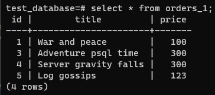

## Задача 1

Используя docker поднимите инстанс PostgreSQL (версию 13). Данные БД сохраните в volume.

Подключитесь к БД PostgreSQL используя `psql`.

Воспользуйтесь командой `\?` для вывода подсказки по имеющимся в `psql` управляющим командам.

**Найдите и приведите** управляющие команды для:
- вывода списка БД
- подключения к БД
- вывода списка таблиц
- вывода описания содержимого таблиц
- выхода из psql

### Ответ

- [docker-compose манифест](06-db-04-postgresql/docker-compose.yaml)
- Запустил контейнер
    ```bash
    root@ubuntuvm:~/06_04# docker-compose -f docker-compose.yaml up -d
    ```
- Подключился к контейнеру с PostgreSQL
    ```bash
    root@ubuntuvm:~/06_04# docker exec -it postgres_6_4 /bin/bash 
    ```
- Подключился к СУБД
    ```bash
    root@b4934645e670:/# psql -U postgres
    ```
- Вывод списка БД - `\l[+]`
- Подключение к БД - `\c[onnect] {[DBNAME|- USER|- HOST|- PORT|-] | conninfo} connect to new database (currently "postgres")`
- Вывод списка таблиц - `\dt[S+]`
- Вывод описания содержимого таблиц - `\d[S+]`
- Выход из psql - `\q`

## Задача 2

Используя `psql` создайте БД `test_database`.

Изучите [бэкап БД](06-db-04-postgresql/test_data/test_dump.sql).

Восстановите бэкап БД в `test_database`.

Перейдите в управляющую консоль `psql` внутри контейнера.

Подключитесь к восстановленной БД и проведите операцию ANALYZE для сбора статистики по таблице.

Используя таблицу [pg_stats](https://postgrespro.ru/docs/postgresql/12/view-pg-stats), найдите столбец таблицы `orders` 
с наибольшим средним значением размера элементов в байтах.

**Приведите в ответе** команду, которую вы использовали для вычисления и полученный результат.

### Ответ
- Создал БД `test_database`
    ```bash
    postgres=# CREATE DATABASE test_database;
    CREATE DATABASE 
    ```
- Восстановил БД
    ```bash
    root@b4934645e670:/# psql -U postgres -W test_database < /var/lib/postgresql/backup/test_dump.sql
    ```
- Подключился к восстановленной БД
    ```bash
    root@b4934645e670:/# psql -U postgres test_database
    ```
- Проведите операцию ANALYZE
    ```bash
    test_database=# ANALYZE VERBOSE orders;
    INFO:  analyzing "public.orders"
    INFO:  "orders": scanned 1 of 1 pages, containing 8 live rows and 0 dead rows; 8 rows in sample, 8 estimated total rows
    ANALYZE 
    ```
- Нашёл столбец таблицы `orders` с наибольшим средним значением размера элементов в байтах
  - Запрос
      ```sql
      select attname, avg_width
      from pg_stats
      where tablename = 'orders'
      order by avg_width desc
      limit 1; 
      ```
  - Результат
      ```bash
       attname | avg_width
      ---------+-----------
       title   |        16
      (1 row)
      ```
## Задача 3

Архитектор и администратор БД выяснили, что ваша таблица orders разрослась до невиданных размеров и
поиск по ней занимает долгое время. Вам, как успешному выпускнику курсов DevOps в нетологии предложили
провести разбиение таблицы на 2 (шардировать на orders_1 - price>499 и orders_2 - price<=499).

Предложите SQL-транзакцию для проведения данной операции.

Можно ли было изначально исключить "ручное" разбиение при проектировании таблицы orders?

### Ответ

- SQL транзакция для разбиения таблицы
  ```sql
  BEGIN;
  
  CREATE TABLE orders_partition (
      id integer NOT NULL,
      title character varying(80) NOT NULL,
      price integer DEFAULT 0
  )
  PARTITION BY RANGE (price); -- Создал новую партицированную таблицу
  
  CREATE TABLE orders_1
      PARTITION OF orders_partition
      FOR VALUES FROM (MINVALUE) TO (499); -- Создал партицию orders_1 с price>499
  
  CREATE TABLE orders_2
      PARTITION OF orders_partition
      FOR VALUES FROM (499) TO (MAXVALUE); -- Создал партицию orders_2 с price<=499
  
  INSERT INTO orders_partition SELECT * FROM orders;  -- Скопировал данные в новую таблицу
     
  DROP TABLE orders; -- Удалил старую таблицу
     
  ALTER TABLE orders_partition RENAME TO orders; -- Переименовал новую таблицу в старое название
  
  COMMIT; 
  ```
    
  
  
  

- Можно было бы исключить "ручное" разбиение если бы изначально была бы создана партицированная таблица или соответсвующая правка внесена на этапе восстановления

## Задача 4

Используя утилиту `pg_dump` создайте бекап БД `test_database`.

Как бы вы доработали бэкап-файл, чтобы добавить уникальность значения столбца `title` для таблиц `test_database`?

### Ответ

- Создал бекап
  ```bash
  root@b4934645e670:/# pg_dump -U postgres -Fp test_database > /var/lib/postgresql/backup/test_database_backup.sql 
  ```
- Что бы добавить уникальность значения столбца `title` можно создать индекс
  ```sql
  CREATE INDEX ixtitle ON orders(title); 
  ```

---
  
### Доработка
- В последнем задании вы сделали через индекс, подумайте как сделать иначе и почему через индес делать не стоит.
  - Можно определить атрибут `UNIQUE` на уровне таблиц патриций
  ```sql
  ALTER TABLE public.orders_1 ADD UNIQUE (title);
  ALTER TABLE public.orders_2 ADD UNIQUE (title);
  ```
  - Через индекс делать не стоит вероятно потому, что его в последствии проще потерять/удалить чем изменять структуру таблицы.