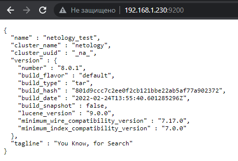

## Задача 1

В этом задании вы потренируетесь в:
- установке elasticsearch
- первоначальном конфигурировании elastcisearch
- запуске elasticsearch в docker

Используя докер образ [centos:7](https://hub.docker.com/_/centos) как базовый и 
[документацию по установке и запуску Elastcisearch](https://www.elastic.co/guide/en/elasticsearch/reference/current/targz.html):

- составьте Dockerfile-манифест для elasticsearch
- соберите docker-образ и сделайте `push` в ваш docker.io репозиторий
- запустите контейнер из получившегося образа и выполните запрос пути `/` c хост-машины

Требования к `elasticsearch.yml`:
- данные `path` должны сохраняться в `/var/lib`
- имя ноды должно быть `netology_test`

В ответе приведите:
- текст Dockerfile манифеста
- ссылку на образ в репозитории dockerhub
- ответ `elasticsearch` на запрос пути `/` в json виде

Подсказки:
- возможно вам понадобится установка пакета perl-Digest-SHA для корректной работы пакета shasum
- при сетевых проблемах внимательно изучите кластерные и сетевые настройки в elasticsearch.yml
- при некоторых проблемах вам поможет docker директива ulimit
- elasticsearch в логах обычно описывает проблему и пути ее решения

Далее мы будем работать с данным экземпляром elasticsearch.

### Ответ

- Составил [Dockerfile](06-db-05-elasticsearch/Dockerfile) и конфигурационные файлы
  - [elasticsearch.yml](06-db-05-elasticsearch/elasticsearch.yml)
  - [logging.yml](06-db-05-elasticsearch/logging.yml)
- Собрал образ
    ```bash
    root@ubuntuvm:~/06_05# DOCKER_BUILDKIT=0 docker build -t danilabar/elasticsearch:8.0.1 . 
    ```
- Перед запуском образа пришлось выполнить дополнительную настройку хостовой машины иначе была ошибка `max virtual memory areas vm.max_map_count [65530] is too low, increase to at least [262144]`  
    ```bash
    sysctl -w vm.max_map_count=262144 
    ```
  - P.s.: Предположительно этой настройки можно было избежать с помощью редактирования в `jvm.options` параметров `-Xms512m` и `-Xmx512m`, но проверить не смог,
  так как почему-то при возврате к стандартному значению `vm.max_map_count = 65530` эластик продолжил запускаться штатно - осталось загадкой
    - P.p.s: Ещё есть предположение, что `elasticsearch` стал запускатся после добавления в `elasticsearch.yml` настройки
    `discovery.type: single-node` т.к. больше концептуальных изменений к конфиг не вносилось.
- Запустил образ
    ```bash
    root@ubuntuvm:~/06_05# docker run -d -p 9200:9200 danilabar/elasticsearch:8.0.1 
    ```
- Ответ `elasticsearch` на запрос пути `/` в [json](06-db-05-elasticsearch/elasticsearch_response.json) виде
  - И в картинке
  
- Загрузил образ в свой docker.io репозиторий [ссылка](https://hub.docker.com/repository/docker/danilabar/elasticsearch)
    ```bash
    root@ubuntuvm:~/06_05# docker login -u danilabar
    root@ubuntuvm:~/06_05# docker push danilabar/elasticsearch:8.0.1
    ```
## Задача 2

В этом задании вы научитесь:
- создавать и удалять индексы
- изучать состояние кластера
- обосновывать причину деградации доступности данных

Ознакомтесь с [документацией](https://www.elastic.co/guide/en/elasticsearch/reference/current/indices-create-index.html) 
и добавьте в `elasticsearch` 3 индекса, в соответствии со таблицей:

| Имя | Количество реплик | Количество шард |
|-----|-------------------|-----------------|
| ind-1| 0 | 1 |
| ind-2 | 1 | 2 |
| ind-3 | 2 | 4 |

Получите список индексов и их статусов, используя API и **приведите в ответе** на задание.

Получите состояние кластера `elasticsearch`, используя API.

Как вы думаете, почему часть индексов и кластер находится в состоянии yellow?

Удалите все индексы.

**Важно**

При проектировании кластера elasticsearch нужно корректно рассчитывать количество реплик и шард,
иначе возможна потеря данных индексов, вплоть до полной, при деградации системы.

### Ответ

- Создал индексы
  ```bash
  root@ubuntuvm:~/06_05# curl -X PUT "localhost:9200/ind-1?pretty" -H 'Content-Type: application/json' -d'
  {
    "settings": {
      "index": {
        "number_of_shards": 1,  
        "number_of_replicas": 0 
      }
    }
  }
  '
  
  и т.д.
  ответ сервера:
  {
    "acknowledged" : true,
    "shards_acknowledged" : true,
    "index" : "ind-1"
  }
  ```
- Получил список индексов и их статусы
  ```bash
  root@ubuntuvm:~/06_05# curl -X GET "localhost:9200/_cat/indices?v&pretty"
  health status index uuid                   pri rep docs.count docs.deleted store.size pri.store.size
  green  open   ind-1 2_3LD2g0R0ukrihogmEohQ   1   0          0            0       225b           225b
  yellow open   ind-3 643UWuMKSaytRbai1TxUWQ   4   2          0            0       900b           900b
  yellow open   ind-2 _EYalzsCTaOGE8YXUHxOMQ   2   1          0            0       450b           450b
  ```
- Получил состояние кластера
  ```bash
  root@ubuntuvm:~/06_05# curl -X GET "localhost:9200/_cluster/health?pretty"
  {
    "cluster_name" : "netology",
    "status" : "yellow",
    "timed_out" : false,
    "number_of_nodes" : 1,
    "number_of_data_nodes" : 1,
    "active_primary_shards" : 8,
    "active_shards" : 8,
    "relocating_shards" : 0,
    "initializing_shards" : 0,
    "unassigned_shards" : 10,
    "delayed_unassigned_shards" : 0,
    "number_of_pending_tasks" : 0,
    "number_of_in_flight_fetch" : 0,
    "task_max_waiting_in_queue_millis" : 0,
    "active_shards_percent_as_number" : 44.44444444444444
  }
  ```
- Часть индексов и кластер находится в состоянии yellow так как часть secondary шард в состоянии unassigned ввиду отсудствия дополнительных нод для реплики
- Удалил все индексы
  ```bash
  curl -X DELETE "localhost:9200/ind-1,ind-2,ind-3?pretty" 
  
  {
  "acknowledged" : true
  }
  ```

## Задача 3

В данном задании вы научитесь:
- создавать бэкапы данных
- восстанавливать индексы из бэкапов

Создайте директорию `{путь до корневой директории с elasticsearch в образе}/snapshots`.

Используя API [зарегистрируйте](https://www.elastic.co/guide/en/elasticsearch/reference/current/snapshots-register-repository.html#snapshots-register-repository) 
данную директорию как `snapshot repository` c именем `netology_backup`.

**Приведите в ответе** запрос API и результат вызова API для создания репозитория.

Создайте индекс `test` с 0 реплик и 1 шардом и **приведите в ответе** список индексов.

[Создайте `snapshot`](https://www.elastic.co/guide/en/elasticsearch/reference/current/snapshots-take-snapshot.html) 
состояния кластера `elasticsearch`.

**Приведите в ответе** список файлов в директории со `snapshot`ами.

Удалите индекс `test` и создайте индекс `test-2`. **Приведите в ответе** список индексов.

[Восстановите](https://www.elastic.co/guide/en/elasticsearch/reference/current/snapshots-restore-snapshot.html) состояние
кластера `elasticsearch` из `snapshot`, созданного ранее. 

**Приведите в ответе** запрос к API восстановления и итоговый список индексов.

Подсказки:
- возможно вам понадобится доработать `elasticsearch.yml` в части директивы `path.repo` и перезапустить `elasticsearch`

### Ответ

- Создание директории для снепшотов описано в [Dockerfile](06-db-05-elasticsearch/Dockerfile) и [elasticsearch.yml](06-db-05-elasticsearch/elasticsearch.yml)
- Зарегистрировал директорию как `snapshot repository` 
  ```bash
  curl -X PUT "localhost:9200/_snapshot/netology_backup?pretty" -H 'Content-Type: application/json' -d'
  {
    "type": "fs",
    "settings": {
      "location": "/elasticsearch-8.0.1/snapshots"
    }
  }
  ' 
  ```
  ```bash
  {
    "acknowledged" : true
  }
  ```
- Создал индекс `test`
  ```bash
  curl -X PUT "localhost:9200/test?pretty" -H 'Content-Type: application/json' -d'
  {
    "settings": {
      "index": {
        "number_of_shards": 1,  
        "number_of_replicas": 0 
      }
    }
  }
  ' 
  ```
  ```bash
  root@ubuntuvm:~/06_05# curl -X GET "localhost:9200/_cat/indices?v&pretty"
  health status index uuid                   pri rep docs.count docs.deleted store.size pri.store.size
  green  open   test  Oeo2z_FWTtWZzV-rhTZ1CA   1   0          0            0       225b           225b
  ```
- Создал снепшот
  ```bash
  root@ubuntuvm:~/06_05# curl -X PUT "localhost:9200/_snapshot/netology_backup/my_snapshot?pretty"
  {
    "accepted" : true
  }
  ```
- Список файлов в директории со `snapshot`ами
  ```bash
  [elasticsearch@5116e7558f20 elasticsearch]$ ls -lh /elasticsearch-8.0.1/snapshots/
  total 36K
  -rw-r--r-- 1 elasticsearch elasticsearch  844 Mar  5 23:07 index-2
  -rw-r--r-- 1 elasticsearch elasticsearch    8 Mar  5 23:07 index.latest
  drwxr-xr-x 4 elasticsearch elasticsearch 4.0K Mar  5 23:07 indices
  -rw-r--r-- 1 elasticsearch elasticsearch  18K Mar  5 23:07 meta-TW78NdlwRuKYM5rgZsjK-w.dat
  -rw-r--r-- 1 elasticsearch elasticsearch  355 Mar  5 23:07 snap-TW78NdlwRuKYM5rgZsjK-w.dat
  ```
- Удалил индекс `test` и создал индекс `test-2`  
  ```bash
  root@ubuntuvm:~/06_05# curl -X DELETE "localhost:9200/test?pretty"
  {
    "acknowledged" : true
  }
  
  root@ubuntuvm:~/06_05# curl -X PUT "localhost:9200/test-2?pretty"
  {
    "acknowledged" : true,
    "shards_acknowledged" : true,
    "index" : "test-2"
  } 
  ```
- Список индексов
  ```bash
  root@ubuntuvm:~/06_05# curl -X GET "localhost:9200/_cat/indices?v&pretty"
  health status index  uuid                   pri rep docs.count docs.deleted store.size pri.store.size
  yellow open   test-2 Aml3V23QRwiJhsILfud56A   1   1          0            0       225b           225b
  ```
- Восстановил состояние кластера `elasticsearch` из `snapshot`  
  ```bash
  curl -X POST localhost:9200/_snapshot/netology_backup/my_snapshot/_restore?pretty -H 'Content-Type: application/json' -d'
  {"include_global_state":true}
  ' 
  
  {
    "accepted" : true
  }
  ```
- Итоговый список индексов
  ```bash
  root@ubuntuvm:~/06_05# curl -X GET "localhost:9200/_cat/indices?v&pretty"
  health status index  uuid                   pri rep docs.count docs.deleted store.size pri.store.size
  yellow open   test-2 Aml3V23QRwiJhsILfud56A   1   1          0            0       225b           225b
  green  open   test   gYEyGCQzRlOqkFF2b8DtDA   1   0          0            0       225b           225b
  ```