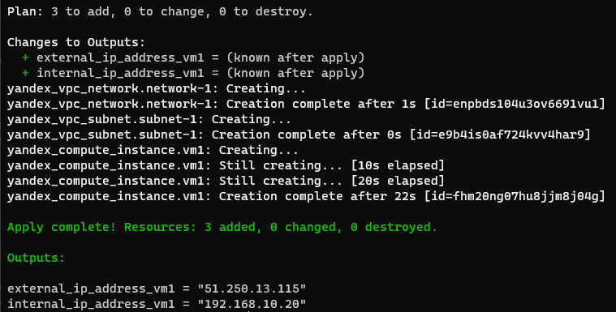

## Задача 1 (вариант с AWS). Регистрация в aws и знакомство с основами (необязательно, но крайне желательно).

Остальные задания можно будет выполнять и без этого аккаунта, но с ним можно будет увидеть полный цикл процессов. 

AWS предоставляет достаточно много бесплатных ресурсов в первый год после регистрации, подробно описано [здесь](https://aws.amazon.com/free/).
1. Создайте аккаут aws.
1. Установите c aws-cli https://aws.amazon.com/cli/.
1. Выполните первичную настройку aws-sli https://docs.aws.amazon.com/cli/latest/userguide/cli-configure-quickstart.html.
1. Создайте IAM политику для терраформа c правами
    * AmazonEC2FullAccess
    * AmazonS3FullAccess
    * AmazonDynamoDBFullAccess
    * AmazonRDSFullAccess
    * CloudWatchFullAccess
    * IAMFullAccess
1. Добавьте переменные окружения 
    ```
    export AWS_ACCESS_KEY_ID=(your access key id)
    export AWS_SECRET_ACCESS_KEY=(your secret access key)
    ```
1. Создайте, остановите и удалите ec2 инстанс (любой с пометкой `free tier`) через веб интерфейс. 

В виде результата задания приложите вывод команды `aws configure list`.

### Ответ

- При невозможности привязать карту выполнение задания по части ec2 инстанса и IAM политики оказалось нереальным
- Вывод команды `aws configure list`
   ```bash
   root@ubuntuvm:~/07_02# aws configure list
         Name                    Value             Type    Location
         ----                    -----             ----    --------
      profile                <not set>             None    None
   access_key     ****************GHRC              env
   secret_key     ****************ZPXn              env
       region                us-west-2      config-file    ~/.aws/config 
   ```

## Задача 1 (Вариант с Yandex.Cloud). Регистрация в ЯО и знакомство с основами (необязательно, но крайне желательно).

1. Подробная инструкция на русском языке содержится [здесь](https://cloud.yandex.ru/docs/solutions/infrastructure-management/terraform-quickstart).
2. Обратите внимание на период бесплатного использования после регистрации аккаунта. 
3. Используйте раздел "Подготовьте облако к работе" для регистрации аккаунта. Далее раздел "Настройте провайдер" для подготовки
базового терраформ конфига.
4. Воспользуйтесь [инструкцией](https://registry.terraform.io/providers/yandex-cloud/yandex/latest/docs) на сайте терраформа, что бы 
не указывать авторизационный токен в коде, а терраформ провайдер брал его из переменных окружений.

### Ответ

- Что бы не указывать не указывать авторизационный токен в коде надо воспользоваться следующей командой
   ```bash
   export YC_TOKEN=`yc iam create-token`
   ```

## Задача 2. Создание aws ec2 или yandex_compute_instance через терраформ. 

1. В каталоге `terraform` вашего основного репозитория, который был создан в начале курсе, создайте файл `main.tf` и `versions.tf`.
2. Зарегистрируйте провайдер 
   1. для [aws](https://registry.terraform.io/providers/hashicorp/aws/latest/docs). В файл `main.tf` добавьте
   блок `provider`, а в `versions.tf` блок `terraform` с вложенным блоком `required_providers`. Укажите любой выбранный вами регион 
   внутри блока `provider`.
   2. либо для [yandex.cloud](https://registry.terraform.io/providers/yandex-cloud/yandex/latest/docs). Подробную инструкцию можно найти 
   [здесь](https://cloud.yandex.ru/docs/solutions/infrastructure-management/terraform-quickstart).
3. Внимание! В гит репозиторий нельзя пушить ваши личные ключи доступа к аккаунту. Поэтому в предыдущем задании мы указывали
их в виде переменных окружения. 
4. В файле `main.tf` воспользуйтесь блоком `data "aws_ami` для поиска ami образа последнего Ubuntu.  
5. В файле `main.tf` создайте рессурс 
   1. либо [ec2 instance](https://registry.terraform.io/providers/hashicorp/aws/latest/docs/resources/instance).
   Постарайтесь указать как можно больше параметров для его определения. Минимальный набор параметров указан в первом блоке 
   `Example Usage`, но желательно, указать большее количество параметров.
   2. либо [yandex_compute_image](https://registry.terraform.io/providers/yandex-cloud/yandex/latest/docs/resources/compute_image).
6. Также в случае использования aws:
   1. Добавьте data-блоки `aws_caller_identity` и `aws_region`.
   2. В файл `outputs.tf` поместить блоки `output` с данными об используемых в данный момент: 
       * AWS account ID,
       * AWS user ID,
       * AWS регион, который используется в данный момент, 
       * Приватный IP ec2 инстансы,
       * Идентификатор подсети в которой создан инстанс.  
7. Если вы выполнили первый пункт, то добейтесь того, что бы команда `terraform plan` выполнялась без ошибок. 


В качестве результата задания предоставьте:
1. Ответ на вопрос: при помощи какого инструмента (из разобранных на прошлом занятии) можно создать свой образ ami?
2. Ссылку на репозиторий с исходной конфигурацией терраформа.  

### Ответ

- Создать свой образ ami можно при помощи Packer
- Конфигурация terraform
  - [main.tf](07-terraform-02-syntax/terraform/main.tf)
  - [outputs.tf](07-terraform-02-syntax/terraform/outputs.tf)
  - [versions.tf](07-terraform-02-syntax/terraform/versions.tf)

- Развернул конфигурацию
   ```bash
   root@ubuntuvm:~/07_02/terraform# terraform init
   ```
   ```bash
   root@ubuntuvm:~/07_02/terraform# terraform validate
   Success! The configuration is valid.
   ```
   ```bash
   export YC_TOKEN=`yc iam create-token`
   ```
   ```bash
   root@ubuntuvm:~/07_02/terraform# terraform plan
   ```
   ```bash
   root@ubuntuvm:~/07_02/terraform# terraform apply -auto-approve
   ```
     

- Долго пытался понять причину возникновения ошибки вида `InvalidArgument desc = Request validation error: BootDiskSpec: DiskSpec: Name: invalid resource name` пока 
не понял, что нельзя использовать нижний пробел `_` в именах ресурсов
- Удалил ресурсы
   ```bash
   root@ubuntuvm:~/07_02/terraform# terraform destroy -auto-approve
   ```