## Задача 1. Создадим бэкэнд в S3 (необязательно, но крайне желательно).

Если в рамках предыдущего задания у вас уже есть аккаунт AWS, то давайте продолжим знакомство со взаимодействием
терраформа и aws. 

1. Создайте s3 бакет, iam роль и пользователя от которого будет работать терраформ. Можно создать отдельного пользователя,
а можно использовать созданного в рамках предыдущего задания, просто добавьте ему необходимы права, как описано 
[здесь](https://www.terraform.io/docs/backends/types/s3.html).
1. Зарегистрируйте бэкэнд в терраформ проекте как описано по ссылке выше. 

### Ответ

- Создал в отдельном каталоге [main.tf](07-terraform-03-basic/mk_backet/main.tf) для создания бакета
- Получил ключи сервис аккаунту для работы с S3 хранилищем
   ```bash
   root@ubuntuvm:~/07_03/terraform/mk_backet# yc iam access-key create --service-account-id aje74us3u21t4...
   access_key:
     id: ajeea4b9ep9up1fpifhe
     service_account_id: aje74us3u21t4...
     created_at: "2022-03-19T19:33:01.768877951Z"
     key_id: YCA...DtZ
   secret: YCO...wqC
   ```
- Поместил ключи и токен в `env`
   ```bash
   export YC_TOKEN=`yc iam create-token`
   export YC_STORAGE_ACCESS_KEY='YCA...DtZ'
   export YC_STORAGE_SECRET_KEY='YCO...wqC'
   ```
  - Вообще по [доке яндекса](https://cloud.yandex.ru/docs/iam/operations/iam-token/create) для IAM токена нужно 
  пользоваться переменной `IAM_TOKEN`, но terraform почему-то её не съедает и в [его доке](https://registry.terraform.io/providers/yandex-cloud/yandex/latest/docs) 
  написано, что нужно пользоваться `YC_TOKEN` для использования IAM токена и тогда всё работает
- Выполнил `init`, `plan`, `apply`
   ```bash
   root@ubuntuvm:~/07_03/terraform/mk_backet# terraform apply -auto-approve
   
   Terraform used the selected providers to generate the following execution plan. Resource actions are indicated with the
   following symbols:
     + create
   
   Terraform will perform the following actions:
   
     # yandex_storage_bucket.netology will be created
     + resource "yandex_storage_bucket" "netology" {
         + acl                = "private"
         + bucket             = "netology-terraform"
         + bucket_domain_name = (known after apply)
         + force_destroy      = false
         + id                 = (known after apply)
         + website_domain     = (known after apply)
         + website_endpoint   = (known after apply)
   
         + versioning {
             + enabled = (known after apply)
           }
       }
   
   Plan: 1 to add, 0 to change, 0 to destroy.
   yandex_storage_bucket.netology: Creating...
   yandex_storage_bucket.netology: Creation complete after 1s [id=netology-terraform]
   
   Apply complete! Resources: 1 added, 0 changed, 0 destroyed. 
   ```
  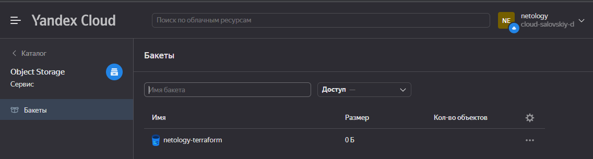

## Задача 2. Инициализируем проект и создаем воркспейсы. 

1. Выполните `terraform init`:
    * если был создан бэкэнд в S3, то терраформ создат файл стейтов в S3 и запись в таблице 
dynamodb.
    * иначе будет создан локальный файл со стейтами.  
1. Создайте два воркспейса `stage` и `prod`.
1. В уже созданный `aws_instance` добавьте зависимость типа инстанса от вокспейса, что бы в разных ворскспейсах 
использовались разные `instance_type`.
1. Добавим `count`. Для `stage` должен создаться один экземпляр `ec2`, а для `prod` два. 
1. Создайте рядом еще один `aws_instance`, но теперь определите их количество при помощи `for_each`, а не `count`.
1. Что бы при изменении типа инстанса не возникло ситуации, когда не будет ни одного инстанса добавьте параметр
жизненного цикла `create_before_destroy = true` в один из рессурсов `aws_instance`.
1. При желании поэкспериментируйте с другими параметрами и рессурсами.

В виде результата работы пришлите:
* Вывод команды `terraform workspace list`.
* Вывод команды `terraform plan` для воркспейса `prod`.  

### Ответ

- Создал проект и поместил файл стейтов в бэкэнд S3
  - [main.tf](07-terraform-03-basic/terraform/main.tf)
  - [versions.tf](07-terraform-03-basic/terraform/versions.tf)
  - [s3.tf](07-terraform-03-basic/terraform/s3.tf)
    - Почему-то для создания бакета `access_key` `secret_key` необходимо брать из `YC_STORAGE_ACCESS_KEY` и `YC_STORAGE_ACCESS_KEY` 
    соответсвенно, а вот уже при использовании бакета для бекенда надо пользоваться `AWS_ACCESS_KEY_ID` и `AWS_SECRET_ACCESS_KEY`
  - [outputs.tf](07-terraform-03-basic/terraform/outputs.tf)
    - Поупражнялся в организации удобочитаемого вывода при использовании `count`
- Выполнил `terraform init`  
    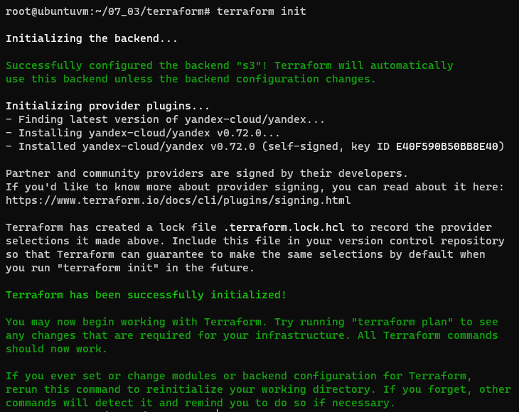
- Создал два воркспейса
    ```bash
    root@ubuntuvm:~/07_03/terraform# terraform workspace new stage
    root@ubuntuvm:~/07_03/terraform# terraform workspace new prod
    ```
- В `yandex_compute_instance.instance-1` добавлена зависимость железа и `count` от воркспейса
- Выполнил `terraform plan` и `terraform apply` для проверки
    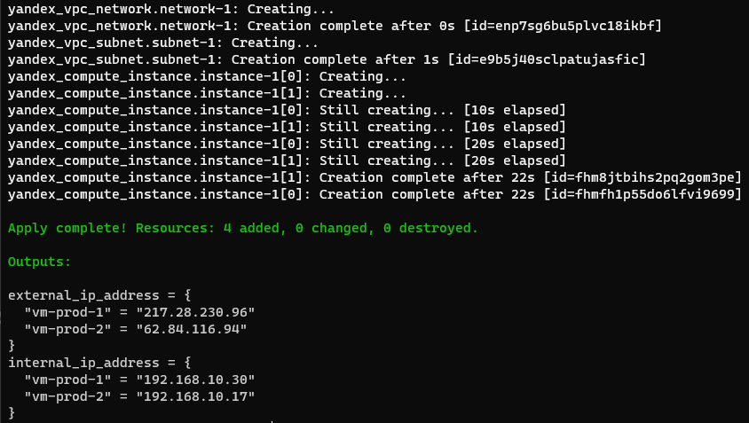
- Добавил `yandex_compute_instance.instance-2` с переопределением количества ресурсов и нод при помощи `for_each`
- В `instance-1` добавил `create_before_destroy = true`
- Вывод команды `terraform workspace list`  
    ```bash
    root@ubuntuvm:~/07_03/terraform# terraform workspace list
      default
    * prod
      stage
    ```
- Вывод команды `terraform plan` для воркспейса `prod`  
    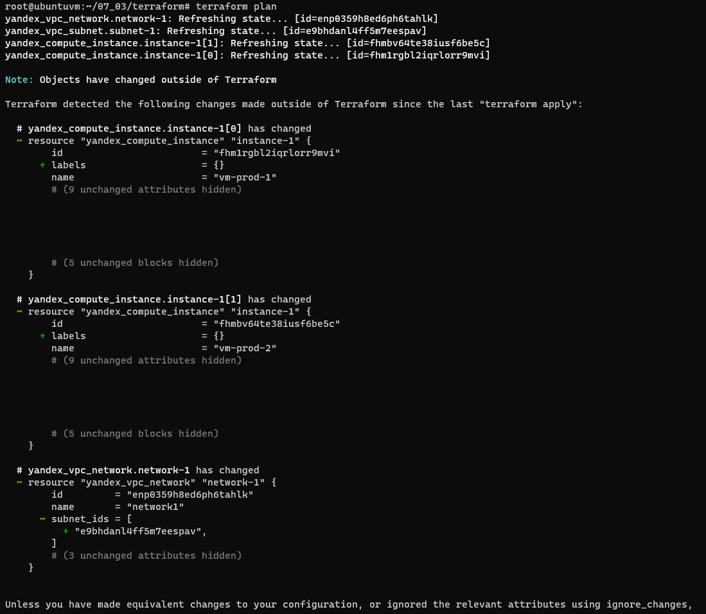  
    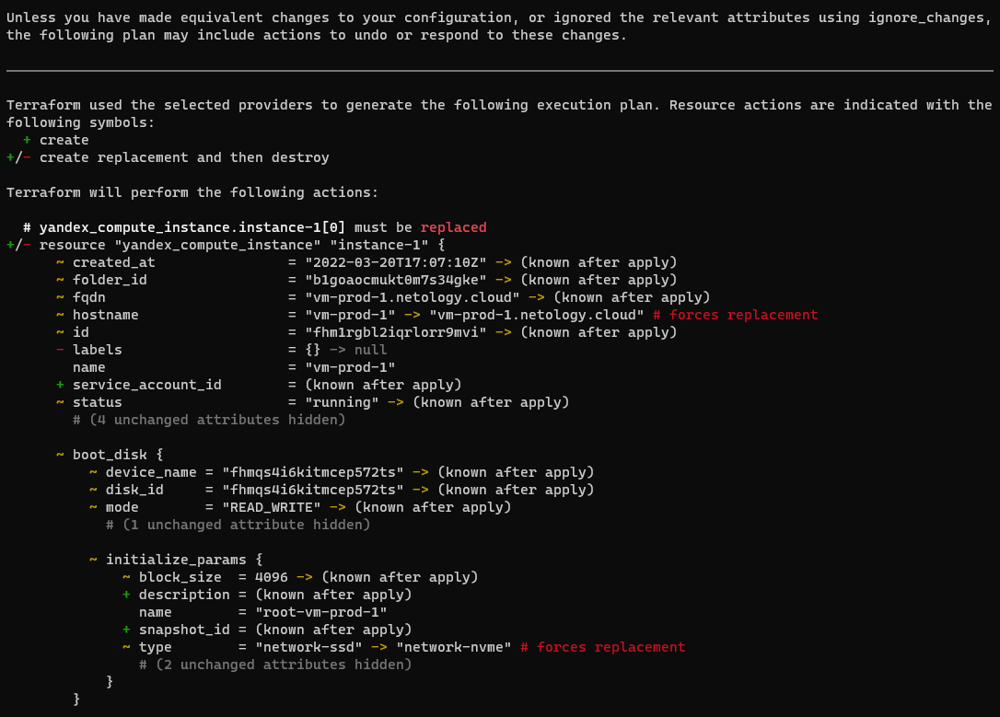  
    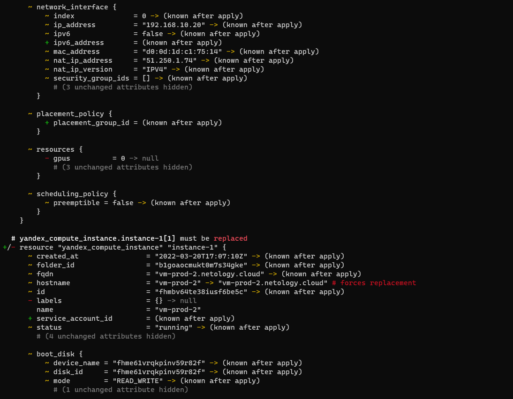  
    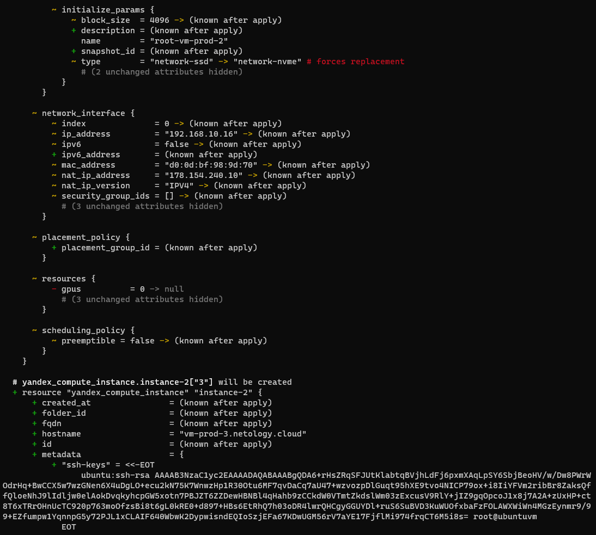  
    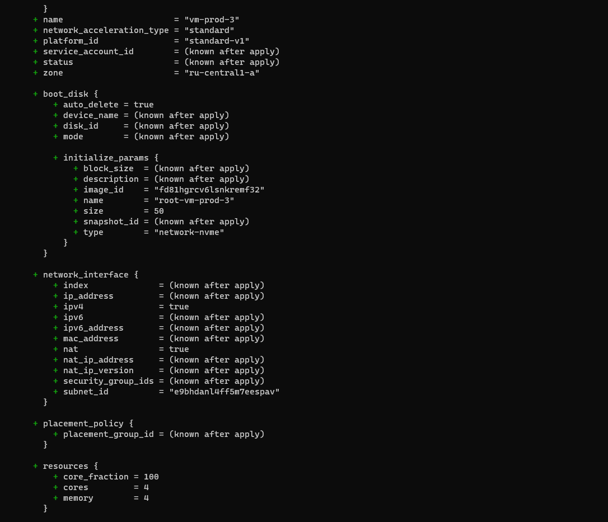  
    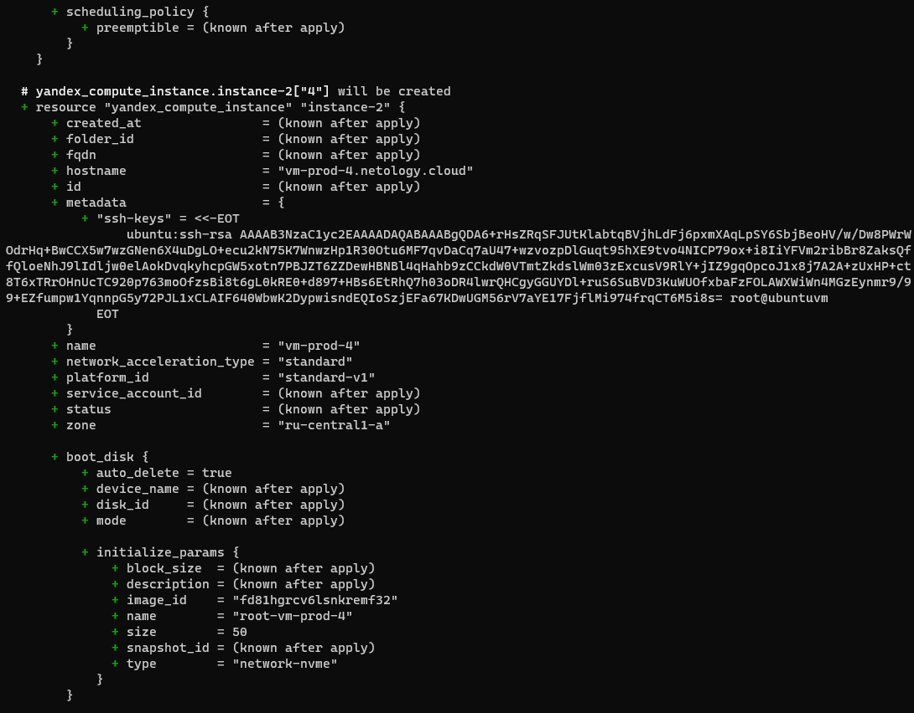  
    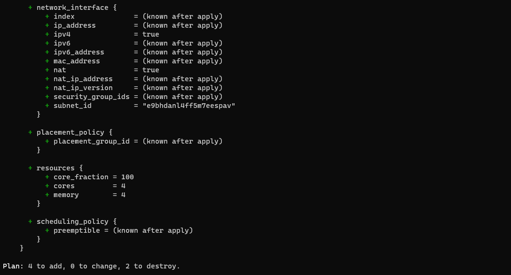  
    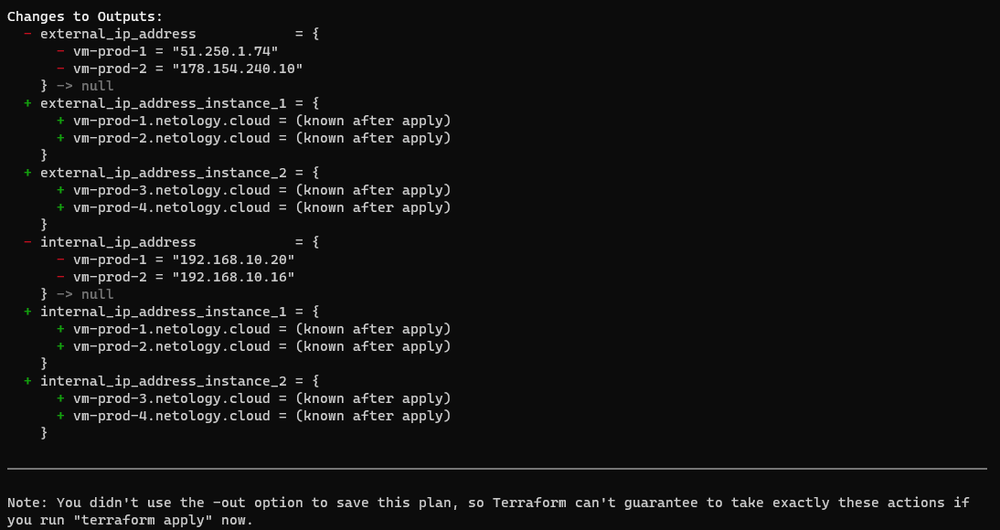  
- С `terraform apply` возникли проблемы при использовании `create_before_destroy = true` т.к. упёрся в лимит `The limit on total size of network-ssd disks has exceeded`, 
но если его опустить то всё деплоится
    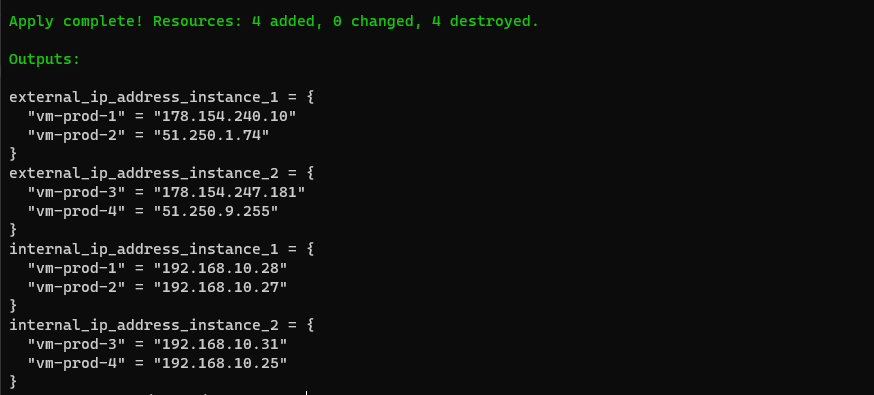
    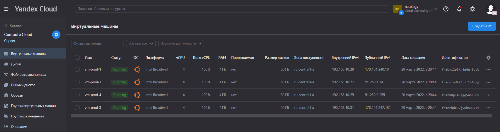
- P.s.: ещё при использовании `create_before_destroy = true` столкнулся с проблемой `AlreadyExists desc = Instance with hostname vm-prod-2.netology.cloud already connected to this network`, 
но так и не придумал/ненагуглил как можно было бы её обойти, поэтому для `instance-1` коментировал `hostname` при попытке 
передеплоить с `create_before_destroy = true`
  - Возможно это можно было бы обыграть при помощи чего-то подобного вместо использования `hostname`:
    ```bash
    provisioner "remote-exec" {
      inline = ["sudo hostnamectl set-hostname friendly.example.com"]
    } 
    ```