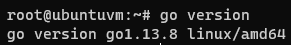
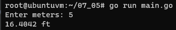
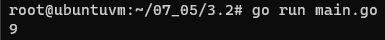
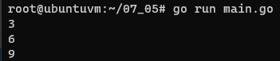
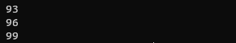

## Задача 1. Установите golang.
1. Воспользуйтесь инструкций с официального сайта: [https://golang.org/](https://golang.org/).
2. Так же для тестирования кода можно использовать песочницу: [https://play.golang.org/](https://play.golang.org/).

### Ответ
- Установил через `apt install golang`  
  

## Задача 2. Знакомство с gotour.
У Golang есть обучающая интерактивная консоль [https://tour.golang.org/](https://tour.golang.org/). 
Рекомендуется изучить максимальное количество примеров. В консоли уже написан необходимый код, 
осталось только с ним ознакомиться и поэкспериментировать как написано в инструкции в левой части экрана.  

## Задача 3. Написание кода. 
Цель этого задания закрепить знания о базовом синтаксисе языка. Можно использовать редактор кода 
на своем компьютере, либо использовать песочницу: [https://play.golang.org/](https://play.golang.org/).

1. Напишите программу для перевода метров в футы (1 фут = 0.3048 метр). Можно запросить исходные данные 
у пользователя, а можно статически задать в коде.
    Для взаимодействия с пользователем можно использовать функцию `Scanf`:
    ```
    package main
    
    import "fmt"
    
    func main() {
        fmt.Print("Enter a number: ")
        var input float64
        fmt.Scanf("%f", &input)
    
        output := input * 2
    
        fmt.Println(output)    
    }
    ```
 
---
### Ответ

- Код в целом уже описан в задании, поправил конвертацию [main.go](07-terraform-05-golang/3.1/main.go)  
- 

---

2. Напишите программу, которая найдет наименьший элемент в любом заданном списке, например:
    ```
    x := []int{48,96,86,68,57,82,63,70,37,34,83,27,19,97,9,17,}
    ```
   
---
### Ответ

- В Go нет встроенной функции для определения максимального или минимального значения, самый лучший вариант делать 
это с помощью цикла [main.go](07-terraform-05-golang/3.2/main.go)  
- 

---

3. Напишите программу, которая выводит числа от 1 до 100, которые делятся на 3. То есть `(3, 6, 9, …)`.

В виде решения ссылку на код или сам код. 

---
### Ответ

- Программа состоит из двух функций [main.go](07-terraform-05-golang/3.3/main.go)  
  - `createNumbers(1, 100)` - генерирует массив от 1 до 100. Как оказалось в Go нельзя просто взять и объявить массив `[1..100]`, надо писать функцию
  - `main()` - производит непосредственно поиск чисел кратных 3 в массиве
  - Можно было бы и в рамках одного цикла/функции сделать вычисление без создания массива, но мне показалось так познавательнее  
    
  ...  
  
  
---

## Задача 4. Протестировать код (не обязательно).

Создайте тесты для функций из предыдущего задания. 