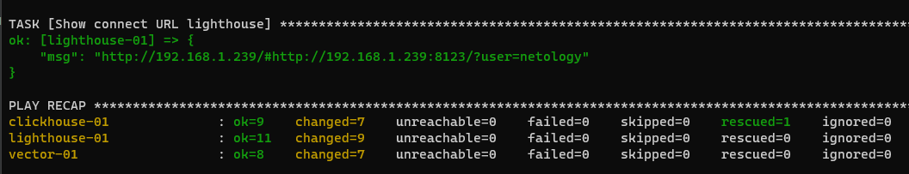

## Подготовка к выполнению
1. Создайте два пустых публичных репозитория в любом своём проекте: vector-role и lighthouse-role.
2. Добавьте публичную часть своего ключа к своему профилю в github.

## Основная часть

Наша основная цель - разбить наш playbook на отдельные roles. Задача: сделать roles для clickhouse, vector и lighthouse и написать playbook для использования этих ролей. Ожидаемый результат: существуют три ваших репозитория: два с roles и один с playbook.

1. Создать в старой версии playbook файл `requirements.yml` и заполнить его следующим содержимым:

   ```yaml
   ---
     - src: git@github.com:AlexeySetevoi/ansible-clickhouse.git
       scm: git
       version: "1.11.0"
       name: clickhouse 
   ```

2. При помощи `ansible-galaxy` скачать себе эту роль.
3. Создать новый каталог с ролью при помощи `ansible-galaxy role init vector-role`.
4. На основе tasks из старого playbook заполните новую role. Разнесите переменные между `vars` и `default`. 
5. Перенести нужные шаблоны конфигов в `templates`.
6. Описать в `README.md` обе роли и их параметры.
7. Повторите шаги 3-6 для lighthouse. Помните, что одна роль должна настраивать один продукт.
8. Выложите все roles в репозитории. Проставьте тэги, используя семантическую нумерацию Добавьте roles в `requirements.yml` в playbook.
9. Переработайте playbook на использование roles. Не забудьте про зависимости lighthouse и возможности совмещения `roles` с `tasks`.
10. Выложите playbook в репозиторий.
11. В ответ приведите ссылки на оба репозитория с roles и одну ссылку на репозиторий с playbook.

### Ответ

- Создал роли
   ```bash
   root@ubuntuvm:~/08_04/vector-role# ansible-galaxy role init vector-role
   - Role vector-role was created successfully
   
    root@ubuntuvm:~/08_04/lighthouse-role# ansible-galaxy role init lighthouse-role
   - Role lighthouse-role was created successfully
   
   root@ubuntuvm:~/08_04/clickhouse-role# ansible-galaxy role init clickhouse-role
   - Role clickhouse-role was created successfully
   ```
  - Роль для clickhouse взял свою, т.к. там уже всё сконфигурровано для работы стека
- Наполнил роли:
  - [vector-role](https://github.com/danilabar/vector-role)
  - [lighthouse-role](https://github.com/danilabar/lighthouse-role)
  - [clickhouse-role](https://github.com/danilabar/clickhouse-role)
- Переработал [Playbook](https://github.com/danilabar/08-ansible-02-playbook/blob/main/site.yml) на использование ролей
- Добавил файл [requirements.yml](https://github.com/danilabar/08-ansible-02-playbook/blob/main/requirements.yml)
- Установил роли
    ```bash
    root@ubuntuvm:~/08_04/08-ansible-02-playbook# ansible-galaxy install -r requirements.yml -p roles
    Starting galaxy role install process
    - extracting clickhouse-role to /root/08_04/08-ansible-02-playbook/roles/clickhouse-role
    - clickhouse-role (0.1.0) was installed successfully
    - extracting vector-role to /root/08_04/08-ansible-02-playbook/roles/vector-role
    - vector-role (0.1.0) was installed successfully
    - extracting lighthouse-role to /root/08_04/08-ansible-02-playbook/roles/lighthouse-role
    - lighthouse-role (0.1.0) was installed successfully 
    ```
- Запустил playbook, он успешно выполнился
  ```bash
  root@ubuntuvm:~/08_04/08-ansible-02-playbook# ansible-playbook site.yml -i inventory/test.yml
  ```
  