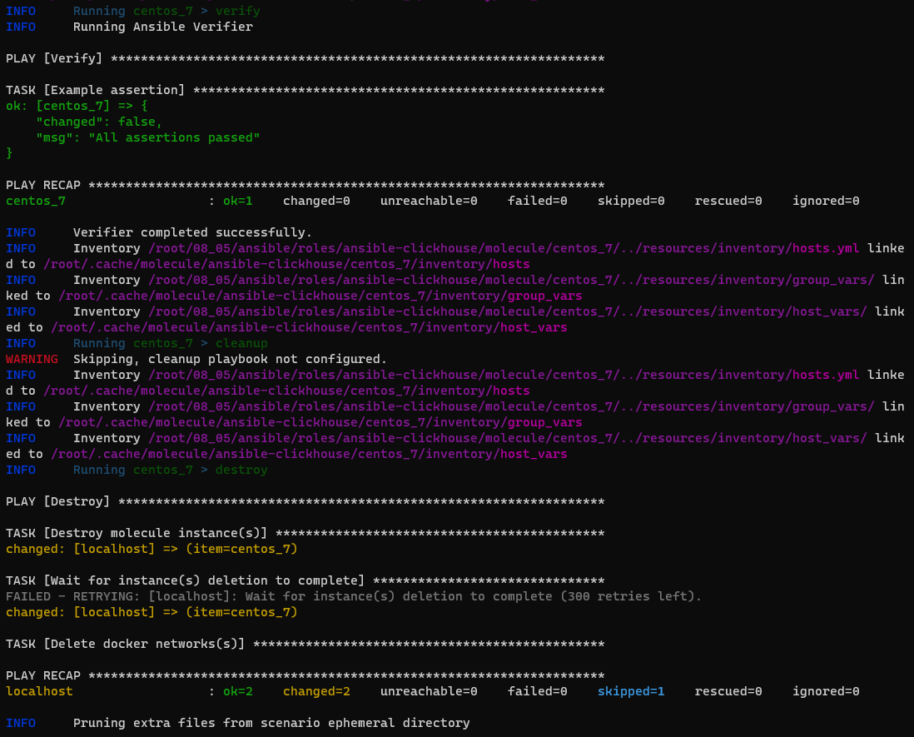
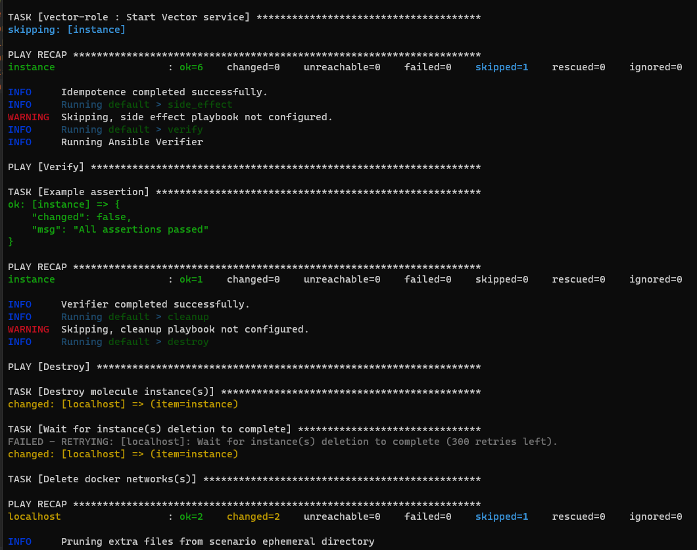
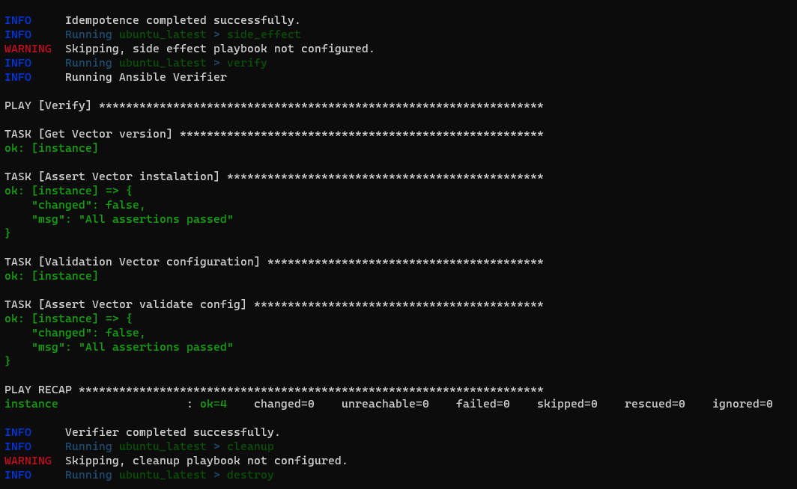
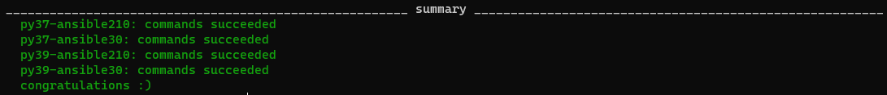
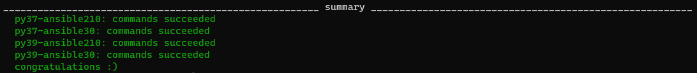

## Подготовка к выполнению
1. Установите molecule: `pip3 install "molecule==3.4.0"`
2. Соберите локальный образ на основе [Dockerfile](https://github.com/netology-code/mnt-homeworks/blob/MNT-13/08-ansible-05-testing/Dockerfile)

## Основная часть

Наша основная цель - настроить тестирование наших ролей. Задача: сделать сценарии тестирования для vector. Ожидаемый результат: все сценарии успешно проходят тестирование ролей.

### Molecule

1. Запустите  `molecule test -s centos_7` внутри корневой директории clickhouse-role, посмотрите на вывод команды.
2. Перейдите в каталог с ролью vector-role и создайте сценарий тестирования по умолчанию при помощи `molecule init scenario --driver-name docker`.
3. Добавьте несколько разных дистрибутивов (centos:8, ubuntu:latest) для инстансов и протестируйте роль, исправьте найденные ошибки, если они есть.
4. Добавьте несколько assert'ов в verify.yml файл для  проверки работоспособности vector-role (проверка, что конфиг валидный, проверка успешности запуска, etc). Запустите тестирование роли повторно и проверьте, что оно прошло успешно.
5. Добавьте новый тег на коммит с рабочим сценарием в соответствии с семантическим версионированием.

### Tox

1. Добавьте в директорию с vector-role файлы из [директории](08-ansible-05-testing/example)
2. Запустите `docker run --privileged=True -v <path_to_repo>:/opt/vector-role -w /opt/vector-role -it <image_name> /bin/bash`, где path_to_repo - путь до корня репозитория с vector-role на вашей файловой системе.
3. Внутри контейнера выполните команду `tox`, посмотрите на вывод.
5. Создайте облегчённый сценарий для `molecule`. Проверьте его на исполнимость.
6. Пропишите правильную команду в `tox.ini` для того чтобы запускался облегчённый сценарий.
8. Запустите команду `tox`. Убедитесь, что всё отработало успешно.
9. Добавьте новый тег на коммит с рабочим сценарием в соответствии с семантическим версионированием.

После выполнения у вас должно получится два сценария molecule и один tox.ini файл в репозитории. Ссылка на репозиторий являются ответами на домашнее задание. Не забудьте указать в ответе теги решений Tox и Molecule заданий.

## Необязательная часть

1. Проделайте схожие манипуляции для создания роли lighthouse.
2. Создайте сценарий внутри любой из своих ролей, который умеет поднимать весь стек при помощи всех ролей.
3. Убедитесь в работоспособности своего стека. Создайте отдельный verify.yml, который будет проверять работоспособность интеграции всех инструментов между ними.
4. Выложите свои roles в репозитории. В ответ приведите ссылки.

### Ответ Molecule

- Уствновил роль ansible-clickhouse `ansible-galaxy install -r requirements.yml -p roles`
- Установил molecule: `pip3 install "molecule==3.4.0"`
- Установил lint: `pip3 install "ansible-lint<6.0.0"`
- Установил driver docker: `pip3 install molecule_docker`
- Установил flake8 `pip3 install flake8`
- Запустил  `molecule test -s centos_7`
    
- Создал сценарий тестирования по умолчанию для роли vector-role при помощи `molecule init scenario --driver-name docker`
в репозитории с ролью [vector-role](https://github.com/danilabar/vector-role)
- Запустил сценарий default и он выполнился успешно
    
- Добавил дистрибутив ubuntu `molecule init scenario ubuntu_latest --driver-name docker` и его поддержку в роли
- Добавил несколько assert'ов в verify.yml файл для  проверки работоспособности vector-role
- Провёл тестирование роли на ubuntu `molecule test -s ubuntu_latest`  
    
- Добавил новый тег `0.2.0` на коммит в репозитории [vector-role](https://github.com/danilabar/vector-role/tree/0.2.0)

### Ответ Tox

- Собрал свой Docker образ `docker build -t danilabar/tox:0.1.0 .` из [Dockerfile](/08-ansible-05-testing/Dockerfile)
т.к. предложенный не работает
- Запустил контейнер `docker run --privileged=True --name tox -v /root/08_05/ansible/roles/vector-role/:/opt/vector-role -w /opt/vector-role -d danilabar/tox:0.1.0 /usr/sbin/init && docker exec --privileged=True -it tox /bin/bash`
- Запустил `tox` на сценарии default, и он отработал успешно
    
- Создал облегчённый сценарий для `molecule` centos7_lite `molecule init scenario centos7_lite --driver-name docker`  
    ```yaml
    scenario:
      test_sequence:
        - destroy
        - create
        - converge
        - idempotence
        - verify
        - destroy
    ```
- Прописал правильную команду в `tox.ini` для того чтобы запускался облегчённый сценарий
- Запустил `tox` на сценарии centos7_lite, и он отработал успешно
    
- - Добавил новый тег `0.3.0` на коммит в репозитории [vector-role](https://github.com/danilabar/vector-role/tree/0.3.0)