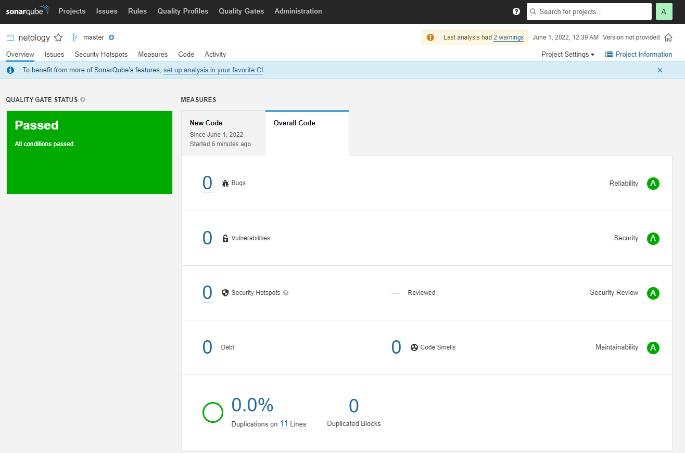
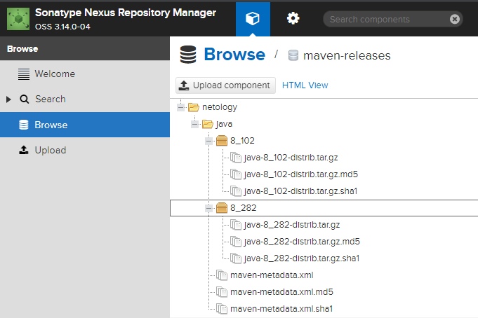

## Подготовка к выполнению

1. Создаём 2 VM в yandex cloud со следующими параметрами: 2CPU 4RAM Centos7(остальное по минимальным требованиям)
2. Прописываем в [inventory](09-ci-03-cicd/source/infrastructure/inventory/cicd/hosts.yml) [playbook'a](09-ci-03-cicd/source/infrastructure/site.yml) созданные хосты
3. Добавляем в [files](09-ci-03-cicd/source/infrastructure/files/) файл со своим публичным ключом (id_rsa.pub). Если ключ называется иначе - найдите таску в плейбуке, которая использует id_rsa.pub имя и исправьте на своё
4. Запускаем playbook, ожидаем успешного завершения
5. Проверяем готовность Sonarqube через [браузер](http://localhost:9000)
6. Заходим под admin\admin, меняем пароль на свой
7.  Проверяем готовность Nexus через [бразуер](http://localhost:8081)
8. Подключаемся под admin\admin123, меняем пароль, сохраняем анонимный доступ

## Знакомоство с SonarQube

### Основная часть

1. Создаём новый проект, название произвольное
2. Скачиваем пакет sonar-scanner, который нам предлагает скачать сам sonarqube
3. Делаем так, чтобы binary был доступен через вызов в shell (или меняем переменную PATH или любой другой удобный вам способ)
4. Проверяем `sonar-scanner --version`
5. Запускаем анализатор против кода из директории [example](09-ci-03-cicd/source/example) с дополнительным ключом `-Dsonar.coverage.exclusions=fail.py`
6. Смотрим результат в интерфейсе
7. Исправляем ошибки, которые он выявил(включая warnings)
8. Запускаем анализатор повторно - проверяем, что QG пройдены успешно
9. Делаем скриншот успешного прохождения анализа, прикладываем к решению ДЗ

## Знакомство с Nexus

### Основная часть

1. В репозиторий `maven-public` загружаем артефакт с GAV параметрами:
   1. groupId: netology
   2. artifactId: java
   3. version: 8_282
   4. classifier: distrib
   5. type: tar.gz
2. В него же загружаем такой же артефакт, но с version: 8_102
3. Проверяем, что все файлы загрузились успешно
4. В ответе присылаем файл `maven-metadata.xml` для этого артефекта

### Знакомство с Maven

### Подготовка к выполнению

1. Скачиваем дистрибутив с [maven](https://maven.apache.org/download.cgi)
2. Разархивируем, делаем так, чтобы binary был доступен через вызов в shell (или меняем переменную PATH или любой другой удобный вам способ)
3. Удаляем из `apache-maven-<version>/conf/settings.xml` упоминание о правиле, отвергающем http соединение( раздел mirrors->id: my-repository-http-unblocker)
4. Проверяем `mvn --version`
5. Забираем директорию [mvn](09-ci-03-cicd/source/mvn) с pom

### Основная часть

1. Меняем в `pom.xml` блок с зависимостями под наш артефакт из первого пункта задания для Nexus (java с версией 8_282)
2. Запускаем команду `mvn package` в директории с `pom.xml`, ожидаем успешного окончания
3. Проверяем директорию `~/.m2/repository/`, находим наш артефакт
4. В ответе присылаем исправленный файл `pom.xml`

### Ответ

- Подготовил инфраструктуру с помощью ansible
- SonarQube
   
- Nexus
   

#### SonarQube

- Создал новый проект `Netology`
- Скачал sonar-scanner
- Сделал, чтобы binary был доступен через вызов в shell `export PATH=$(pwd):$PATH`
- Проверил что работает sonar-scanner
   ```bash
   root@ubuntuvm:~/09_03# sonar-scanner --version
   INFO: Scanner configuration file: /root/09_03/sonar-scanner-4.7.0.2747-linux/conf/sonar-scanner.properties
   INFO: Project root configuration file: NONE
   INFO: SonarScanner 4.7.0.2747
   INFO: Java 11.0.14.1 Eclipse Adoptium (64-bit)
   INFO: Linux 5.13.0-40-generic amd64
   ```
- Запускаем анализатор, исправил ошибки, запустил повторно
   

#### Nexus

- Загрузил в репозиторий артефакт с version 8_282 и 8_102
   
- [maven-metadata.xml](09-ci-03-cicd/maven-metadata.xml)

#### Maven

- Скачиваем дистрибутив с maven
- Разархивировал, сделал, чтобы binary был доступен через вызов в shell `export PATH=$(pwd):$PATH`
- Удалил из `apache-maven-<version>/conf/settings.xml` упоминание о правиле, отвергающем http соединение
- Проверил `mvn --version`  
   ```bash
   root@ubuntuvm:~/09_03/mvn# mvn --version
   Apache Maven 3.8.5 (3599d3414f046de2324203b78ddcf9b5e4388aa0)
   Maven home: /root/09_03/apache-maven-3.8.5
   Java version: 1.8.0_312, vendor: Private Build, runtime: /usr/lib/jvm/java-8-openjdk-amd64/jre
   Default locale: en_US, platform encoding: UTF-8
   OS name: "linux", version: "5.13.0-40-generic", arch: "amd64", family: "unix"
   ```
- Поменял в `pom.xml` блок с зависимостями под мой артефакт
- Проверил директорию `~/.m2/repository/`  
   
- [pom.xml](09-ci-03-cicd/pom.xml)