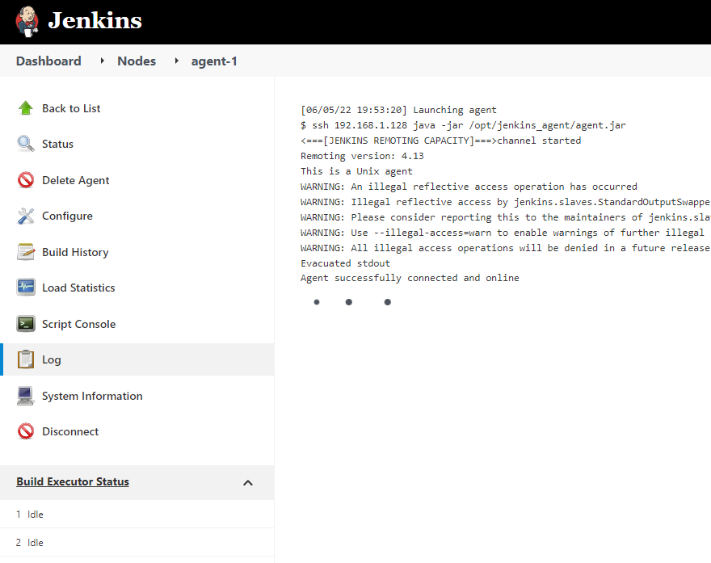
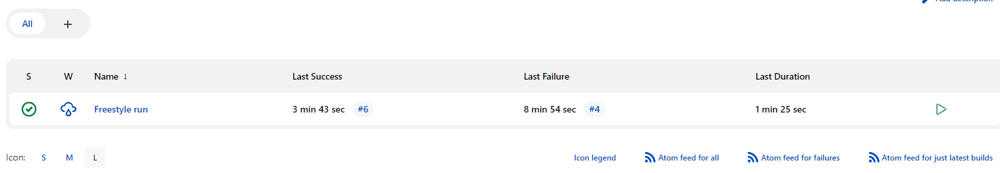
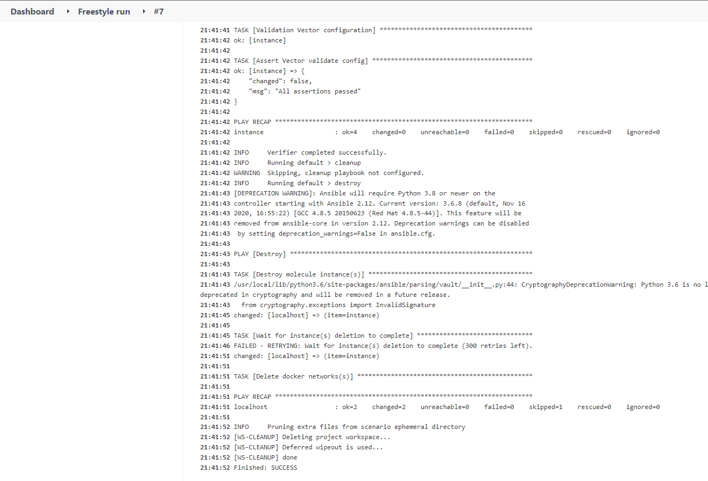
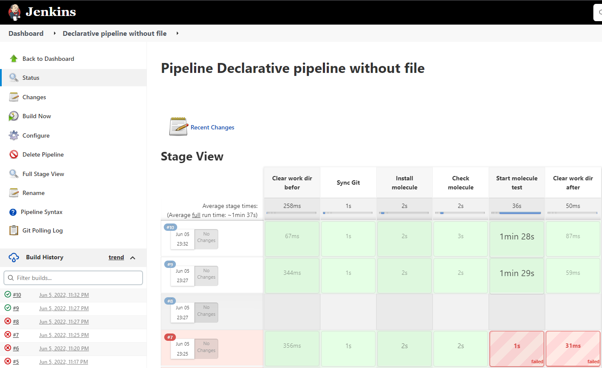
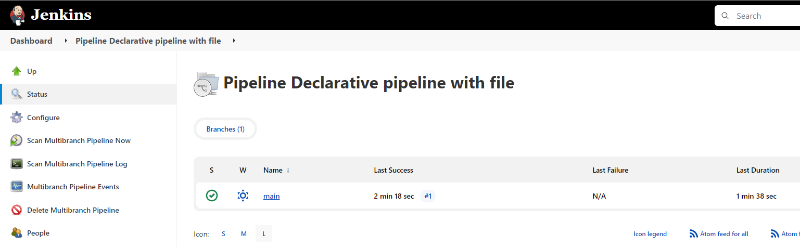
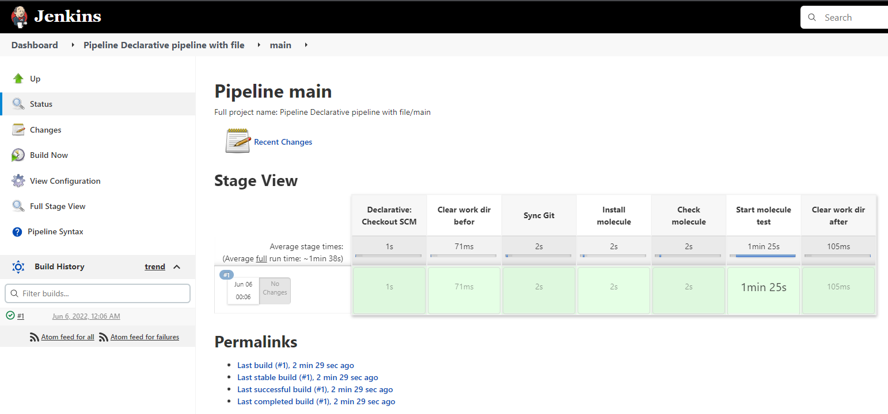
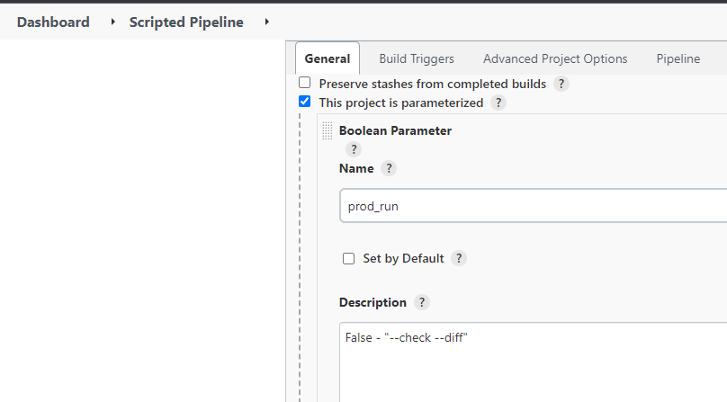
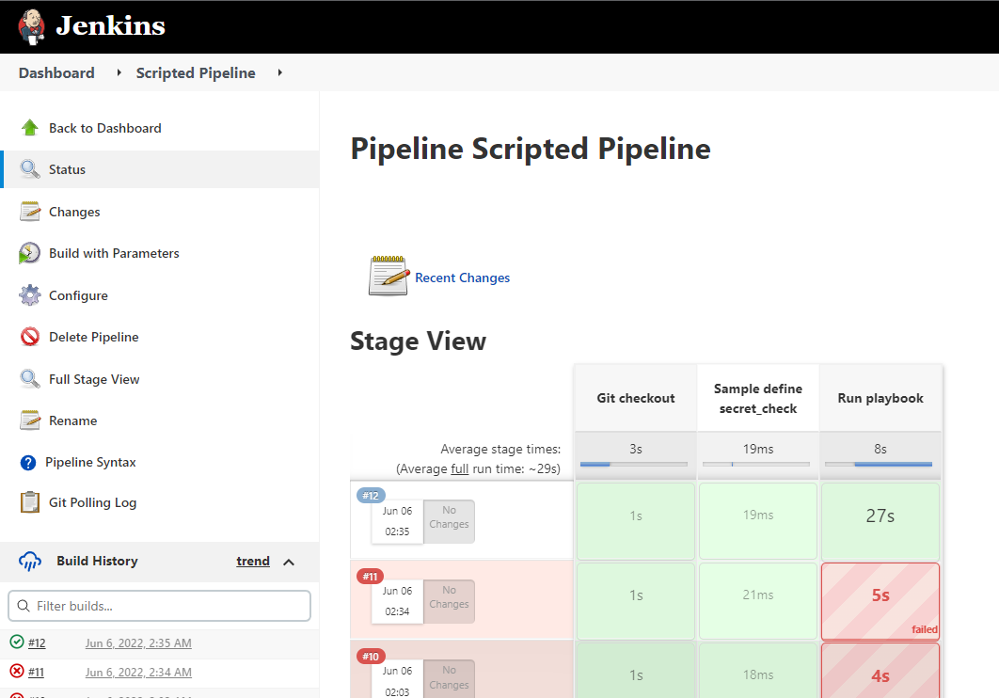

## Подготовка к выполнению

1. Создать 2 VM: для jenkins-master и jenkins-agent.
2. Установить jenkins при помощи playbook'a.
3. Запустить и проверить работоспособность.
4. Сделать первоначальную настройку.

## Основная часть

1. Сделать Freestyle Job, который будет запускать `molecule test` из любого вашего репозитория с ролью.
2. Сделать Declarative Pipeline Job, который будет запускать `molecule test` из любого вашего репозитория с ролью.
3. Перенести Declarative Pipeline в репозиторий в файл `Jenkinsfile`.
4. Создать Multibranch Pipeline на запуск `Jenkinsfile` из репозитория.
5. Создать Scripted Pipeline, наполнить его скриптом из [pipeline](09-ci-04-jenkins/source/pipeline).
6. Внести необходимые изменения, чтобы Pipeline запускал `ansible-playbook` без флагов `--check --diff`, если не установлен параметр при запуске джобы (prod_run = True), по умолчанию параметр имеет значение False и запускает прогон с флагами `--check --diff`.
7. Проверить работоспособность, исправить ошибки, исправленный Pipeline вложить в репозиторий в файл `ScriptedJenkinsfile`.
8. Отправить ссылку на репозиторий с ролью и Declarative Pipeline и Scripted Pipeline.

## Необязательная часть

1. Создать скрипт на groovy, который будет собирать все Job, которые завершились хотя бы раз неуспешно. Добавить скрипт в репозиторий с решением с названием `AllJobFailure.groovy`.
2. Создать Scripted Pipeline таким образом, чтобы он мог сначала запустить через Ya.Cloud CLI необходимое количество инстансов, прописать их в инвентори плейбука и после этого запускать плейбук. Тем самым, мы должны по нажатию кнопки получить готовую к использованию систему.

### Ответ

- Создал 2 ВМ для jenkins-master и jenkins-agent
- Установил jenkins при помощи playbook'a
- Запустил и сделал первоначальную настройку
    
- Сделал Freestyle Job, который запускает `molecule test` из репозитория с ролью `vector-role`  
  - Для `Source Code Management` дополнительно было настроено `Additional Behaviours | Check out to a sub-directory Local subdirectory for repo` 
  в каталог `vector-role` для того, что бы работала molecule, иначе она падала из-за того, что не могла найти роль  
        
        
- Сделал Declarative Pipeline Job, который запускает`molecule test` из репозитория с ролью `vector-role`  
      
- Перенёс Declarative Pipeline в репозиторий в файл [Jenkinsfile](https://github.com/danilabar/vector-role/blob/0.4.0/Jenkinsfile)
- Создал Multibranch Pipeline на запуск `Jenkinsfile` из репозитория
      
      
- Создал Scripted Pipeline с bool параметром prod_run
      
- Проверил работоспособность  
      
- Вложил в репозиторий файл со скриптом [ScriptedJenkinsfile](https://github.com/danilabar/vector-role/blob/0.5.0/ScriptedJenkinsfile)