## Подготовка к выполнению

1. В Ya.Cloud создайте новый инстанс (4CPU4RAM) на основе образа `jetbrains/teamcity-server`
2. Дождитесь запуска teamcity, выполните первоначальную настройку
3. Создайте ещё один инстанс(2CPU4RAM) на основе образа `jetbrains/teamcity-agent`. Пропишите к нему переменную окружения `SERVER_URL: "http://<teamcity_url>:8111"`
4. Авторизуйте агент
5. Сделайте fork [репозитория](https://github.com/aragastmatb/example-teamcity)
6. Создать VM (2CPU4RAM) и запустить [playbook](09-ci-05-teamcity/src/infrastructure)

## Основная часть

1. Создайте новый проект в teamcity на основе fork
2. Сделайте autodetect конфигурации
3. Сохраните необходимые шаги, запустите первую сборку master'a
4. Поменяйте условия сборки: если сборка по ветке `master`, то должен происходит `mvn clean deploy`, иначе `mvn clean test`
5. Для deploy будет необходимо загрузить [settings.xml](09-ci-05-teamcity/src/teamcity/settings.xml) в набор конфигураций maven у teamcity, предварительно записав туда креды для подключения к nexus
6. В pom.xml необходимо поменять ссылки на репозиторий и nexus
7. Запустите сборку по master, убедитесь что всё прошло успешно, артефакт появился в nexus
8. Мигрируйте `build configuration` в репозиторий
9. Создайте отдельную ветку `feature/add_reply` в репозитории
10. Напишите новый метод для класса Welcomer: метод должен возвращать произвольную реплику, содержащую слово `hunter`
11. Дополните тест для нового метода на поиск слова `hunter` в новой реплике
12. Сделайте push всех изменений в новую ветку в репозиторий
13. Убедитесь что сборка самостоятельно запустилась, тесты прошли успешно
14. Внесите изменения из произвольной ветки `feature/add_reply` в `master` через `Merge`
15. Убедитесь, что нет собранного артефакта в сборке по ветке `master`
16. Настройте конфигурацию так, чтобы она собирала `.jar` в артефакты сборки
17. Проведите повторную сборку мастера, убедитесь, что сбора прошла успешно и артефакты собраны
18. Проверьте, что конфигурация в репозитории содержит все настройки конфигурации из teamcity
19. В ответ предоставьте ссылку на репозиторий

### Ответ

- Создал инстансы teamcity и nexus
  - В docker-compose.yml внёс дополнительно `user: root:root` иначе контейнер не запускался с ошибками доступа к каталогам
- Авторизовал агента  
    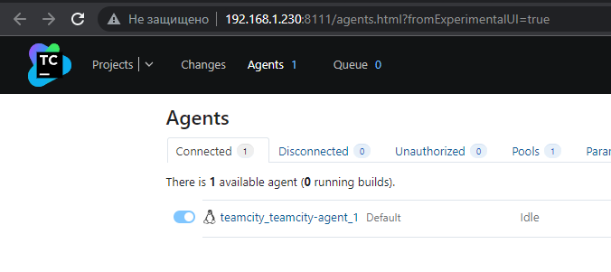
- Сделал fork [репозитория](https://github.com/danilabar/example-teamcity)  
- Создал новый проект в teamcity на основе fork  
    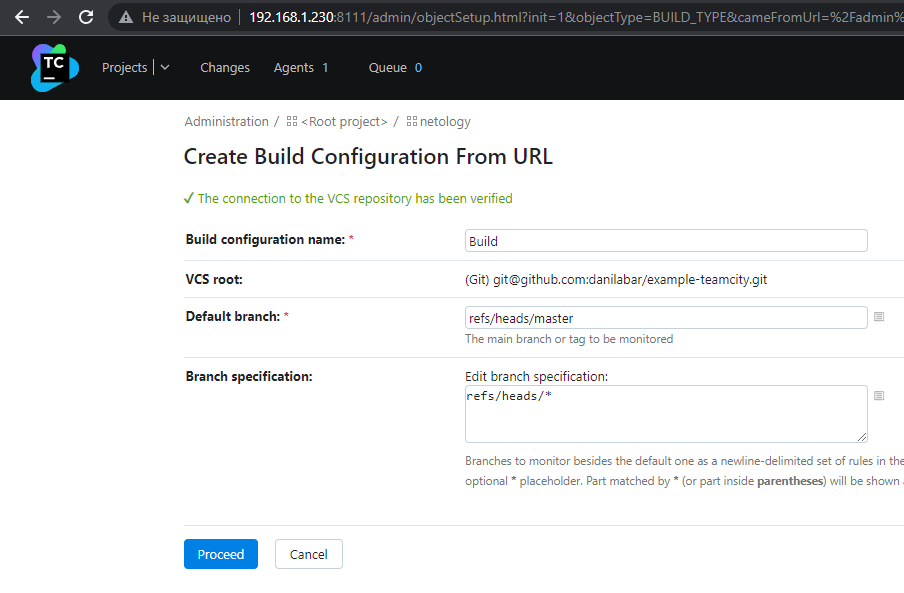
- Сделал autodetect конфигурации  
    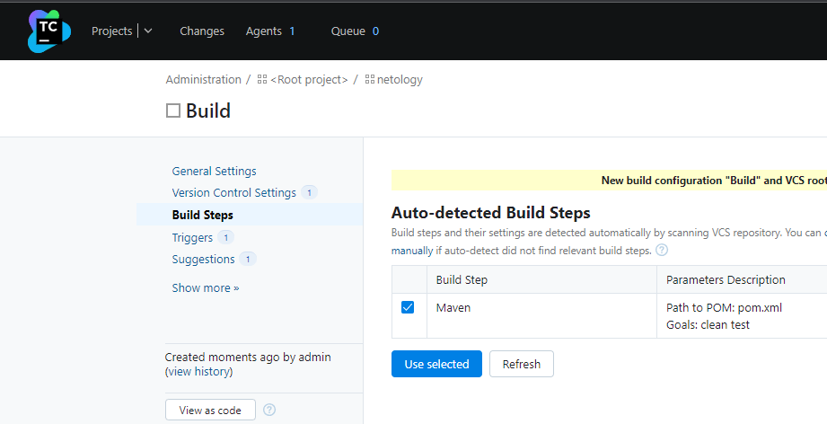
- Запустил первую сборку master  
    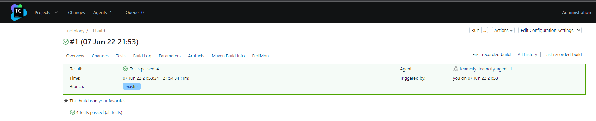
- Поменял условия сборки  
    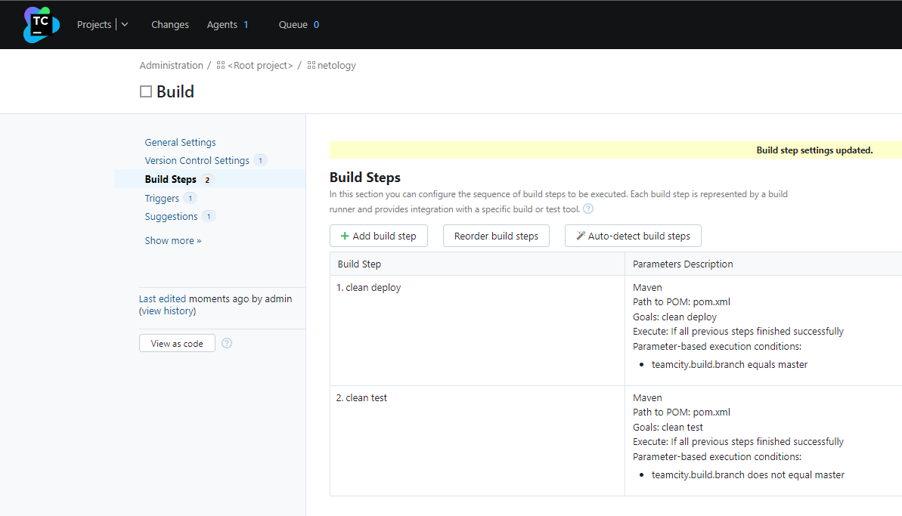
- Загрузил settings.xml в набор конфигураций maven  
    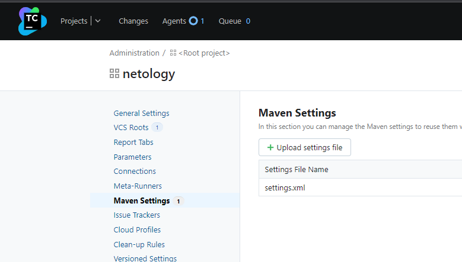
- Поправил pom.xml
- Запустил сборку по master  
    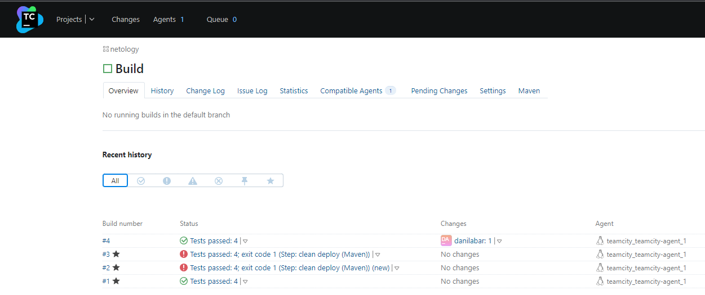
- Артефакт появился в nexus  
    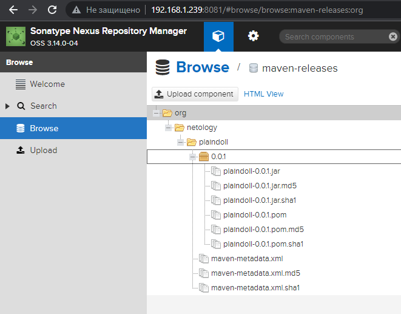
- Мигрировал `build configuration` в репозиторий  
    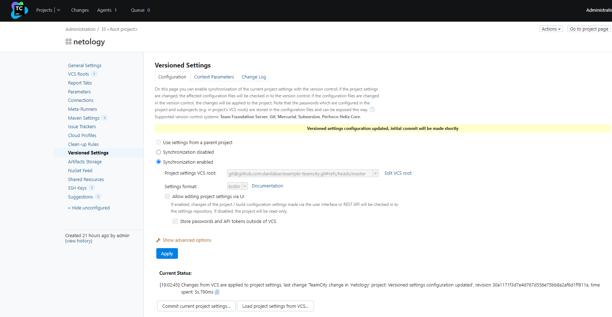
- Создал отдельную ветку `feature/add_reply` в репозитории  
    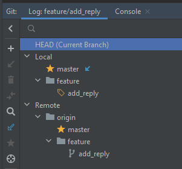
- Написал новый метод `sayAttention` для класса Welcomer
- Дополнил тест для нового метода
- Сделал [push](https://github.com/danilabar/example-teamcity/commit/153851a1d31061b945c86b4a8b04242ef88f35b2) всех изменений 
- Сборка самостоятельно запустилась, тесты прошли успешно  
    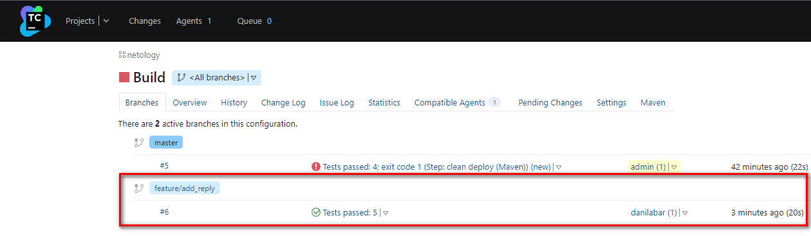  
    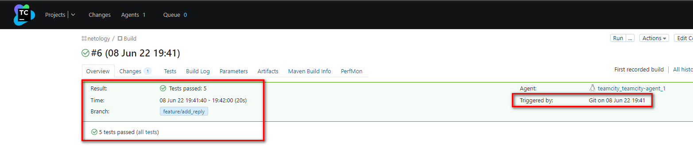  
- Сделал [Pull requests](https://github.com/danilabar/example-teamcity/pull/1) в `master`  
- Убедился, что нет собранного артефакта в сборке по ветке `master`  
    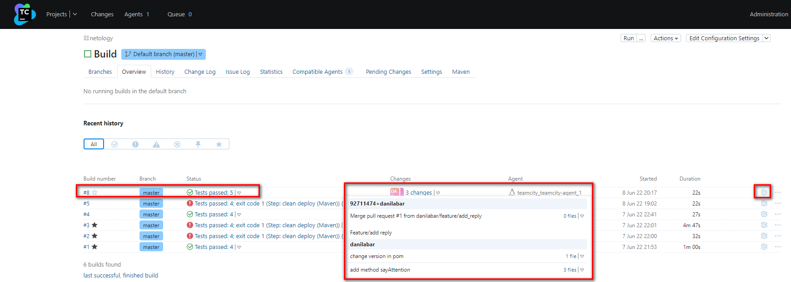
- Настроил конфигурацию, чтобы она собирала `.jar` в артефакты сборки  
    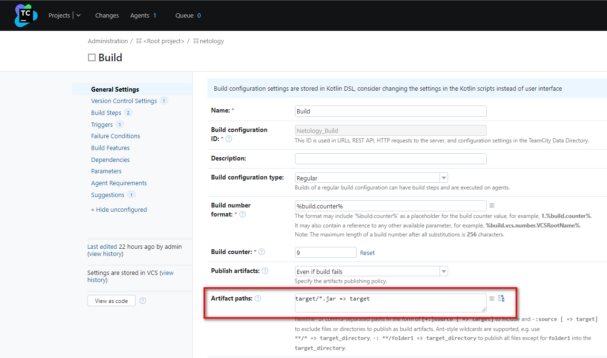
- Провёл повторную сборку мастера, она прошла успешно и артефакты собраны
  - Сборка `#9` зафейлилась т.к. возникла путаница с ветками в IDE после мёржа. Поправил и сборка `#11` прошла успешно  
    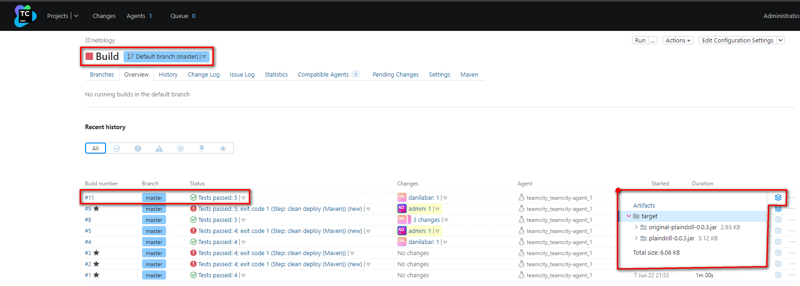  
    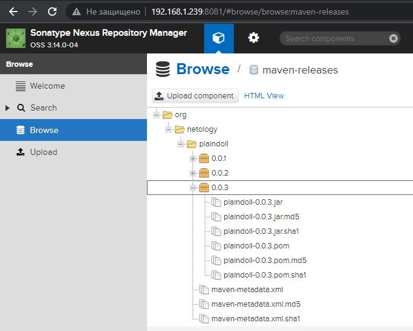  
- Проверил, что конфигурация в [репозитории](https://github.com/danilabar/example-teamcity/tree/master/.teamcity) содержит все настройки конфигурации из teamcity