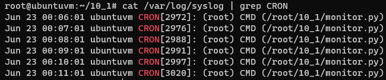
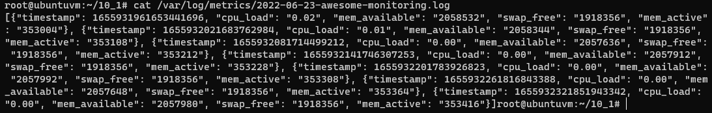

## Обязательные задания

1. Вас пригласили настроить мониторинг на проект. На онбординге вам рассказали, что проект представляет из себя 
платформу для вычислений с выдачей текстовых отчетов, которые сохраняются на диск. Взаимодействие с платформой 
осуществляется по протоколу http. Также вам отметили, что вычисления загружают ЦПУ. Какой минимальный набор метрик вы
выведите в мониторинг и почему?

2. Менеджер продукта посмотрев на ваши метрики сказал, что ему непонятно что такое RAM/inodes/CPUla. Также он сказал, 
что хочет понимать, насколько мы выполняем свои обязанности перед клиентами и какое качество обслуживания. Что вы 
можете ему предложить?

3. Вашей DevOps команде в этом году не выделили финансирование на построение системы сбора логов. Разработчики в свою 
очередь хотят видеть все ошибки, которые выдают их приложения. Какое решение вы можете предпринять в этой ситуации, 
чтобы разработчики получали ошибки приложения?

3. Вы, как опытный SRE, сделали мониторинг, куда вывели отображения выполнения SLA=99% по http кодам ответов. 
Вычисляете этот параметр по следующей формуле: summ_2xx_requests/summ_all_requests. Данный параметр не поднимается выше 
70%, но при этом в вашей системе нет кодов ответа 5xx и 4xx. Где у вас ошибка?

## Дополнительное задание (со звездочкой*) - необязательно к выполнению

Вы устроились на работу в стартап. На данный момент у вас нет возможности развернуть полноценную систему 
мониторинга, и вы решили самостоятельно написать простой python3-скрипт для сбора основных метрик сервера. Вы, как 
опытный системный-администратор, знаете, что системная информация сервера лежит в директории `/proc`. 
Также, вы знаете, что в системе Linux есть  планировщик задач cron, который может запускать задачи по расписанию.

Суммировав все, вы спроектировали приложение, которое:
- является python3 скриптом
- собирает метрики из папки `/proc`
- складывает метрики в файл 'YY-MM-DD-awesome-monitoring.log' в директорию /var/log 
(YY - год, MM - месяц, DD - день)
- каждый сбор метрик складывается в виде json-строки, в виде:
  + timestamp (временная метка, int, unixtimestamp)
  + metric_1 (метрика 1)
  + metric_2 (метрика 2)
  
     ...
     
  + metric_N (метрика N)
  
- сбор метрик происходит каждую 1 минуту по cron-расписанию

Для успешного выполнения задания нужно привести:

а) работающий код python3-скрипта,

б) конфигурацию cron-расписания,

в) пример верно сформированного 'YY-MM-DD-awesome-monitoring.log', имеющий не менее 5 записей,

P.S.: количество собираемых метрик должно быть не менее 4-х.
P.P.S.: по желанию можно себя не ограничивать только сбором метрик из `/proc`.

### Ответ

1. Если руководствоваться правилом, что мониторить только то, что нужно, и не следить за метриками которые вряд-ли
понадобятся, я бы сделал следующий набор:
   1. Метрики утилизации CPU, что бы оценить как сервис его нагружает
   2. Метрики дисковой подсистемы - мониторинг значения очередей, iops и скорости read/write могут показать деградацию диска. 
   Может быть не так актуально, если отчёты сохраняются не к нам на диск
   3. Непосредственно проверка доступности нашего сервиса по http на уровне кодов ответа
   4. Метрики утилизации сетевых интерфейсов - скорость передачи данных, количество соединений, количество отброшенных пакетов, 
   утилизация канала связи. Это поможет оценить нагрузку создаваемую при обращениях к нашему сервису
   5. Дополнительно могут быть полезны:
      1. Метрики RAM
      2. Какие-то бизнес-метрики, например количество всех/уникальных обращений к сервису

2. Предложу заключить SLA об уровне обслуживания, качество которого будет описано в SLO. В качестве метрики предложу SLI, 
  что бы следить за фактически предоставляемом уровне обслуживания.

3. Можно использовать бесплатную облачную версию Sentry, она должна покрыть потребности разработки.

4. Правильная формула расчёта уровня предоставляемого обслуживания выглядит так: `(summ_2xx_requests + summ_3xx_requests)/(summ_all_requests)`  

### Ответ на дополнительное задание

- Написал скрипт по сбору метрик [monitor.py](/10-monitoring-01-base/monitor.py)
- Создал cron-расписание
  - Запустить редактор расписания `crontab -e`
  - Создал расписание для запуска раз в минуту `* * * * * /root/10_1/monitor.py`
  - Посмотреть созданное расписание можно при помощи `crontab -l`
    ```bash
    root@ubuntuvm:~/10_1# crontab -l
    * * * * * /root/10_1/monitor.py
    ```
- cron-расписание работает  
    
- Метрики пишутся  
    
- Пример [YY-MM-DD-awesome-monitoring.log](/10-monitoring-01-base/2022-06-23-awesome-monitoring.log)