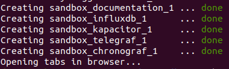
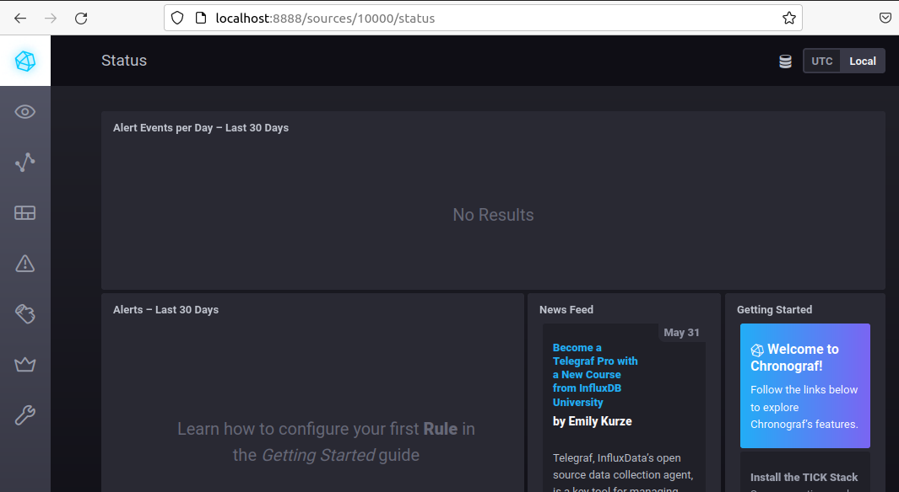
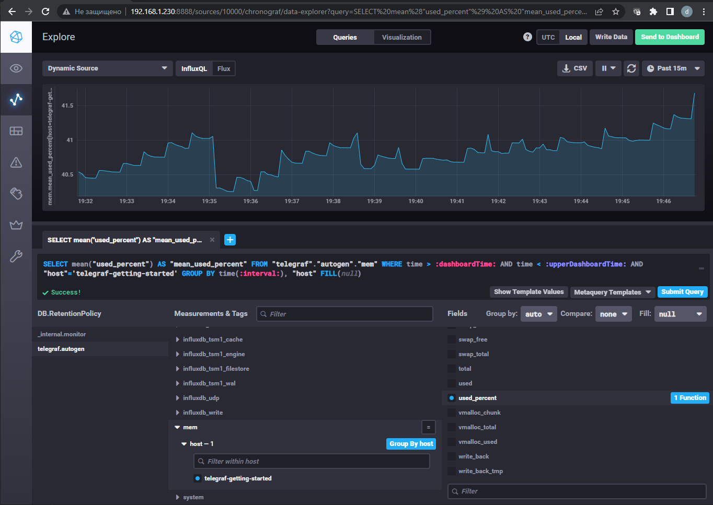
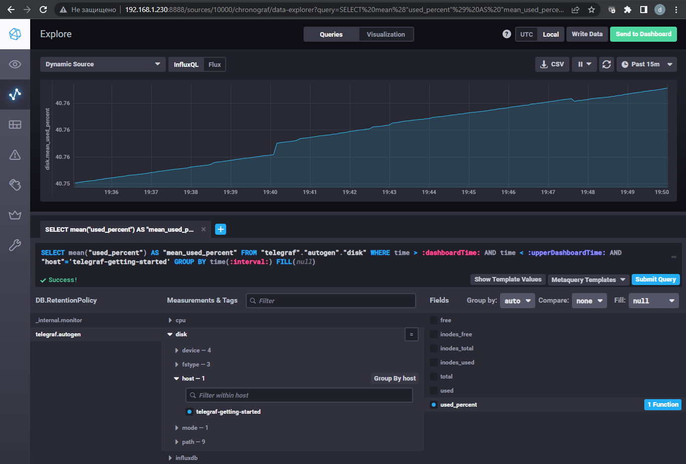
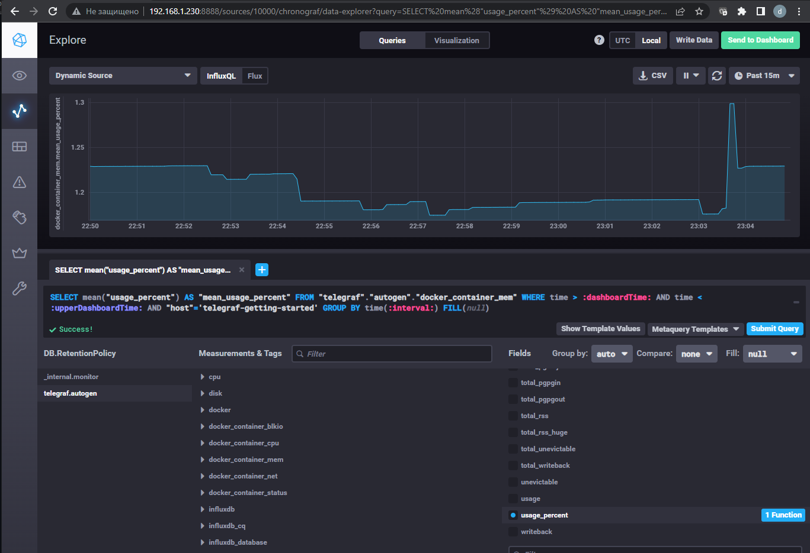
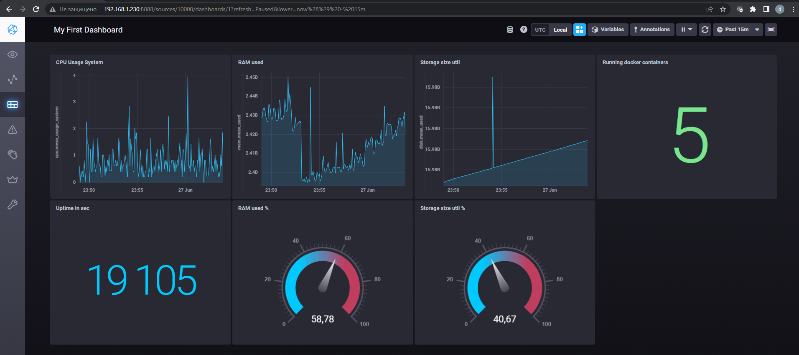

## Обязательные задания

1. Опишите основные плюсы и минусы pull и push систем мониторинга.

2. Какие из ниже перечисленных систем относятся к push модели, а какие к pull? А может есть гибридные?

    - Prometheus 
    - TICK
    - Zabbix
    - VictoriaMetrics
    - Nagios

3. Склонируйте себе [репозиторий](https://github.com/influxdata/sandbox/tree/master) и запустите TICK-стэк, 
используя технологии docker и docker-compose.

В виде решения на это упражнение приведите выводы команд с вашего компьютера (виртуальной машины):

    - curl http://localhost:8086/ping
    - curl http://localhost:8888
    - curl http://localhost:9092/kapacitor/v1/ping

А также скриншот веб-интерфейса ПО chronograf (`http://localhost:8888`). 

P.S.: если при запуске некоторые контейнеры будут падать с ошибкой - проставьте им режим `Z`, например
`./data:/var/lib:Z`

4. Перейдите в веб-интерфейс Chronograf (`http://localhost:8888`) и откройте вкладку `Data explorer`.

    - Нажмите на кнопку `Add a query`
    - Изучите вывод интерфейса и выберите БД `telegraf.autogen`
    - В `measurments` выберите mem->host->telegraf_container_id , а в `fields` выберите used_percent. 
    Внизу появится график утилизации оперативной памяти в контейнере telegraf.
    - Вверху вы можете увидеть запрос, аналогичный SQL-синтаксису. 
    Поэкспериментируйте с запросом, попробуйте изменить группировку и интервал наблюдений.

Для выполнения задания приведите скриншот с отображением метрик утилизации места на диске 
(disk->host->telegraf_container_id) из веб-интерфейса.

5. Изучите список [telegraf inputs](https://github.com/influxdata/telegraf/tree/master/plugins/inputs). 
Добавьте в конфигурацию telegraf следующий плагин - [docker](https://github.com/influxdata/telegraf/tree/master/plugins/inputs/docker):
```
[[inputs.docker]]
  endpoint = "unix:///var/run/docker.sock"
```

Дополнительно вам может потребоваться донастройка контейнера telegraf в `docker-compose.yml` дополнительного volume и 
режима privileged:
```
  telegraf:
    image: telegraf:1.4.0
    privileged: true
    volumes:
      - ./etc/telegraf.conf:/etc/telegraf/telegraf.conf:Z
      - /var/run/docker.sock:/var/run/docker.sock:Z
    links:
      - influxdb
    ports:
      - "8092:8092/udp"
      - "8094:8094"
      - "8125:8125/udp"
```

После настройке перезапустите telegraf, обновите веб интерфейс и приведите скриншотом список `measurments` в 
веб-интерфейсе базы telegraf.autogen . Там должны появиться метрики, связанные с docker.

Факультативно можете изучить какие метрики собирает telegraf после выполнения данного задания.

## Дополнительное задание (со звездочкой*) - необязательно к выполнению

В веб-интерфейсе откройте вкладку `Dashboards`. Попробуйте создать свой dashboard с отображением:

    - утилизации ЦПУ
    - количества использованного RAM
    - утилизации пространства на дисках
    - количество поднятых контейнеров
    - аптайм
    - ...
    - фантазируйте)
    
    ---

### Ответ

1. Основные плюсы и минусы pull и push систем мониторинга
   1. Push системы удобно использовать когда собирается большое количество метрик и неустойчивый канал связи между
   агентами и системой мониторинга. Можно переключать передачу данных между udp и tcp, тем самым выбирая между экономией
   трафика или гарантией доставки. Гибкая настройка частоты и объёма передаваемых метрик. К плюсам данной модели можно
   отнести её использование в динамически меняющемся окружении, т.к. метрики с агентов сами будут поступать в систему
   мониторинга без её дополнительной настройки.
   2. Pull системы мониторинга позволяют контролировать источники откуда принимать метрики. Можно защитить канал связи
   между агентами и системой мониторинга шифрованием. Упрощённая отладка получения метрик с агентов. К минусам можно отнести 
   сложность мониторинга динамически изменяющегося окружения
2. Системы мониторинга по моделям:
   - Prometheus - Pull. Можно отправлять метрики по Push модели при помощи push gateway, но Prometheus будет из забирать как pull
   - TICK - Push. Агент Telegraf отправляет данные в БД InfluxDB. Telegraf при этом можно настроить на работу по Pull модели
   - Zabbix - Push и Pull
   - VictoriaMetrics - Push
   - Nagios - Pull
3. Склонировал [репозиторий](https://github.com/influxdata/sandbox/tree/master)
   1. Запустил TICK-стэк при помощи команды `./sandbox up`  
     
   2. Вывод команды `curl http://localhost:8086/ping -v`  (без -v ничего не возвращает)  
   ```bash
   root@ubuntuvm:~# curl http://localhost:8086/ping -v
   *   Trying 127.0.0.1:8086...
   * TCP_NODELAY set
   * Connected to localhost (127.0.0.1) port 8086 (#0)
   > GET /ping HTTP/1.1
   > Host: localhost:8086
   > User-Agent: curl/7.68.0
   > Accept: */*
   >
   * Mark bundle as not supporting multiuse
   < HTTP/1.1 204 No Content
   < Content-Type: application/json
   < Request-Id: 2ef49338-f569-11ec-8109-0242ac120003
   < X-Influxdb-Build: OSS
   < X-Influxdb-Version: 1.8.10
   < X-Request-Id: 2ef49338-f569-11ec-8109-0242ac120003
   < Date: Sun, 26 Jun 2022 16:01:04 GMT
   <
   * Connection #0 to host localhost left intact
   ```
   3. Вывод команды `curl http://localhost:8888`  
   ```bash
   root@ubuntuvm:~# curl http://localhost:8888
   <!DOCTYPE html>
   <html>
       <head>
           <meta http-equiv="Content-type" content="text/html; charset=utf-8">
               <title>Chronograf</title>
               <link rel="icon shortcut" href="/favicon.fa749080.ico">
                   <link rel="stylesheet" href="/src.9cea3e4e.css"/>
                   <body>
                       <div id="react-root" data-basepath=""/>
                       <script src="/src.a969287c.js"/>
                   </body>
               </html>
   ```
   4. Вывод команды `curl http://localhost:9092/kapacitor/v1/ping -v`  (без -v ничего не возвращает)  
   ```bash
   root@ubuntuvm:~# curl http://localhost:9092/kapacitor/v1/ping -v
   *   Trying 127.0.0.1:9092...
   * TCP_NODELAY set
   * Connected to localhost (127.0.0.1) port 9092 (#0)
   > GET /kapacitor/v1/ping HTTP/1.1
   > Host: localhost:9092
   > User-Agent: curl/7.68.0
   > Accept: */*
   >
   * Mark bundle as not supporting multiuse
   < HTTP/1.1 204 No Content
   < Content-Type: application/json; charset=utf-8
   < Request-Id: c67b8740-f568-11ec-80ca-000000000000
   < X-Kapacitor-Version: 1.6.4
   < Date: Sun, 26 Jun 2022 15:58:09 GMT
   <
   * Connection #0 to host localhost left intact
   ```
   5. Скриншот веб-интерфейса ПО chronograf  
     
4. Что бы выполнить задание предварительно пришлось в `telegraf.conf` добавить инпуты по диску и памяти  
   ```ini
   [[inputs.mem]]
   [[inputs.disk]]
   ```
   1. Метрика mem->host->telegraf_container_id->used_percent  
     
   2. Метрика disk->host->telegraf_container_id->used_percent  
     
5. В `telegraf.conf` уже был inputs с плагином docker, добавил в docker-compose для telegraf `privileged: true`  и `ports`  
   1. Плагин docker сразу не заработал, т.к. не было доступа к сокету и в логе фиксировалась ошибка
   ```text
   2022-06-26T17:45:15Z E! [inputs.docker] Error in plugin: Got permission denied while trying to connect to the Docker daemon socket at unix:///var/run/docker.sock: Get "http://%2Fvar%2Frun%2Fdocker.sock/v1.24/containers/json?filters=%7B%22status%22%3A%7B%22running%22%3Atrue%7D%7D&limit=0": dial unix /var/run/docker.sock: connect: permission denied
   2022-06-26T17:45:20Z E! [inputs.docker] Error in plugin: Got permission denied while trying to connect to the Docker daemon socket at unix:///var/run/docker.sock: Get "http://%2Fvar%2Frun%2Fdocker.sock/v1.24/info": dial unix /var/run/docker.sock: connect: permission denied
   ```
   2. Для решения применил следующее:
      1. Создал переменную `export GID=$(stat -c '%g' /var/run/docker.sock)` для определения группы владельца сокета docker
      2. В docker-compose передал группу для пользователя telegraf
      ```dockerfile
      telegraf:
        user: "telegraf:$GID"
      ```
   3. Метрики связанные с docker появились  
     

### Ответ на дополнительное задание

1. Создал дашборд
   