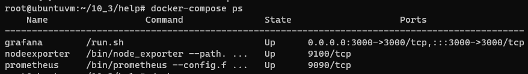
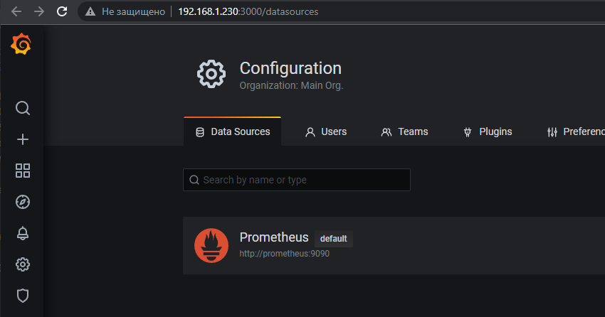
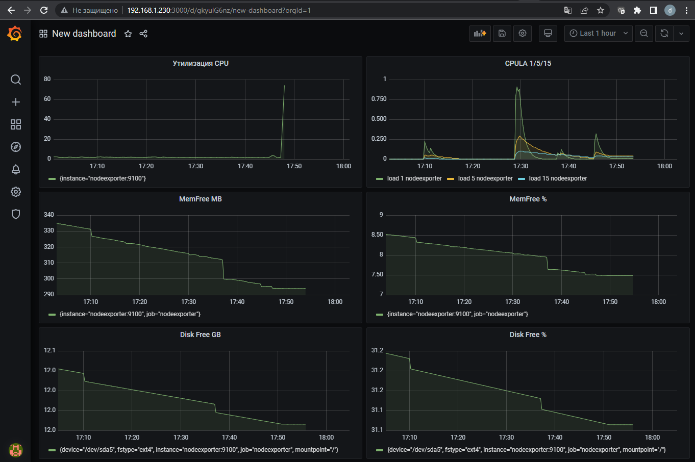
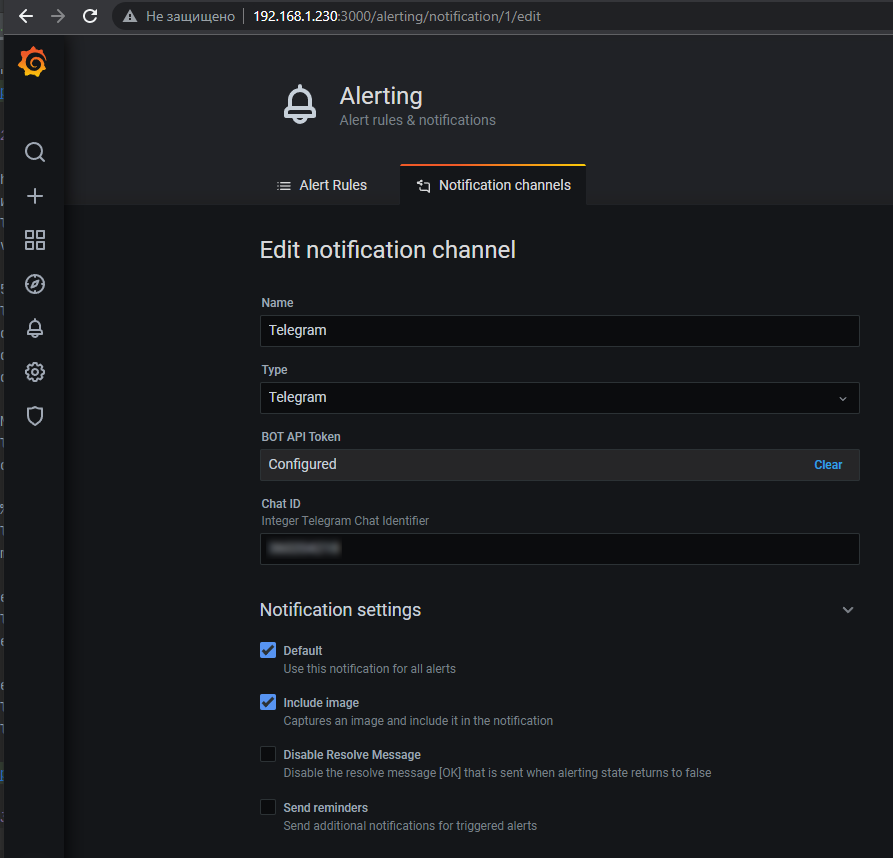
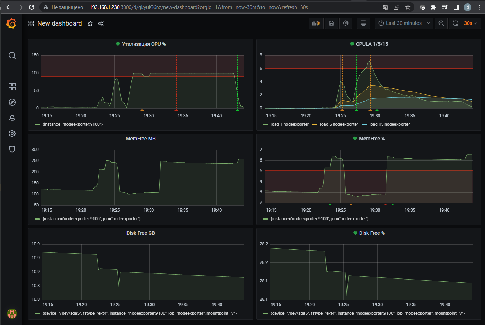
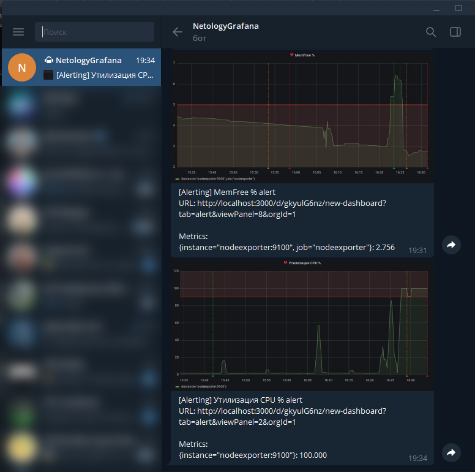

## Задание повышенной сложности

**В части задания 1** не используйте директорию [help](./help) для сборки проекта, самостоятельно разверните grafana, где в 
роли источника данных будет выступать prometheus, а сборщиком данных node-exporter:
- grafana
- prometheus-server
- prometheus node-exporter

За дополнительными материалами, вы можете обратиться в официальную документацию grafana и prometheus.

В решении к домашнему заданию приведите также все конфигурации/скрипты/манифесты, которые вы 
использовали в процессе решения задания.

**В части задания 3** вы должны самостоятельно завести удобный для вас канал нотификации, например Telegram или Email
и отправить туда тестовые события.

В решении приведите скриншоты тестовых событий из каналов нотификаций.

## Обязательные задания

### Задание 1
Используя директорию [help](./help) внутри данного домашнего задания - запустите связку prometheus-grafana.

Зайдите в веб-интерфейс графана, используя авторизационные данные, указанные в манифесте docker-compose.

Подключите поднятый вами prometheus как источник данных.

Решение домашнего задания - скриншот веб-интерфейса grafana со списком подключенных Datasource.

## Задание 2
Изучите самостоятельно ресурсы:
- [promql-for-humans](https://timber.io/blog/promql-for-humans/#cpu-usage-by-instance)
- [understanding prometheus cpu metrics](https://www.robustperception.io/understanding-machine-cpu-usage)

Создайте Dashboard и в ней создайте следующие Panels:
- Утилизация CPU для nodeexporter (в процентах, 100-idle)
- CPULA 1/5/15
- Количество свободной оперативной памяти
- Количество места на файловой системе

Для решения данного ДЗ приведите promql запросы для выдачи этих метрик, а также скриншот получившейся Dashboard.

## Задание 3
Создайте для каждой Dashboard подходящее правило alert (можно обратиться к первой лекции в блоке "Мониторинг").

Для решения ДЗ - приведите скриншот вашей итоговой Dashboard.

## Задание 4
Сохраните ваш Dashboard.

Для этого перейдите в настройки Dashboard, выберите в боковом меню "JSON MODEL".

Далее скопируйте отображаемое json-содержимое в отдельный файл и сохраните его.

В решении задания - приведите листинг этого файла.

## Ответ

### Задание 1

- Запустил связку prometheus-grafana
    ```bash
    root@ubuntuvm:~/10_3/help# docker-compose -f docker-compose.yml up -d
    ```
      
- Подключил поднятый prometheus как источник данных  
      

### Задание 2

- Создал Dashboard и в ней создал следующие Panels:
  - Утилизация CPU
    ```promql
    100 - (avg by (instance) (rate(node_cpu_seconds_total{job="nodeexporter",mode="idle"}[1m])) * 100)
    ```
  - CPULA 1/5/15
    ```promql
    node_load1{job="nodeexporter"}
    node_load5{job="nodeexporter"}
    node_load15{job="nodeexporter"}
    ```
  - MemFree MB
    ```promql
    node_memory_MemFree_bytes / (1024 * 1024)
    ```
  - MemFree %
    ```promql
    (node_memory_MemFree_bytes / node_memory_MemTotal_bytes) * 100
    ```
  - Disk Free GB
    ```promql
    node_filesystem_free_bytes{fstype!~"tmpfs|fuse.lxcfs|squashfs|vfat"} / (1024 * 1024 *1024)
    ```
  - Disk Free %
    ```promql
    (node_filesystem_free_bytes{fstype!~"tmpfs|fuse.lxcfs|squashfs|vfat"} / node_filesystem_size_bytes{fstype!~"tmpfs|fuse.lxcfs|squashfs|vfat"}) * 100
    ```
      

### Задание 3
- Настроил отправку алертов в телеграм  
      
- Для того, что бы в присылаемый алерт добавлялись графики, в [docker-compose](10-monitoring-03-grafana/help/docker-compose.yml) добавил секцию по запуску grafana-renderer
- Создал для каждой панели подходящее правило alert
      
- Во время проведения стресс-теста алерты пришли в телеграм
      

### Задание 4

- Выгрузил [Dashboard](10-monitoring-03-grafana/dashboard.json) в json