# Домашнее задание к занятию "12.1 Компоненты Kubernetes"

Вы DevOps инженер в крупной компании с большим парком сервисов. Ваша задача — разворачивать эти продукты в корпоративном кластере. 

## Задача 1: Установить Minikube

Для экспериментов и валидации ваших решений вам нужно подготовить тестовую среду для работы с Kubernetes. Оптимальное решение — развернуть на рабочей машине Minikube.

### Как поставить на AWS:
- создать EC2 виртуальную машину (Ubuntu Server 20.04 LTS (HVM), SSD Volume Type) с типом **t3.small**. Для работы потребуется настроить Security Group для доступа по ssh. Не забудьте указать keypair, он потребуется для подключения.
- подключитесь к серверу по ssh (ssh ubuntu@<ipv4_public_ip> -i <keypair>.pem)
- установите миникуб и докер следующими командами:
  - curl -LO https://storage.googleapis.com/kubernetes-release/release/`curl -s https://storage.googleapis.com/kubernetes-release/release/stable.txt`/bin/linux/amd64/kubectl
  - chmod +x ./kubectl
  - sudo mv ./kubectl /usr/local/bin/kubectl
  - sudo apt-get update && sudo apt-get install docker.io conntrack -y
  - curl -Lo minikube https://storage.googleapis.com/minikube/releases/latest/minikube-linux-amd64 && chmod +x minikube && sudo mv minikube /usr/local/bin/
- проверить версию можно командой minikube version
- переключаемся на root и запускаем миникуб: minikube start --vm-driver=none
- после запуска стоит проверить статус: minikube status
- запущенные служебные компоненты можно увидеть командой: kubectl get pods --namespace=kube-system

### Для сброса кластера стоит удалить кластер и создать заново:
- minikube delete
- minikube start --vm-driver=none

Возможно, для повторного запуска потребуется выполнить команду: sudo sysctl fs.protected_regular=0

Инструкция по установке Minikube - [ссылка](https://kubernetes.io/ru/docs/tasks/tools/install-minikube/)

**Важно**: t3.small не входит во free tier, следите за бюджетом аккаунта и удаляйте виртуалку.

## Задача 2: Запуск Hello World
После установки Minikube требуется его проверить. Для этого подойдет стандартное приложение hello world. А для доступа к нему потребуется ingress.

- развернуть через Minikube тестовое приложение по [туториалу](https://kubernetes.io/ru/docs/tutorials/hello-minikube/#%D1%81%D0%BE%D0%B7%D0%B4%D0%B0%D0%BD%D0%B8%D0%B5-%D0%BA%D0%BB%D0%B0%D1%81%D1%82%D0%B5%D1%80%D0%B0-minikube)
- установить аддоны ingress и dashboard

## Задача 3: Установить kubectl

Подготовить рабочую машину для управления корпоративным кластером. Установить клиентское приложение kubectl.
- подключиться к minikube 
- проверить работу приложения из задания 2, запустив port-forward до кластера

## Задача 4 (*): собрать через ansible (необязательное)

Профессионалы не делают одну и ту же задачу два раза. Давайте закрепим полученные навыки, автоматизировав выполнение заданий  ansible-скриптами. При выполнении задания обратите внимание на доступные модули для k8s под ansible.
 - собрать роль для установки minikube на aws сервисе (с установкой ingress)
 - собрать роль для запуска в кластере hello world
  
  ---

# Ответ

## Задача 1: Установить Minikube

- Установка выполнена по инструкции, но этого оказалось недостаточно
  - Возникла ошибка связанная с отсутствием `cri-dockerd`, выполнил установку по [инструкции](https://github.com/Mirantis/cri-dockerd#build-and-install)  
    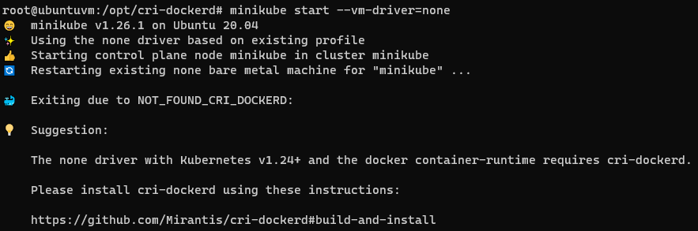
  - После установки `cri-dockerd` возникла проблема с отсутствием `crictl`, выполнил установку по [инструкции](https://github.com/kubernetes-sigs/cri-tools#install-crictl)  
    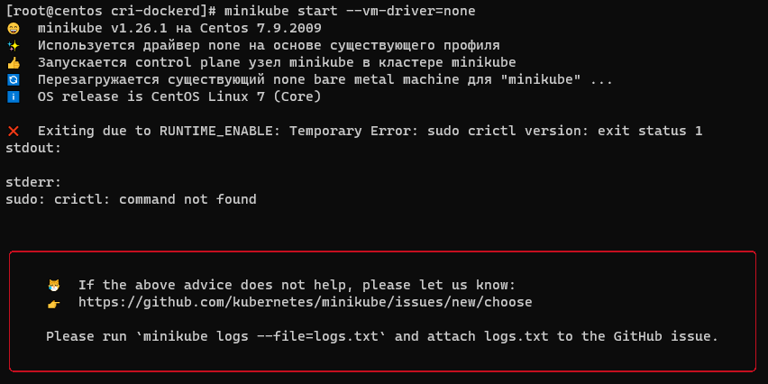
  - После установки `crictl` этого оказалось недостаточно, т.к. по умолчанию `crictl` будет работать из `/usr/local/bin/`, однако `minikube` требует, чтобы `crictl` был в `/usr/bin/`.
  Выполнил `cp /usr/local/bin/crictl /usr/bin/crictl`, [пруфлинк](https://github.com/kubernetes/minikube/issues/14604#issuecomment-1190611171)
  - Далее возникла ошибка `/proc/sys/net/bridge/bridge-nf-call-iptables contents are not set to 1`, решение нашёл [тут](https://stackoverflow.com/questions/44125020/cant-install-kubernetes-on-vagrant)
  - Кластер запустился:  
    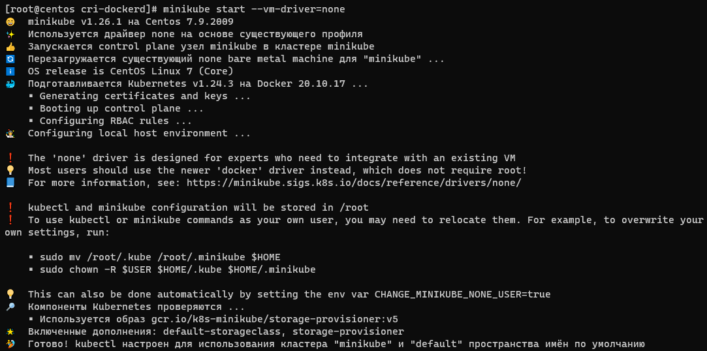
  - Выполнил проверку статуса `minikube status`  
    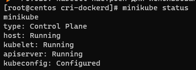
  - Запущенные служебные компоненты `kubectl get pods --namespace=kube-system`  
    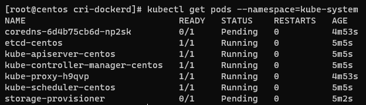
- Как позднее оказалось не смогли запустится дополнения `storage-provisioner` и `default-storageclass`, и приложение `Hello World`, 
с `none` драйвером. Они были в статусе `pending`. Эту проблему победить так и не удалось, ни на виртуалке с ubuntu, ни с centos. Поменял драйвер на `docker` и проблема ушла.  
  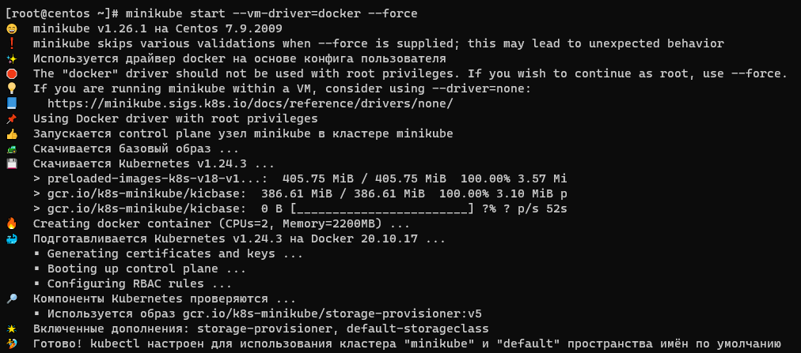  
  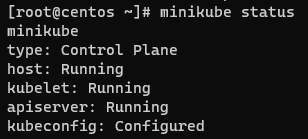  
  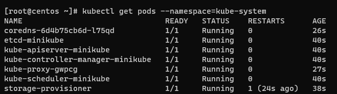  

## Задача 2: Запуск Hello World

- Запустил приложение Hello World 
  ```bash
  kubectl create deployment hello-node --image=k8s.gcr.io/echoserver:1.4
  ```  
  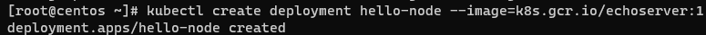  
  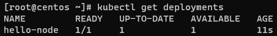  
  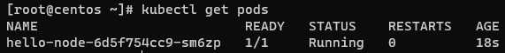  
  - Создал сервис 
    ```bash
    kubectl expose deployment hello-node --type=LoadBalancer --port=8080
    ```  
    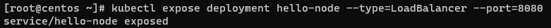  
    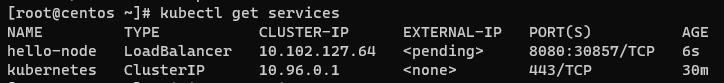  
    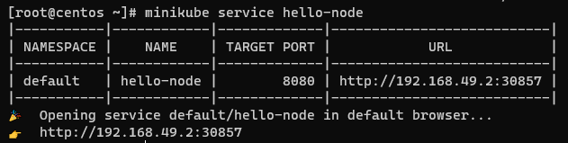  
- Установил аддоны ingress и dashboard  
  - `minikube addons enable ingress`  
  - `minikube addons enable dashboard`  
    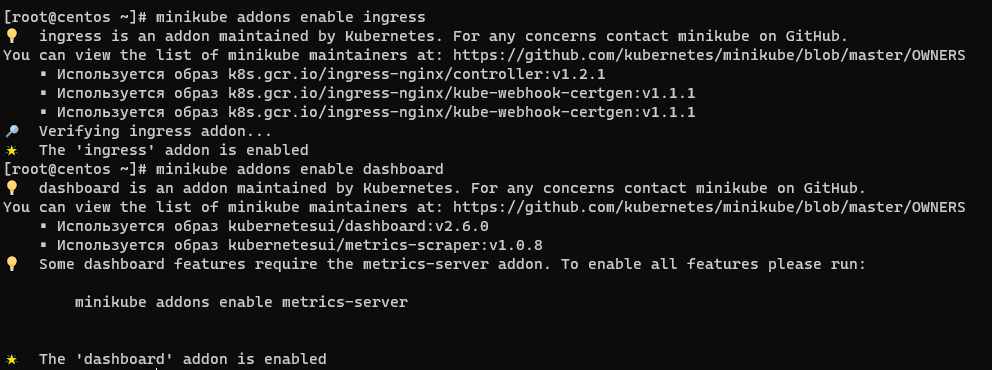  
    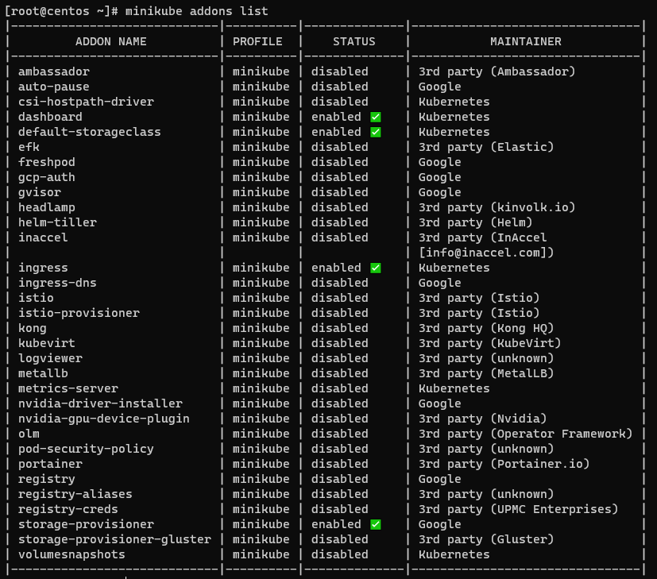  

## Задача 3: Установить kubectl

- Проверил работу приложения из задания 2, запустив port-forward до кластера
  ```bash
  kubectl port-forward service/hello-node --address 0.0.0.0 33333:8080
  Forwarding from 0.0.0.0:33333 -> 8080
  ```  
  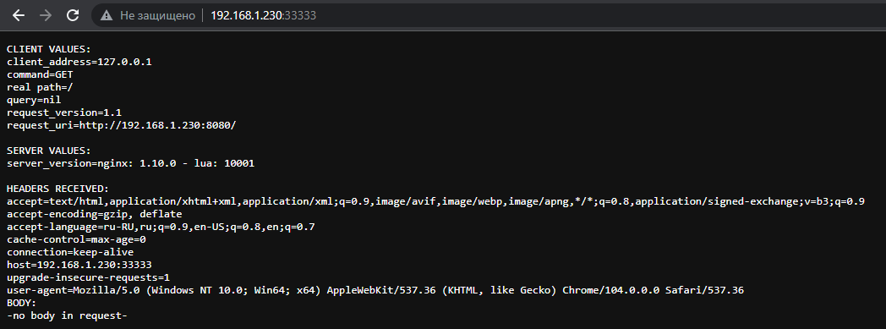  
- Для подключения к minikube пришлось заново запустить кластер с параметром `--apiserver-ips`, т.к. в сертификате не было внешнего адреса  
  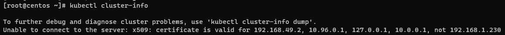 
  ```bash
  root@ubuntuvm:~# minikube start --vm-driver=docker --force --apiserver-ips=192.168.1.230
  ```
  - На другую машину с `kubectl` скопировал содержимое `~/.kube/config` и связанных сертификатов
  - Команды `kubectl` работают штатно  
    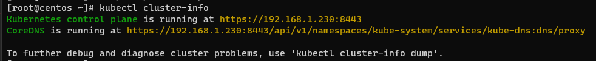  
    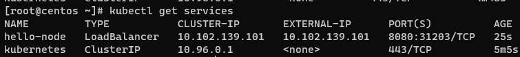  
    - Для примера, `kubectl` который установлен на ноде с minikube получает информацию о кластере с другого адреса  
      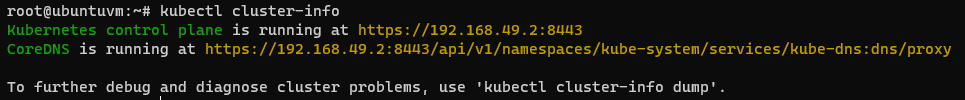  