# Домашнее задание к занятию "12.2 Команды для работы с Kubernetes"
Кластер — это сложная система, с которой крайне редко работает один человек. Квалифицированный devops умеет наладить работу всей команды, занимающейся каким-либо сервисом.
После знакомства с кластером вас попросили выдать доступ нескольким разработчикам. Помимо этого требуется служебный аккаунт для просмотра логов.

## Задание 1: Запуск пода из образа в деплойменте
Для начала следует разобраться с прямым запуском приложений из консоли. Такой подход поможет быстро развернуть инструменты отладки в кластере. Требуется запустить деплоймент на основе образа из hello world уже через deployment. Сразу стоит запустить 2 копии приложения (replicas=2). 

Требования:
 * пример из hello world запущен в качестве deployment
 * количество реплик в deployment установлено в 2
 * наличие deployment можно проверить командой kubectl get deployment
 * наличие подов можно проверить командой kubectl get pods


## Задание 2: Просмотр логов для разработки
Разработчикам крайне важно получать обратную связь от штатно работающего приложения и, еще важнее, об ошибках в его работе. 
Требуется создать пользователя и выдать ему доступ на чтение конфигурации и логов подов в app-namespace.

Требования: 
 * создан новый токен доступа для пользователя
 * пользователь прописан в локальный конфиг (~/.kube/config, блок users)
 * пользователь может просматривать логи подов и их конфигурацию (kubectl logs pod <pod_id>, kubectl describe pod <pod_id>)


## Задание 3: Изменение количества реплик 
Поработав с приложением, вы получили запрос на увеличение количества реплик приложения для нагрузки. Необходимо изменить запущенный deployment, увеличив количество реплик до 5. Посмотрите статус запущенных подов после увеличения реплик. 

Требования:
 * в deployment из задания 1 изменено количество реплик на 5
 * проверить что все поды перешли в статус running (kubectl get pods)

---

# Ответ

## Задание 1

- Запустил minikube `minikube start --vm-driver=docker --force --apiserver-ips=192.168.1.230`  
- Запустил hello world в качестве deployment с двумя репликами `kubectl create deployment hello-node --image=k8s.gcr.io/echoserver:1.4 --replicas=2`  
    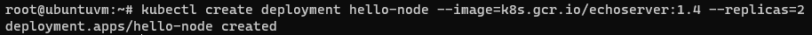  
    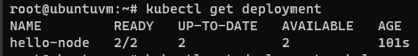  
    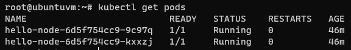  

## Задание 2

- Создал пользователя developer  
    ```bash
    cat <<EOF | kubectl apply -f -
    apiVersion: v1
    kind: ServiceAccount
    metadata:
      name: developer
      namespace: default
    EOF
    ```
    - или командой `kubectl create serviceaccount developer`  
    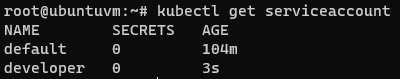  
- Создал роль
    ```bash
    cat <<EOF | kubectl apply -f -
    kind: Role
    apiVersion: rbac.authorization.k8s.io/v1
    metadata:
      namespace: default
      name: developer-view
    rules:
    - apiGroups: [""]
      resources: ["pods", "pods/log"]
      verbs: ["get", "list", "logs", "describe"]
    EOF
    ```
    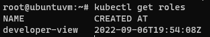  
- Создал привязку роли к пользователю  
    ```bash
    cat <<EOF | kubectl apply -f -
    kind: RoleBinding
    apiVersion: rbac.authorization.k8s.io/v1
    metadata:
      name: dev-viewer
      namespace: default
    subjects:
    - kind: ServiceAccount
      name: developer
      namespace: default
    roleRef:
      apiGroup: rbac.authorization.k8s.io
      kind: Role
      name: developer-view
    EOF
    ```
    - Или командой `kubectl create rolebinding dev-viewer --role=developer-view --serviceaccount=default:developer --namespace=default`  
    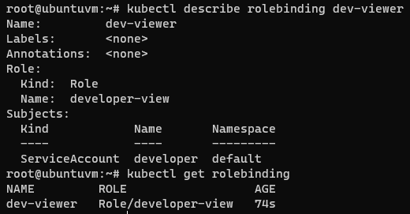  
- Создал токен для пользователя developer
    ```bash
    cat <<EOF | kubectl apply -f -
    apiVersion: v1
    kind: Secret
    metadata:
      name: developer-token
      annotations:
        kubernetes.io/service-account.name: developer
    type: kubernetes.io/service-account-token
    EOF
    ```  
    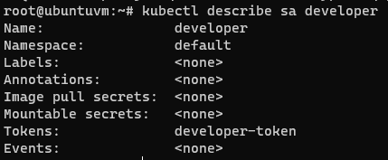  
    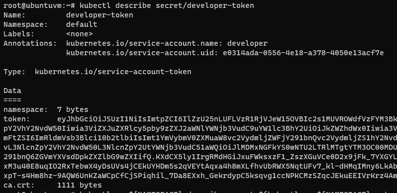  
- Получил токен учетной записи  
    ```bash
    export NAMESPACE="default"
    export K8S_USER="developer"
    export K8S_USER_TOKEN=$(kubectl -n ${NAMESPACE} describe secret $(kubectl -n ${NAMESPACE} get secret | (grep ${K8S_USER} || echo "$_") | awk '{print $1}') | grep token: | awk '{print $2}'\n)
    ```
- Получил данные сертификата (в дело не пошло, просто оставлю это тут)  
    ```bash
    kubectl  -n ${NAMESPACE} get secret `kubectl -n ${NAMESPACE} get secret | (grep ${K8S_USER} || echo "$_") | awk '{print $1}'` -o "jsonpath={.data['ca\.crt']}"
    ```
- Добавил пользователя в конфиг `~/.kube/config`
    ```bash
    kubectl config set-credentials developer --token $K8S_USER_TOKEN
    ```  
    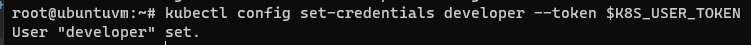  
- Переключился на пользователя developer
    ```bash
    kubectl config set-context minikube --user developer
    ```  
    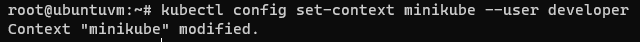  
- Доступ на просмотр логов подов (логов видимо нет) и их конфигурацию есть
    ```bash
    root@ubuntuvm:~# kubectl logs hello-node-6d5f754cc9-9c97q
    root@ubuntuvm:~# kubectl describe pod hello-node-6d5f754cc9-9c97q
    ```  
    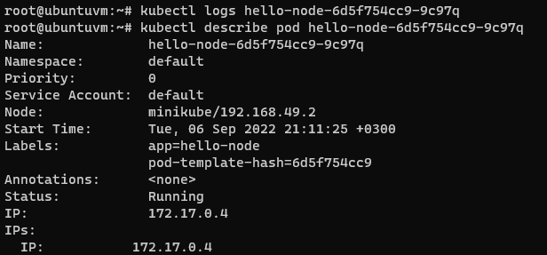  
- Лишнего доступа нет
    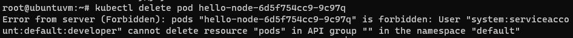  
    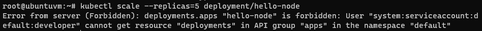  

## Задание 3
- Переключился на пользователя minikube
    ```bash
    kubectl config set-context minikube --user minikube
    ```  
- Увеличил количество реплик до 5 для deployment hello-node
    ```bash
    root@ubuntuvm:~# kubectl scale --replicas=5 deployment/hello-node
    ```  
    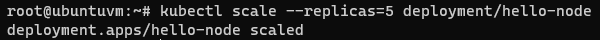  
- Все поды перешли в статус running  
    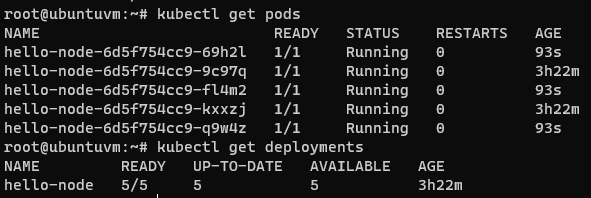  