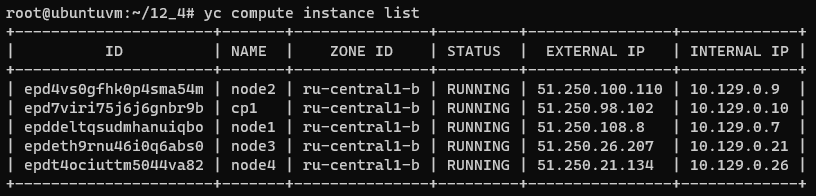
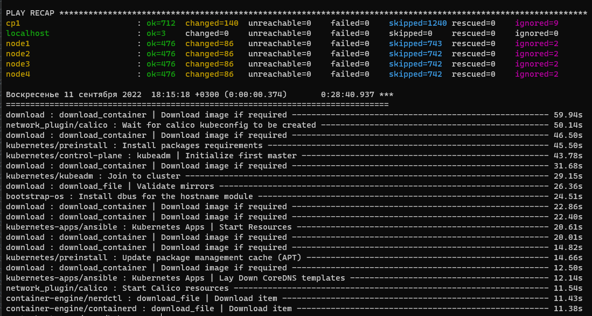
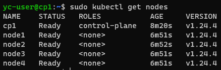
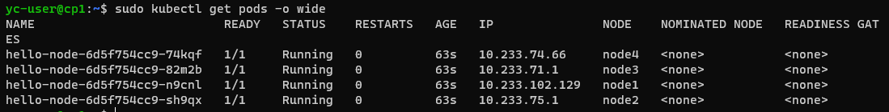

# Домашнее задание к занятию "12.4 Развертывание кластера на собственных серверах, лекция 2"
Новые проекты пошли стабильным потоком. Каждый проект требует себе несколько кластеров: под тесты и продуктив. Делать все руками — не вариант, поэтому стоит автоматизировать подготовку новых кластеров.

## Задание 1: Подготовить инвентарь kubespray
Новые тестовые кластеры требуют типичных простых настроек. Нужно подготовить инвентарь и проверить его работу. Требования к инвентарю:
* подготовка работы кластера из 5 нод: 1 мастер и 4 рабочие ноды;
* в качестве CRI — containerd;
* запуск etcd производить на мастере.

## Задание 2 (*): подготовить и проверить инвентарь для кластера в AWS
Часть новых проектов хотят запускать на мощностях AWS. Требования похожи:
* разворачивать 5 нод: 1 мастер и 4 рабочие ноды;
* работать должны на минимально допустимых EC2 — t3.small.

---

# Ответ

## Задание 1

- Склонировал себе репозиторий kubespray
    ```bash
    git clone https://github.com/kubernetes-sigs/kubespray
    ```
- Установил зависимости
    ```bash
    sudo pip3 install -r requirements.txt
    ```
- Скопировал пример в папку с моей конфигурацией
    ```bash
    cp -rfp inventory/sample inventory/netology-cluster
    ```
- Подготовил машины в YC  
      
- По умолчанию в качестве CRI используется containerd, поэтому [конфиг](12-kubernetes-04-install-part-2/source/kubespray/inventory/netology-cluster/group_vars/k8s_cluster/k8s-cluster.yml) не менял
- Описал [inventory](12-kubernetes-04-install-part-2/source/kubespray/inventory/netology-cluster/inventory.ini)
- Запустил деплой кластера
    ```bash
    ansible-playbook -i inventory/netology-cluster/inventory.ini cluster.yml -b -v
    ```  
      
- Кластер работает  
      
- Запустил деплоймент для проверки
    ```bash
    sudo kubectl create deployment hello-node --image=k8s.gcr.io/echoserver:1.4 --replicas=4
    sudo kubectl get pods -o wide
    ```  
    