# Домашнее задание к занятию "12.5 Сетевые решения CNI"
После работы с Flannel появилась необходимость обеспечить безопасность для приложения. Для этого лучше всего подойдет Calico.
## Задание 1: установить в кластер CNI плагин Calico
Для проверки других сетевых решений стоит поставить отличный от Flannel плагин — например, Calico. Требования: 
* установка производится через ansible/kubespray;
* после применения следует настроить политику доступа к hello-world извне. Инструкции [kubernetes.io](https://kubernetes.io/docs/concepts/services-networking/network-policies/), [Calico](https://docs.projectcalico.org/about/about-network-policy)

## Задание 2: изучить, что запущено по умолчанию
Самый простой способ — проверить командой calicoctl get <type>. Для проверки стоит получить список нод, ipPool и profile.
Требования: 
* установить утилиту calicoctl;
* получить 3 вышеописанных типа в консоли.

---

# Ответ

## Задание 1

- Развернул кластер с помощью [kubespray](12-kubernetes-05-cni/kubespray/inventory/netology-cluster/inventory.ini)
    ```bash
    kubectl get nodes -o wide
    ```  
    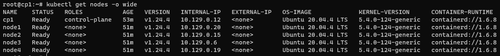  

- Развернул два пода `hello-node` и `hello-node-noacc`
    ```bash
    kubectl create deployment hello-node --image=k8s.gcr.io/echoserver:1.4 --replicas=2
    kubectl create deployment hello-node-noacc --image=k8s.gcr.io/echoserver:1.4 --replicas=2
    kubectl get pods -o wide
    ```  
    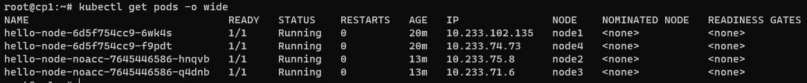  

- Создал сервис
    ```bash
    kubectl expose deployment hello-node --port=8080
    kubectl expose deployment hello-node-noacc --port=8080
    kubectl get service -o wide
    ```  
    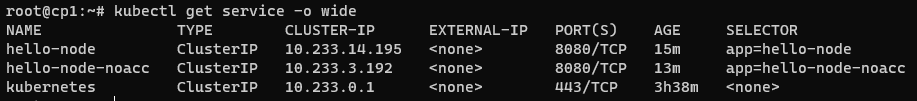  

- Проверил доступность обоих сервисов - доступны  
    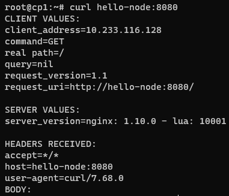  
    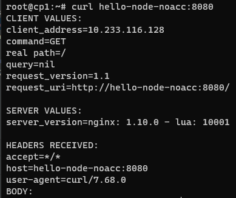  

- Создал политику разрешающую входящие соединения с `hello-node-noacc` на `hello-node`  
  ```bash
  cat <<EOF | kubectl apply -f -
  apiVersion: networking.k8s.io/v1
  kind: NetworkPolicy
  metadata:
    name: hello-node-noacc
    namespace: default
  spec:
    podSelector:
      matchLabels:
        app: hello-node-noacc
    policyTypes:
      - Ingress
  EOF
  ```
  ```bash
  cat <<EOF | kubectl apply -f -
  apiVersion: networking.k8s.io/v1
  kind: NetworkPolicy
  metadata:
    name: hello-node
    namespace: default
  spec:
    podSelector:
      matchLabels:
        app: hello-node
    policyTypes:
      - Ingress
    ingress:
      - from:
        - podSelector:
            matchLabels:
              app: hello-node-noacc
  EOF
  ```

- Создал дефолтное запрещающее правило
  ```bash
  cat <<EOF | kubectl apply -f -
  apiVersion: networking.k8s.io/v1
  kind: NetworkPolicy
  metadata:
    name: default-deny-ingress
  spec:
    podSelector: {}
    policyTypes:
      - Ingress
  EOF
  ```  

- Проверил доступ с `hello-node-noacc` на `hello-node` - присутствует  
  ```bash
  kubectl exec hello-node-noacc-7645446586-hnqvb -- curl -s -m 1 hello-node:8080
  ```  
  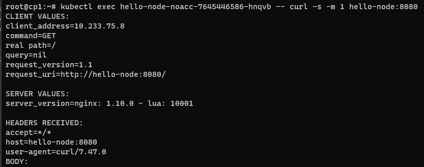  

- Проверил доступ с `hello-node` на `hello-node-noacc` - отсутствует
  ```bash
  kubectl exec hello-node-6d5f754cc9-f9pdt -- curl -s -m 1 hello-node-noacc:8080
  ```  
  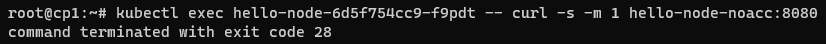  

## Задание 2

- Утилита calicoctl уже была установлена kubespray  
  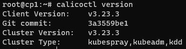

- Вывод команды `calicoctl get ipPool`   
  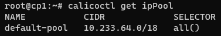  

- Вывод команды `calicoctl get nodes`  
  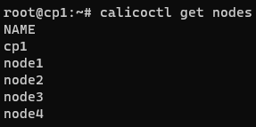  

- Вывод команды `calicoctl get profile`  
  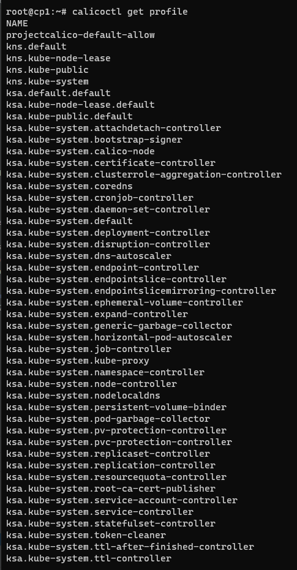