# Домашнее задание к занятию "13.1 контейнеры, поды, deployment, statefulset, services, endpoints"
Настроив кластер, подготовьте приложение к запуску в нём. Приложение стандартное: бекенд, фронтенд, база данных. Его можно найти в папке 13-kubernetes-config.

## Задание 1: подготовить тестовый конфиг для запуска приложения
Для начала следует подготовить запуск приложения в stage окружении с простыми настройками. Требования:
* под содержит в себе 2 контейнера — фронтенд, бекенд;
* регулируется с помощью deployment фронтенд и бекенд;
* база данных — через statefulset.

## Задание 2: подготовить конфиг для production окружения
Следующим шагом будет запуск приложения в production окружении. Требования сложнее:
* каждый компонент (база, бекенд, фронтенд) запускаются в своем поде, регулируются отдельными deployment’ами;
* для связи используются service (у каждого компонента свой);
* в окружении фронта прописан адрес сервиса бекенда;
* в окружении бекенда прописан адрес сервиса базы данных.

## Задание 3 (*): добавить endpoint на внешний ресурс api
Приложению потребовалось внешнее api, и для его использования лучше добавить endpoint в кластер, направленный на это api. Требования:
* добавлен endpoint до внешнего api (например, геокодер).

---

### Как оформить ДЗ?

Выполненное домашнее задание пришлите ссылкой на .md-файл в вашем репозитории.

В качестве решения прикрепите к ДЗ конфиг файлы для деплоя. Прикрепите скриншоты вывода команды kubectl со списком запущенных объектов каждого типа (pods, deployments, statefulset, service) или скриншот из самого Kubernetes, что сервисы подняты и работают.

---

# Ответ

- Запустил кластер  
    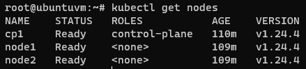  
- Собрал образы из [13-kubernetes-config](13-kubernetes-config-01-objects/13-kubernetes-config)
- Опубликовал образы в docker registry
  - [13-kubernetes-config_backend](https://hub.docker.com/r/danilabar/13-kubernetes-config_backend)
  - [13-kubernetes-config_frontend](https://hub.docker.com/r/danilabar/13-kubernetes-config_frontend)

## Задание 1

- Создал namespace stage
  ```bash
  kubectl create namespace stage
  ```  
  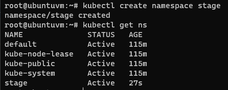  
- Подготовил deployment для [stage](13-kubernetes-config-01-objects/stage)
- Запустил deployment для БД
  - [Pod](13-kubernetes-config-01-objects/stage/db_sfs.yml)
  - [PersistentVolume](13-kubernetes-config-01-objects/stage/db_pv.yml)
  - [Service](13-kubernetes-config-01-objects/stage/db_svc.yml)
  ```bash
  kubectl apply -f db_sfs.yml --namespace=stage
  kubectl apply -f db_pv.yml --namespace=stage
  kubectl apply -f db_svc.yml --namespace=stage
  kubectl get po,svc,pv --namespace=stage -o wide
  ```  
  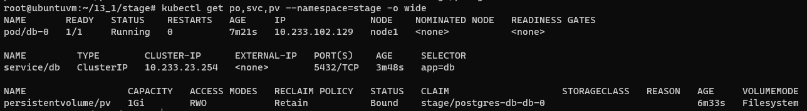  
- Запустил deployment для фронтенд и бекенд
  - [Pod](13-kubernetes-config-01-objects/stage/app.yml)
  ```bash
  kubectl apply -f app.yml --namespace=stage
  ```  
  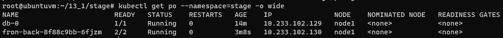  

- Фронтенд работает
  ```bash
  kubectl exec fron-back-7487595fd4-lz9hf -c frontend --namespace=stage -- curl http://localhost:80
  ```  
  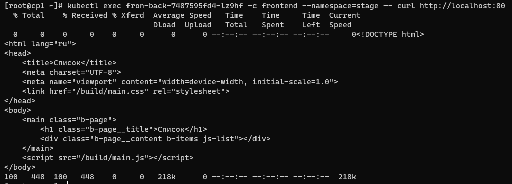  

- Бекенд работает, и имеет доступ к БД (в противном случае бекенд не поднялся бы на 9000 порту и в логе были видны ошибки)
  ```bash
  kubectl exec fron-back-7487595fd4-lz9hf -c backend --namespace=stage -- curl http://localhost:9000/api/news/
  kubectl logs -f -c backend fron-back-7487595fd4-lz9hf --namespace=stage
  ```  
  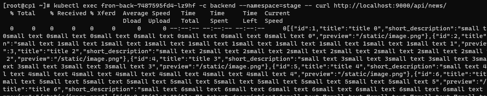  
  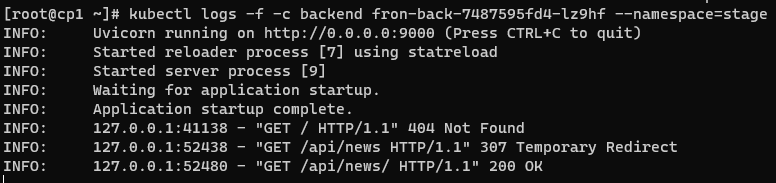  
  - Как показать curl-ом, что фронтенд показывает весь список от фронтента из базы не придумал

## Задание 2

- Создал namespace prod
  ```bash
  kubectl create namespace prod
  ```  
  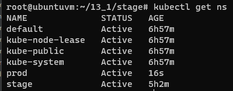  
- Подготовил deployment для [prod](13-kubernetes-config-01-objects/prod)
- Запустил deployment для БД
  - [Pod](13-kubernetes-config-01-objects/prod/db_sfs.yml)
  - [PersistentVolume](13-kubernetes-config-01-objects/prod/db_pv.yml)
  - [Service](13-kubernetes-config-01-objects/prod/db_svc.yml)
  ```bash
  kubectl apply -f db_sfs.yml --namespace=prod
  kubectl apply -f db_pv.yml --namespace=prod
  kubectl apply -f db_svc.yml --namespace=prod
  kubectl get po,svc,pv --namespace=prod -o wide
  ```  
  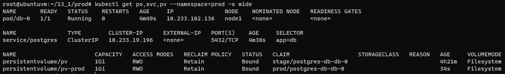  

- Запустил deployment для бекенд
  - [Pod, service](13-kubernetes-config-01-objects/prod/backend.yml)
  ```bash
  kubectl apply -f backend.yml --namespace=prod
  kubectl get po,svc -l="app=backend" --namespace=prod -o wide
  ```  
  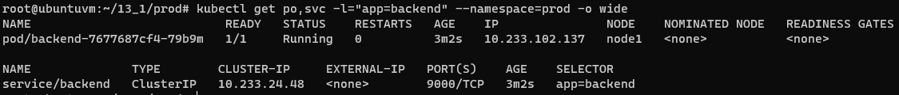

- Запустил deployment для фронтенд
  - [Pod, service](13-kubernetes-config-01-objects/prod/frontend.yml)
  ```bash
  kubectl apply -f frontend.yml --namespace=prod
  kubectl get po,svc -l="app=frontend" --namespace=prod -o wide
  ```  
  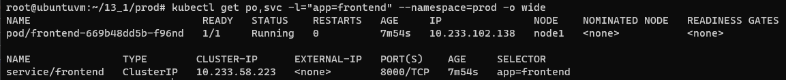  

- Фронтенд работает
  ```bash
  curl http://frontend.prod.svc.cluster.local:8000
  ```  
  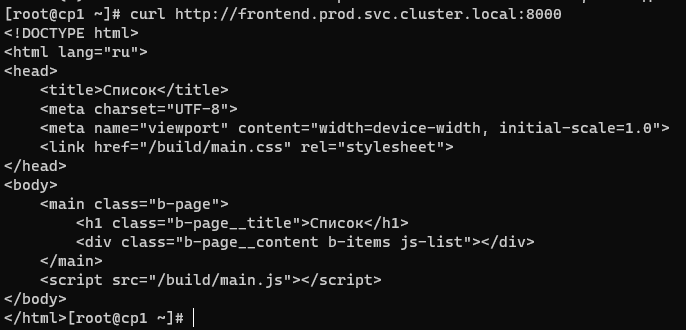  

- Бекенд работает
  ```bash
  curl http://backend.prod.svc.cluster.local:9000/api/news/
  ```  
  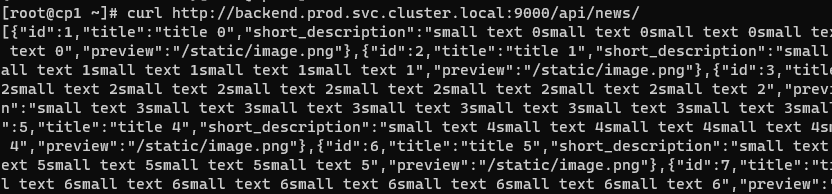  

- Список запущенных объектов каждого типа
  ```bash
  kubectl get po,deploy,sts,svc --namespace=prod -o wide
  ```  
  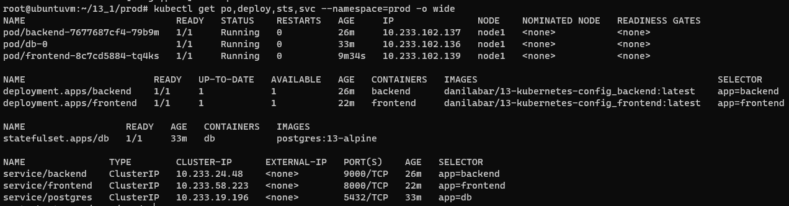  

## Задание 3

- Создал [svc и ep](13-kubernetes-config-01-objects/endpoint/custom_ep.yml) на базе [http://jservice.io](http://jservice.io)
- Выполнил деплой
  ```text
  kubectl apply -f custom_ep.yml --namespace=prod
  kubectl get ep,svc --namespace=prod -o wide
  ```   
  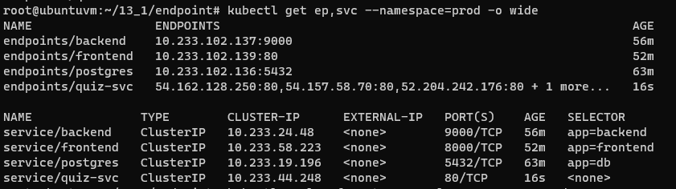  
- По факту рабочего ответа от API получить не получилось, т.к. в `ep` нужно указывать IP адерса, а ресурсы (пробовал много разных api) ждут что к ним придут по имени.
Как это обойти - найти не удалось. Но хоть какой-то ответ получен.
  