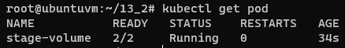

# Домашнее задание к занятию "13.2 разделы и монтирование"
Приложение запущено и работает, но время от времени появляется необходимость передавать между бекендами данные. А сам бекенд генерирует статику для фронта. Нужно оптимизировать это.
Для настройки NFS сервера можно воспользоваться следующей инструкцией (производить под пользователем на сервере, у которого есть доступ до kubectl):
* установить helm: curl https://raw.githubusercontent.com/helm/helm/master/scripts/get-helm-3 | bash
* добавить репозиторий чартов: helm repo add stable https://charts.helm.sh/stable && helm repo update
* установить nfs-server через helm: helm install nfs-server stable/nfs-server-provisioner

В конце установки будет выдан пример создания PVC для этого сервера.

## Задание 1: подключить для тестового конфига общую папку
В stage окружении часто возникает необходимость отдавать статику бекенда сразу фронтом. Проще всего сделать это через общую папку. Требования:
* в поде подключена общая папка между контейнерами (например, /static);
* после записи чего-либо в контейнере с беком файлы можно получить из контейнера с фронтом.

## Задание 2: подключить общую папку для прода
Поработав на stage, доработки нужно отправить на прод. В продуктиве у нас контейнеры крутятся в разных подах, поэтому потребуется PV и связь через PVC. Сам PV должен быть связан с NFS сервером. Требования:
* все бекенды подключаются к одному PV в режиме ReadWriteMany;
* фронтенды тоже подключаются к этому же PV с таким же режимом;
* файлы, созданные бекендом, должны быть доступны фронту.

---

# Ответ

Выполнил:

* установить helm: `curl https://raw.githubusercontent.com/helm/helm/master/scripts/get-helm-3 | bash`
* добавить репозиторий чартов: `helm repo add stable https://charts.helm.sh/stable && helm repo update`
* установить nfs-server через helm: `helm install nfs-server stable/nfs-server-provisioner`

    ```yaml
    ---
    kind: PersistentVolumeClaim
    apiVersion: v1
    metadata:
      name: test-dynamic-volume-claim
    spec:
      storageClassName: "nfs"
      accessModes:
        - ReadWriteOnce
      resources:
        requests:
          storage: 100Mi
    ```


## Задание 1

- Подготовил и применил [манифест](13-kubernetes-config-02-mounts/stage/app.yml), в котором volume подключен к двум контейнерам в поде
  ```bash
  kubectl apply -f stage/app.yml
  ```  
    

- В контейнере `nginx-first` создал файл `test-file.txt`  
  ```bash
  kubectl exec stage-volume -c nginx-first -- sh -c "echo 'created on nginx-first' > /static/test-file.txt"
  ```

- В контейнере `nginx-first` проверил содержимое файла `test-file.txt`  
  ```bash
  kubectl exec stage-volume -c nginx-first -- sh -c "cat /static/test-file.txt"
  ```  
    

- В контейнере `multitool-second` проверил содержимое файла `test-file.txt`  
  ```bash
  kubectl exec stage-volume -c multitool-second -- sh -c "cat /static/test-file.txt"
  ```  
    

- Так же просмотрел содержимое файла `test-file.txt` на рабочей ноде, где запущен под  
  

## Задание 2

- Подготовил и применил манифесты
  - [pvc](13-kubernetes-config-02-mounts/prod/pvc.yml)
  - [frontend](13-kubernetes-config-02-mounts/prod/frontend.yml)
  - [backend](13-kubernetes-config-02-mounts/prod/backend.yml)
```text
kubectl apply -f prod/backend.yml
kubectl apply -f prod/frontend.yml
kubectl apply -f prod/pvc.yml
```  


- В поде `frontend` создал файл `test-file.txt`  
  ```bash
  kubectl exec frontend -- sh -c "echo 'created on frontend' > /static/test-file.txt"
  ```  
- В поде `backend` проверил содержимое файла `test-file.txt`  
  ```bash
  kubectl exec backend -- sh -c "cat /static/test-file.txt"
  ```  
  
