# Домашнее задание к занятию "13.3 работа с kubectl"
## Задание 1: проверить работоспособность каждого компонента
Для проверки работы можно использовать 2 способа: port-forward и exec. Используя оба способа, проверьте каждый компонент:
* сделайте запросы к бекенду;
* сделайте запросы к фронту;
* подключитесь к базе данных.

## Задание 2: ручное масштабирование

При работе с приложением иногда может потребоваться вручную добавить пару копий. Используя команду kubectl scale, попробуйте увеличить количество бекенда и фронта до 3. Проверьте, на каких нодах оказались копии после каждого действия (kubectl describe, kubectl get pods -o wide). После уменьшите количество копий до 1.

---

# Ответ

## Задание 1

- Список подов и сервисов  
  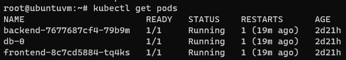  
  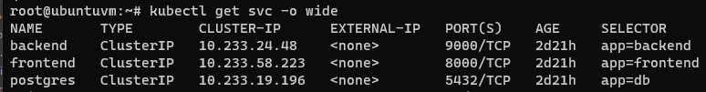  

- exec
  - Запрос к бекенду от фронтенда
    ```bash
    kubectl exec frontend-8c7cd5884-tq4ks -- curl -s backend.prod.svc.cluster.local:9000/api/news/
    ```  
    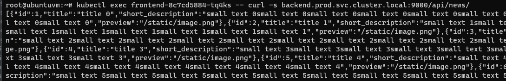  

  - Запрос к фронтенду от бекенда
    ```bash
    kubectl exec backend-7677687cf4-79b9m -- curl -s frontend.prod.svc.cluster.local:8000
    ```  
    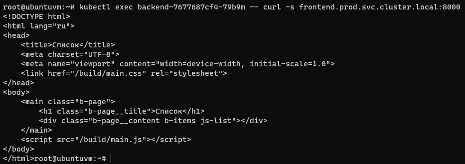  

  - Запрос к БД
    ```bash
    kubectl exec db-0 -- psql -U postgres -d news -c \\dt
    ```  
    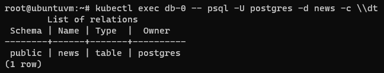

- port-forward
  - Фронтенд
    ```bash
    kubectl port-forward service/frontend 8080:8000
    ```  
    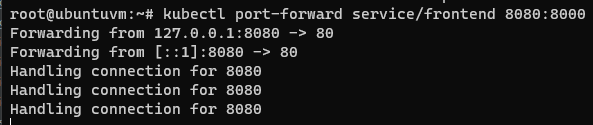  
      

  - Бекенд
    ```bash
    kubectl port-forward service/backend 8080:9000
    ```  
    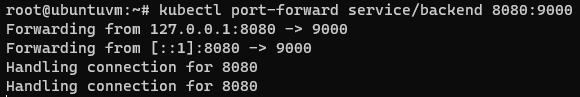  
    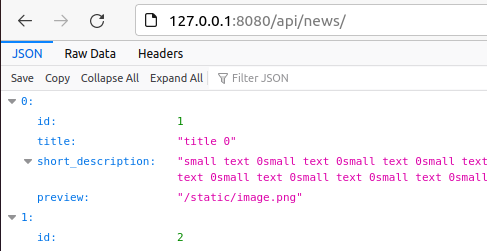  

  - БД
    ```bash
    kubectl port-forward service/postgres 8080:5432
    ```  
    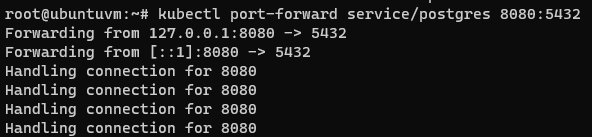  
    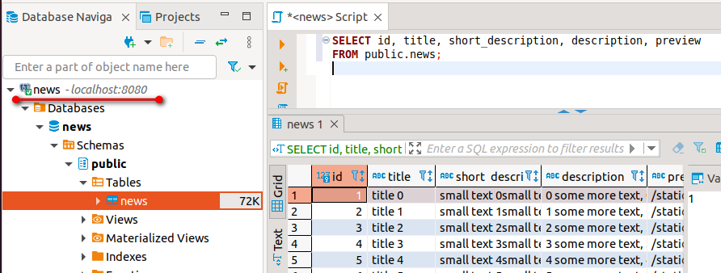  

## Задание 2

- Поды до масштабирования  
  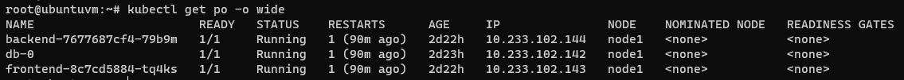  

- Увеличил реплики фронтенд и бекенд до 3-х
  ```bash
  kubectl scale --replicas=3 deploy/frontend
  kubectl scale --replicas=3 deploy/backend
  ```  
  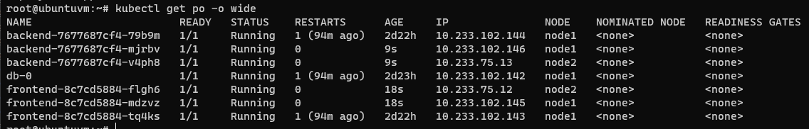  
- Уменьшил реплики фронтенд и бекенд до 1-й
  ```bash
  kubectl scale --replicas=1 deploy/frontend
  kubectl scale --replicas=1 deploy/backend
  ```  
  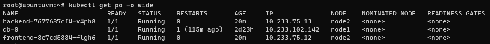  