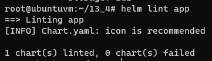
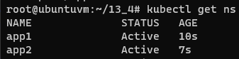
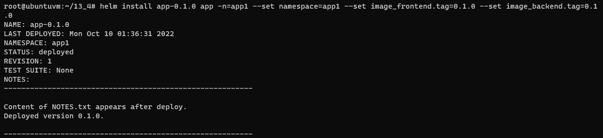
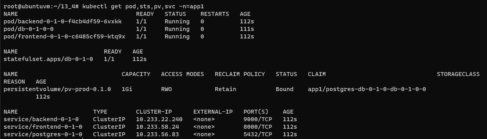
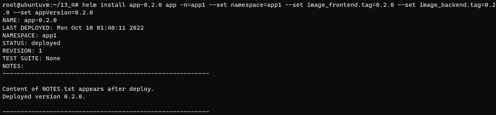
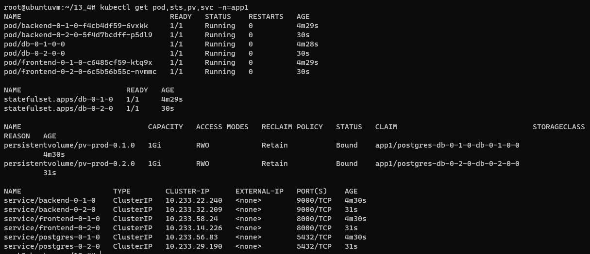
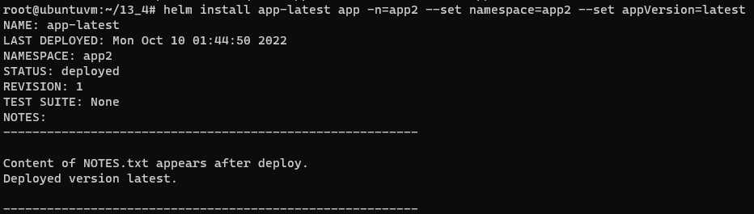
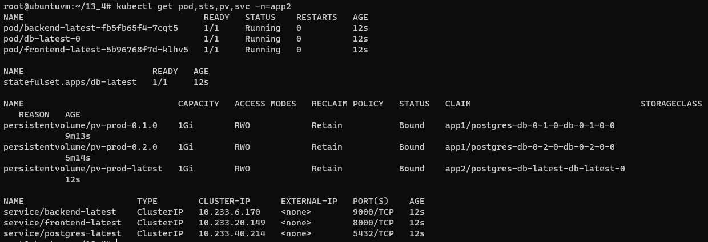
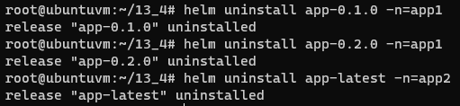
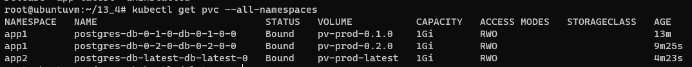

# Домашнее задание к занятию "13.4 инструменты для упрощения написания конфигурационных файлов. Helm и Jsonnet"
В работе часто приходится применять системы автоматической генерации конфигураций. Для изучения нюансов использования разных инструментов нужно попробовать упаковать приложение каждым из них.

## Задание 1: подготовить helm чарт для приложения
Необходимо упаковать приложение в чарт для деплоя в разные окружения. Требования:
* каждый компонент приложения деплоится отдельным deployment’ом/statefulset’ом;
* в переменных чарта измените образ приложения для изменения версии.

## Задание 2: запустить 2 версии в разных неймспейсах
Подготовив чарт, необходимо его проверить. Попробуйте запустить несколько копий приложения:
* одну версию в namespace=app1;
* вторую версию в том же неймспейсе;
* третью версию в namespace=app2.

## Задание 3 (*): повторить упаковку на jsonnet
Для изучения другого инструмента стоит попробовать повторить опыт упаковки из задания 1, только теперь с помощью инструмента jsonnet.

---

# Ответ

## Задание 1

- Создал чарт [app](13-kubernetes-config-04-helm/app)
    ```bash
    helm create app
    ```
- Проверил что он собирается без ошибок  
    ```bash
    helm template app
    helm lint app
    ```  
      
- Шаблонизацию использовал во всех сущностях находящихся в [templates](13-kubernetes-config-04-helm/app/templates)

## Задание 2

- Создал namespace app1 и app2
    ```bash
    kubectl create namespace app1
    kubectl create namespace app2
    ```  
      

- Выполнил деплой чарта c версией `0.1.0` в namespace=app1   
    ```bash
    helm install app-0.1.0 app -n=app1 --set namespace=app1 --set image_frontend.tag=0.1.0 --set image_backend.tag=0.1.0
    ```  
      
      

- Выполнил деплой чарта c версией `0.2.0` в namespace=app1  
    ```bash
    helm install app-0.2.0 app -n=app1 --set namespace=app1 --set image_frontend.tag=0.2.0 --set image_backend.tag=0.2.0 --set appVersion=0.2.0
    ```  
      
      

- Выполнил деплой чарта c версией `latest` в namespace=app2  
    ```bash
    helm install app-latest app -n=app2 --set namespace=app2 --set appVersion=latest
    ```  
      
      

- Удалил деплои чартов
    ```bash
    helm uninstall app-0.1.0 -n=app1
    helm uninstall app-0.2.0 -n=app1
    helm uninstall app-latest -n=app2
    ```  
      

- Отдельно пришлось удалить pvc, через `kubectl delete pvc`  
      