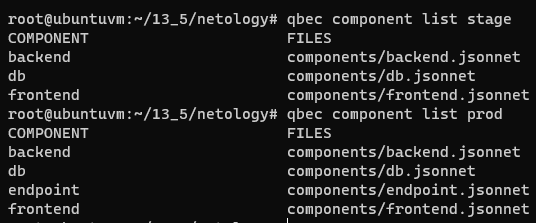
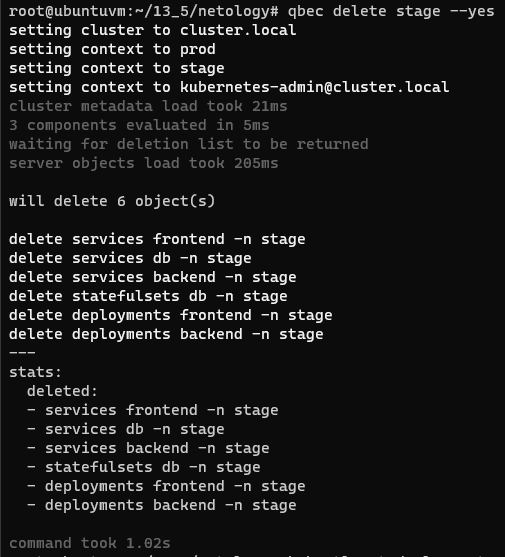

# Домашнее задание к занятию "13.5 поддержка нескольких окружений на примере Qbec"
Приложение обычно существует в нескольких окружениях. Для удобства работы следует использовать соответствующие инструменты, например, Qbec.

## Задание 1: подготовить приложение для работы через qbec
Приложение следует упаковать в qbec. Окружения должно быть 2: stage и production. 

Требования:
* stage окружение должно поднимать каждый компонент приложения в одном экземпляре;
* production окружение — каждый компонент в трёх экземплярах;
* для production окружения нужно добавить endpoint на внешний адрес.

---

# Ответ

- Установил jsonnet
- Установил qbec
- Создал конфигурацию
    ```bash
    qbec init netology --with-example
    ```  
    

- Добавил компоненты в конфигурацию [netology](13-kubernetes-config-05-qbec/netology)
- Посмотрел список компонентов в окружении
    ```bash
    qbec component list stage
    qbec component list prod
    ```  
    

- Запустил деплой stage
    ```bash
    qbec apply stage --yes
    ```  
    

- Проверил что всё запущено
    ```bash
    kubectl get deployments.apps,statefulsets.apps -n stage -o wide
    ```  
    

- Удалил деплой stage
    ```bash
    qbec delete stage --yes
    ```  
    

- Запустил деплой prod
    ```bash
    qbec apply prod --yes
    ```  
    

- Проверил что всё запущено
    ```bash
    kubectl get deployments.apps,statefulsets.apps,endpoints -n prod -o wide
    ```  
      

- Удалил деплой prod
    ```bash
    qbec delete prod --yes
    ```  