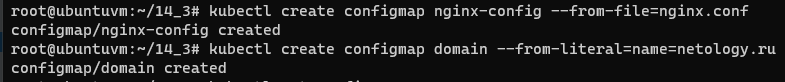
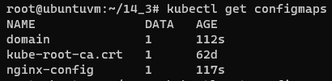
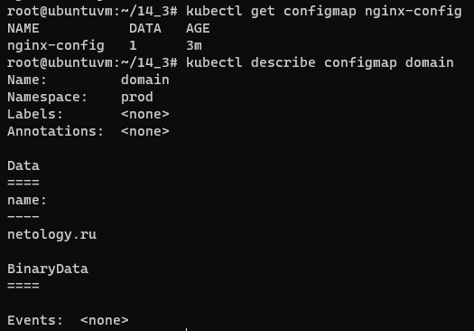
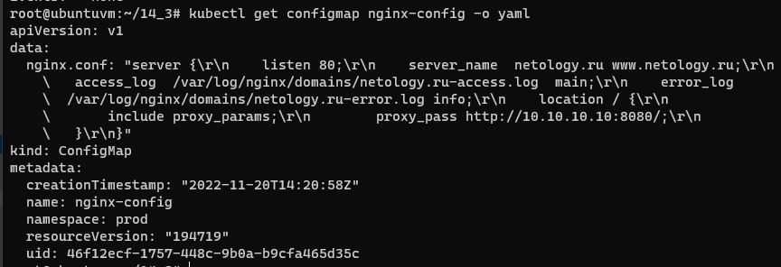
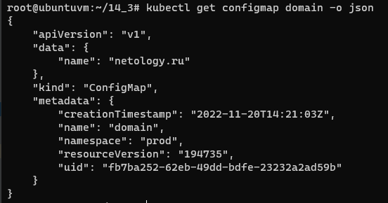
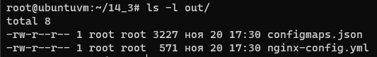
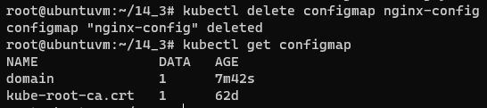
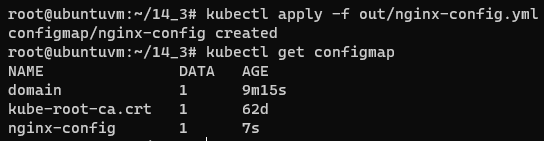

# Домашнее задание к занятию "14.3 Карты конфигураций"

## Задача 1: Работа с картами конфигураций через утилиту kubectl в установленном minikube

Выполните приведённые команды в консоли. Получите вывод команд. Сохраните
задачу 1 как справочный материал.

### Как создать карту конфигураций?

```
kubectl create configmap nginx-config --from-file=nginx.conf
kubectl create configmap domain --from-literal=name=netology.ru
```

### Как просмотреть список карт конфигураций?

```
kubectl get configmaps
kubectl get configmap
```

### Как просмотреть карту конфигурации?

```
kubectl get configmap nginx-config
kubectl describe configmap domain
```

### Как получить информацию в формате YAML и/или JSON?

```
kubectl get configmap nginx-config -o yaml
kubectl get configmap domain -o json
```

### Как выгрузить карту конфигурации и сохранить его в файл?

```
kubectl get configmaps -o json > configmaps.json
kubectl get configmap nginx-config -o yaml > nginx-config.yml
```

### Как удалить карту конфигурации?

```
kubectl delete configmap nginx-config
```

### Как загрузить карту конфигурации из файла?

```
kubectl apply -f nginx-config.yml
```

## Задача 2 (*): Работа с картами конфигураций внутри модуля

Выбрать любимый образ контейнера, подключить карты конфигураций и проверить
их доступность как в виде переменных окружения, так и в виде примонтированного
тома

---

# Ответ

## Задача 1

### Создал карту конфигураций

```bash
kubectl create configmap nginx-config --from-file=nginx.conf
kubectl create configmap domain --from-literal=name=netology.ru
```  
  

### Посмотрел список карт конфигураций

```bash
kubectl get configmaps
kubectl get configmap
```  
  

### Посмотрел карту конфигурации

```bash
kubectl get configmap nginx-config
kubectl describe configmap domain
```  
  

### Получил информацию в формате YAML и JSON

```bash
kubectl get configmap nginx-config -o yaml
kubectl get configmap domain -o json
```  
  
  

### Выгрузил карту конфигурации и сохранил её в файл

```bash
kubectl get configmaps -o json > out/configmaps.json
kubectl get configmap nginx-config -o yaml > out/nginx-config.yml
```  
  

### Удалил карту конфигурации

```bash
kubectl delete configmap nginx-config
```  
  

### Загрузил карту конфигурации из файла

```bash
kubectl apply -f out/nginx-config.yml
```  
  