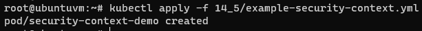
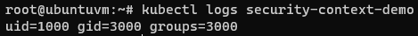

# Домашнее задание к занятию "14.5 SecurityContext, NetworkPolicies"

## Задача 1: Рассмотрите пример 14.5/example-security-context.yml

Создайте модуль

```
kubectl apply -f 14.5/example-security-context.yml
```

Проверьте установленные настройки внутри контейнера

```
kubectl logs security-context-demo
uid=1000 gid=3000 groups=3000
```

## Задача 2 (*): Рассмотрите пример 14.5/example-network-policy.yml

Создайте два модуля. Для первого модуля разрешите доступ к внешнему миру
и ко второму контейнеру. Для второго модуля разрешите связь только с
первым контейнером. Проверьте корректность настроек.

---

# Ответ

## Задача 1

Создайте модуль

```bash
kubectl apply -f 14_5/example-security-context.yml
```  
  

Проверьте установленные настройки внутри контейнера

```bash
kubectl logs security-context-demo
```  
  